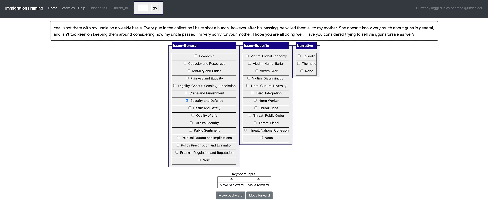

# 🥔Potato: the POrtable Text Annotation TOol

##

Potato is an easy-to-use  web-based annotation tool accepted by EMNLP 2022 DEMO track. Potato allows you quickly mock-up and deploy a variety of text annotation tasks. Potato works in the back-end as a web server that you can launch locally and then annotators use the web-based front end to work through data. Our goal is to allow folks to quickly and easily annotate text data by themselves or in small teams&mdash;going from zero to annotating in a matter of a few lines of configuration.

Potato is driven by a single configuration file that specifies the type of task and data you want to use. Potato does not require any coding to get up and running. For most tasks, no additional web design is needed, though Potato is easily customizable so you can tweak the interface and elements your annotators see.

Please check out our [official documentation](https://potato-annotation-tutorial.readthedocs.io/) for detailed instructions.

>Jiaxin Pei, Aparna Ananthasubramaniam, Xingyao Wang, Naitian Zhou, Jackson Sargent, Apostolos Dedeloudis and David Jurgens. 🥔Potato: the POrtable Text Annotation TOol. In Proceedings of the 2022 Conference on Empirical Methods on Natural Language Processing (EMNLP'22 demo)

## Feature hightlights 
Potato supports a wide ranges of features that can make your data annotation easier:

### Easy setup and flexible for diverse needs
Potato can be easily set up with simply editing a configuration file. You don't need to write any codes to set up your annotation webpage. Potato also comes with a series of features for diverse needs.
- [Built-in schemas and templates](https://potato-annotation-tutorial.readthedocs.io/en/latest/schemas_and_templates.html): Potato supports a wide range of annotation schemas including radio, likert, checkbox, textbox, span, pairwise comparison, best-worst-scaling, image/video-as-label, etc. All these schemas can be 
- [Flexible data types](https://potato-annotation-tutorial.readthedocs.io/en/latest/data_format.html#): Potato supports displaying short documents, long documents, dialogue, comparisons, etc.. 
- [Multi-task setup](https://potato-annotation-tutorial.readthedocs.io/en/latest/schemas_and_templates.html): NLP researchers may need to set up a series of similar but different tasks (e.g. multilingual annotation). Potato allows you to easily generate configuration files for all the tasks with minimum configurations and has supported the [SemEval 2023 Task 9: Multilingual Tweet Intimacy Analysis](https://sites.google.com/umich.edu/semeval-2023-tweet-intimacy/home)

### Improving Annotator Productivity
Potato is carefully desinged with a series of features that can make your annotators experience better and help you get your annotations faster. You can easily set up 
- [Keyboard Shortcuts](https://potato-annotation-tutorial.readthedocs.io/en/latest/productivity.html#keyboard-shortcuts): Annotators can direcly type in their answers with keyboards
- [Dynamic Highlighting](https://potato-annotation-tutorial.readthedocs.io/en/latest/productivity.html#dynamic-highlighting): For tasks that have a lot of labels or super long documents, you can setup dynamic highlighting which will smartly highlight the potential association between labels and keywords in the document (as defined by you). 
- [Label Tooltips](https://potato-annotation-tutorial.readthedocs.io/en/latest/productivity.html#tooltips): When you have a lot of labels (e.g. 30 labels in 4 categories), it'd be extremely hard for annotators to remember all the detailed descriptions of each of them. Potato allows you to set up label tooltips and annotators can hover the mouse over labels to view the description.

### Knowing better about your annotators
Potato allows a series of features that can help you to better understand the background of annotators and identify potential data biases in your data.
- [Pre and Post screening questions](https://potato-annotation-tutorial.readthedocs.io/en/latest/surveyflow.html#pre-study-survey): Potato allows you to easily set up prescreening and postscreening questions and can help you to better understand the backgrounds of your annotators. Potato comes with a seires of question templates that allows you to easily setup common prescreening questions like [demographics](https://potato-annotation-tutorial.readthedocs.io/en/latest/surveyflow.html#built-in-demographic-questions).

### Better quality control
Potato comes with features that allows you to collect more reliable annotations and identify potential spammers.
- [Attention Test](https://potato-annotation-tutorial.readthedocs.io/en/latest/surveyflow.html#attention-test): Potato allows you to easily set up attention test questions and will randomly insert them into the annotation queue, allowing you to better identify potential spammers.
- [Qualification Test](https://potato-annotation-tutorial.readthedocs.io/en/latest/surveyflow.html#pre-study-test): Potato allows you to easily set up qualification test before the full data labeling and allows you to easily identify disqualified annotators.
- [Built-in time check](https://potato-annotation-tutorial.readthedocs.io/en/latest/annotator_stats.html#annotation-time): Potato automatically keeps track of the time annotators spend on each instance and allows you to better analyze annotator behaviors.


## Quick Start
Clone the github repo to your computer

    git clone https://github.com/davidjurgens/potato.git

Install all the required dependencies

    pip3 install -r requirements.txt

To run a simple check-box style annotation on text data, run

    python3 potato/flask_server.py config/examples/simple-check-box.yaml -p 8000
        
This will launch the webserver on port 8000 which can be accessed at [http://localhost:8000](http://localhost:8000). 

Clicking "Submit" will autoadvance to the next instance and you can navigate between items using the arrow keys.

The `config/examples` folder contains example `.yaml` configuration files that match many common simple use-cases. See the full [documentation](https://potato-annotation-tutorial.readthedocs.io/en/latest/usage.html) for all configuration options.


## Example projects (project hub)
Potato aims to improve the replicability of data annotation and reduce the cost for researchers to set up new annotation tasks. Therefore, Potato comes with a list of predefined example projects, and welcome public contribution to the project hub. If you have used potato for your own annotation, you are encouraged to create a pull request and release your annotation setup. 

### Dialogue analysis (span + categorization)

    [launch] python3 potato/flask_server.py example-projects/dialogue_analysis/configs/dialogue-analysis.yaml -p 8000
    [Annotate] http://localhost:8000


### Sentiment analysis (categorization)

    [launch] python3 potato/flask_server.py example-projects/sentiment_analysis/configs/sentiment-analysis.yaml -p 8000
    [Annotate] http://localhost:8000
    

    
### Summarization evaluation (likert + categorization)

    [launch] python3 potato/flask_server.py example-projects/summarization_evaluation/configs/summ-eval.yaml -p 8000
    [Annotate] http://localhost:8000/?PROLIFIC_PID=user
    


### Match findings in papers and news (likert + prescreening questions + multi-task)

    [Setup configuration files for multiple similar tasks] python3 potato/setup_multitask_config.py example-projects/match_finding/multitask_config.yaml
    [launch] python3 potato/flask_server.py example-projects/match_finding/configs/Computer_Science.yaml -p 8000
    [Annotate] http://localhost:8000/?PROLIFIC_PID=user
    


### Immigration framing in tweets (Multi-schema categorization)

    [launch] python3 potato/flask_server.py example-projects/immigration_framing/configs/config.yaml -p 8000
    [Annotate] http://localhost:8000/
    


### GIF Reply Appropriateness (video as label)

    [launch] python3 potato/flask_server.py example-projects/gif_reply/configs/gif-reply.yaml -p 8000
    [Annotate] http://localhost:8000/


## Design Team and Support

Potato is run by a small and engergetic team of academics doing the best they can. For support, please leave a issue on this git repo. Feature requests and issues are both welcomed!
If you have any questions or want to collaborate on this project, please email pedropei@umich.edu
   
## Cite us
Please use the following bibtex when referencing this work:
```
@inproceedings{pei2022potato,
  title={POTATO: The Portable Text Annotation Tool},
  author={Pei, Jiaxin and Ananthasubramaniam, Aparna and Wang, Xingyao and Zhou, Naitian and Dedeloudis, Apostolos and Sargent, Jackson and Jurgens, David},
  booktitle={Proceedings of the 2022 Conference on Empirical Methods in Natural Language Processing: System Demonstrations},
  year={2022}
}
```
