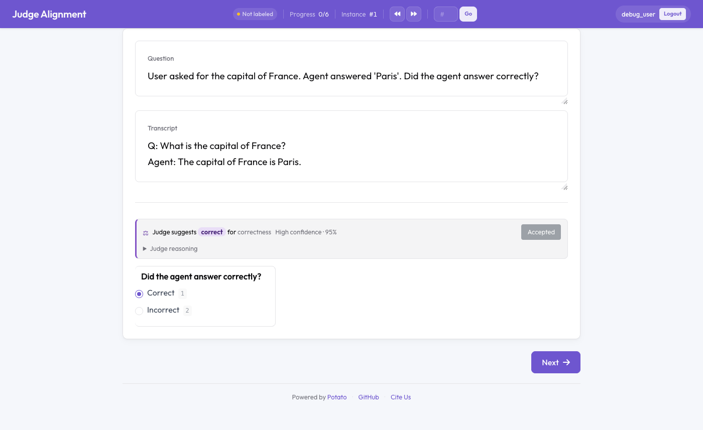

# LLM-Judge ↔ Human Alignment

Measure and calibrate how well an LLM judge agrees with your human gold labels.
Potato runs a configurable LLM-as-judge over instances your annotators have
labeled, computes **Cohen's κ** + a confusion matrix + a disagreement list, and
tracks κ as you edit the judge rubric. With **inline mode** on, the judge's
verdict is shown beside the human's label during annotation, with a running κ.

This is the standard "align your judge to ~100–200 gold labels" workflow
(LangSmith Align Evals, Databricks, Evidently): collect human labels → run the
judge → inspect disagreements → refine the rubric → re-run until κ is high.



## Configuration

```yaml
# The judge uses the standard AI endpoint machinery.
ai_support:
  enabled: true
  endpoint_type: "ollama"        # ollama (keyless/local) | openai | anthropic | vllm | ...
  ai_config:
    model: "llama3.2"
    temperature: 0.0
    # openai/anthropic: add api_key: "<key>"

judge_alignment:
  enabled: true
  schemas:
    correctness:                 # per annotation-scheme rubric (editable)
      rubric: >
        Label 'correct' only if the agent's answer is factually right and fully
        satisfies the request; otherwise 'incorrect'.
  few_shot:
    enabled: false               # seed the judge prompt with gold examples
    max_examples: 4              # drawn from high-agreement human labels
    min_agreement: 0.8
  inline:
    enabled: true                # show judge verdict beside the human label
    schemas: [correctness]
    compute_on_demand: false     # call the judge live when no cached verdict exists
```

Scope: single-choice categorical schemes (`radio`, `select`, `likert`). If
`judge_alignment.schemas` is set, only those schemes are judged; otherwise all
categorical schemes are.

## Running the judge

The judge is run from the admin API (predictions are cached per prompt version,
so re-runs are cheap):

```bash
# Generate / refresh judge verdicts over human-annotated instances
curl -X POST localhost:8000/admin/api/judge-alignment/run \
  -H "X-API-Key: <admin-key>" \
  -H "Content-Type: application/json" \
  -d '{"max_per_schema": 200}'
```

To **calibrate**, pass an edited rubric — this creates a new prompt version so
you can compare κ across rounds:

```bash
curl -X POST localhost:8000/admin/api/judge-alignment/run \
  -H "X-API-Key: <admin-key>" -H "Content-Type: application/json" \
  -d '{"rubrics": {"correctness": "Stricter rubric text..."}}'
```

### κ drift trend

The dashboard's **Prompt versions** card plots a sparkline of mean κ across every
prompt version, with a direction badge — **improving**, **declining**, or
**stable** — and the first→last delta. This makes calibration *drift* visible at a
glance: you can see whether successive rubric edits (or auto-calibration rounds)
are actually raising agreement, or whether a "fix" quietly regressed it.

## Automated calibration (corrections → few-shot)

Instead of hand-editing the rubric, **auto-calibrate**: the instances where a
human *corrected* the judge (human label ≠ judge label) are exactly where it's
wrong, so they make the most informative few-shot examples. One call re-runs the
judge with those corrections injected into the prompt and reports the new κ:

```bash
curl -X POST localhost:8000/admin/api/judge-alignment/autocalibrate \
  -H "X-API-Key: <admin-key>" -H "Content-Type: application/json" \
  -d '{"max_corrections": 5}'
```

This mirrors LangSmith's "human corrections become few-shot examples", grounded
in Potato's κ tracking. Per schema it returns the base vs new prompt version,
base vs new κ, the delta, and whether κ improved:

```json
{"schemas": {"correctness": {"base_kappa": 0.42, "new_kappa": 0.71,
  "delta": 0.29, "improved": true, "n_corrections": 5,
  "new_version": "v_…"}}, "improved_count": 1, "total": 1}
```

**Leakage guard:** when judging an instance, any correction *for that same
instance* is excluded from its few-shot set — the judge never sees the answer to
the item it's grading. The new prompt version appears in the report's
prompt-version history alongside manual rounds.

## The alignment report

```
GET /admin/judge-alignment            # JSON
GET /admin/judge-alignment?format=html  # rendered page
GET /admin/judge-alignment?prompt_version=v_abc123  # a specific version
```
(send the `X-API-Key` header). The report shows, per schema:

- **Cohen's κ** + Landis–Koch interpretation, agreement rate, and n compared,
- a **confusion matrix** (rows = human gold, columns = judge),
- a **disagreement table** (instance, human, judge, confidence, judge reasoning),
- **prompt-version history** with mean κ per version, so calibration progress is visible.

Human gold is the majority vote across annotators for each instance.

## Judging beyond single-choice (span & free-text)

The judge isn't limited to `radio`/`select`/`likert`. `potato.ai.judge` routes by
schema type (`judge_mode`):

- **Span schemas** (`span`, `error_span`, `coreference`) — `JudgeService.judge_spans`
  asks the model to extract labeled spans (exact substrings + labels), maps them to
  character offsets (repeated text → distinct offsets), and validates labels against
  the schema. Score against human spans with `score_spans(predicted, gold,
  iou_threshold=0.5)` → IoU-matched precision / recall / F1 / mean IoU (the same
  matcher as `judge_calibration.metrics.span_prf`).

  ```python
  res = service.judge_spans(iid, schema, text)        # {"spans": [...], "reasoning": ...}
  score_spans(res["spans"], human_spans)              # {"precision","recall","f1","mean_iou",...}
  ```

- **Free-text schemas** (`textbox`, `text`, `text_edit`) — `JudgeService.judge_freetext`
  rubric-scores a free-form response along one or more **feedback dimensions**
  (`continuous` 0–1, `boolean`, or `categorical`), à la LangSmith:

  ```python
  dims = [{"key": "helpful", "type": "boolean"},
          {"key": "fluency", "type": "continuous"}]
  service.judge_freetext(iid, schema, text, dims)     # {"scores": {...}, "reasoning": ...}
  ```
  Defaults to a single continuous `quality` score. Continuous values are clamped to
  [0, 1]; booleans/categoricals are coerced and (for categorical) fuzzy-matched to the
  declared labels.

Span agreement uses **IoU-F1** (not κ); free-text judging is reference-free (the judge
produces the feedback scores).

## Inline mode

With `inline.enabled`, each annotation page shows the judge's cached verdict for
the instance (label + confidence + expandable reasoning) and a running κ for the
task. "Accept" fills the matching choice. Each human save records a human↔judge
comparison feeding the running agreement. Set `compute_on_demand: true` to call
the judge live when no cached verdict exists (slower; otherwise pre-run the batch).

## How it works (reuse)

- The judge call goes through the same `ai_support` endpoint as every AI feature.
- Few-shot calibration examples are drawn from high-agreement human labels (the
  ICL example selector), always **excluding** the instance being judged (no leakage).
- κ is computed by `potato/agreement.py` (judge vs. human gold as two annotators).
- Predictions persist under `{output_annotation_dir}/judge_alignment/` keyed by
  prompt version; the LLM calls are cached.

## Notes & limitations

- v1 calibration is **manual** (edit rubric + re-run); automated prompt
  optimization is out of scope.
- Scope is single-choice categorical schemes. Span/free-text judging is future work.
- Run the judge over a focused gold set (≈100–200 labeled instances) for a stable κ.

## Related

- [Agent Traces](agent_traces.md), [Three-Pane Trace Eval](eval_trace.md),
  [Trajectory Correction](trajectory_correction.md)
- The `/admin/iaa` page (human-vs-human inter-annotator agreement) is the sibling report.
