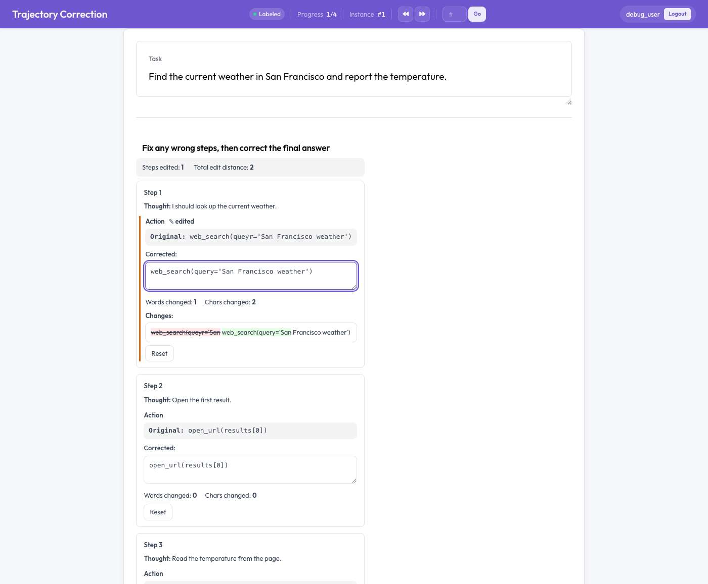

# Trajectory Correction → SFT/DPO Training Data

The `trajectory_edit` annotation schema lets annotators **rewrite** the steps of an agent trace —
fix a wrong reasoning step, correct a typo'd tool call, or strengthen the final answer — and saves
the corrected trajectory alongside the original. The `trajectory_correction` exporter then turns
each `(original, corrected)` pair into supervised fine-tuning (SFT) targets and DPO preference
pairs.

This is the editing counterpart to [Trajectory Evaluation](trajectory_eval.md) (which *scores*
steps). It mirrors Labelbox's "Agent Trajectory Editor" and Datadog's "edited outputs" — the
dominant workflow for converting agent eval into training data.



## Quick start

```bash
python potato/flask_server.py start examples/agent-traces/trajectory-correction/config.yaml -p 8000
```

See `examples/agent-traces/trajectory-correction/` for the full runnable project.

## How it works

Each agent step renders as a card showing the **Original** text (read-only) and an editable
**Corrected** box pre-filled with the original. As the annotator types:

- a live **word-level diff** highlights insertions (green) and deletions (red strikethrough),
- words/characters changed are counted, and
- an **"✎ edited"** flag appears on changed fields.

A "Reset" button restores the original per field. With `edit_final_answer: true` the final answer
gets its own editor. Nothing is required — an unedited trace simply produces no training pair.

## Configuration

```yaml
annotation_schemes:
  - annotation_type: trajectory_edit
    name: corrected_trajectory
    description: "Fix any wrong steps, then correct the final answer"
    steps_key: steps          # instance field holding the step list
    step_text_key: action     # the default per-step editable field
    editable_fields:          # which fields get an editor
      - action
      # - thought             # add to also edit reasoning
    show_diff: true
    show_edit_distance: true
    allow_reset: true
    require_reason_on_edit: false   # add a per-field "reason" input
    edit_final_answer: true
    final_answer_key: final_answer
```

| Option | Default | Description |
|--------|---------|-------------|
| `steps_key` | `steps` | Instance field holding the step list (read from `[data-instance-json]`). |
| `step_text_key` | `action` | Default editable field per step. |
| `editable_fields` | `[step_text_key]` | Which step fields get an editor (e.g. `[action, thought]`). |
| `show_diff` | `true` | Show the live word-level diff. |
| `show_edit_distance` | `true` | Show words/chars changed. |
| `allow_reset` | `true` | Per-field "Reset to original" button. |
| `require_reason_on_edit` | `false` | Per-field "reason for edit" input. |
| `edit_final_answer` | `false` | Add an editor for the final answer. |
| `final_answer_key` | `final_answer` | Instance field holding the final answer. |

### Data format

The schema reads steps from the instance under `steps_key`. Each step is an object whose fields
(`action`, `thought`, …) can be edited; bare-string steps are edited as the `step_text_key` field.

```json
{
  "id": "traj_001",
  "task_description": "Find the weather in San Francisco.",
  "steps": [
    {"thought": "Look it up.", "action": "web_search(queyr='SF weather')"},
    {"thought": "Open it.",    "action": "open_url(results[0])"}
  ],
  "final_answer": "It is sunny."
}
```

## Export

Run the `trajectory_correction` exporter. It writes three files:

- **`trajectory_corrections.json`** — every record: `original_trace`, reconstructed
  `corrected_trace`, and per-field `edits` (with edit distances and reasons).
- **`trajectory_sft.jsonl`** — one line per *edited* trace:
  `{"prompt": <task>, "completion": <corrected_trace>}`.
- **`trajectory_dpo.jsonl`** — one line per *edited* trace:
  `{"prompt": <task>, "chosen": <corrected_trace>, "rejected": <original_trace>}`.

Unedited traces are counted but excluded from SFT/DPO (training on an unchanged trajectory adds
nothing); the skipped count is reported in the export stats and warnings. With multiple annotators,
each annotator who edited a trace yields one SFT/DPO record.

## Notes & limitations

- The diff is **word-level** (reused from the `text_edit` schema). For code-like tool calls with
  no spaces, a single token may show as wholly changed even for a one-character fix — the
  character-distance counter is the precise signal.
- Span annotation is not applicable here; pair with [`trajectory_eval`](trajectory_eval.md) if you
  also want per-step scoring/error taxonomy on the same trace.

## Related

- [Trajectory Evaluation](trajectory_eval.md) — per-step correctness, error taxonomy, severity
- [Three-Pane Trace Eval](eval_trace.md) — read-only reasoning | calls | answer view
- [Agent Traces](agent_traces.md) — agent-trace display and evaluation patterns
