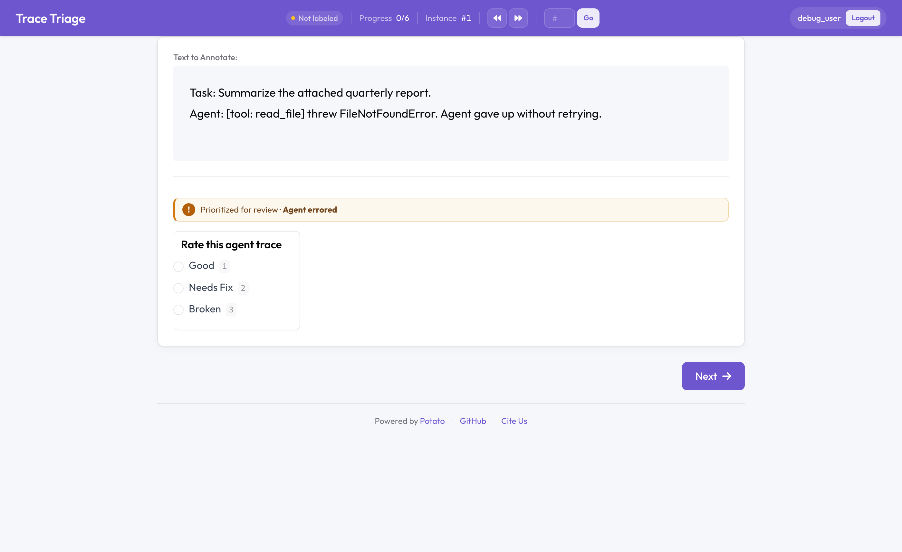

# Signal-Based Triage Queue

Prioritize the annotation queue by a per-item **quality signal** so reviewers see
the worst / most-suspect traces first, instead of annotating in arrival (FIFO)
order. The signal can be an agent error, a production thumbs-down, a low automated
score, or any custom field. It is read both for statically loaded data and for
traces ingested at runtime (webhook / Langfuse), and it surfaces in two places:
a banner during annotation and the `/admin/triage-queue` ranking page.



## Configuration

```yaml
triage:
  enabled: true
  order: desc            # high priority first (default); 'asc' = low first
  default_priority: 0    # items matching no rule
  show_badge: true       # banner during annotation explaining the priority
  rules:                 # evaluated in order; highest matching priority wins
    - name: "Agent errored"
      badge: "Agent errored"     # banner text (defaults to name)
      priority: 100
      when:
        field: status            # dotted paths allowed, e.g. metadata.tags
        equals: error
    - name: "Negative feedback"
      priority: 80
      when:
        field: feedback
        in: [thumbs_down, negative]
    - name: "Low quality score"
      priority: 60
      when:
        field: score
        lt: 0.5

# Serve the highest-priority items first. If you enable triage WITHOUT setting
# assignment_strategy, Potato defaults to `priority` automatically.
assignment_strategy: priority
```

If you omit `rules` (and `signal_field`), a turnkey default set is used: error
status (100), negative feedback (80), score < 0.5 (60).

### Condition operators

| Operator   | Meaning                                  |
|------------|------------------------------------------|
| `equals`   | exact match (strings case-insensitive)   |
| `in`       | value is one of a list                   |
| `contains` | list field contains, or substring match  |
| `lt` / `lte` / `gt` / `gte` | numeric comparison       |
| `exists`   | field is present / absent (`true`/`false`) |

### Reading a numeric signal directly

Instead of (or in addition to) rules, read a number straight from a field:

```yaml
triage:
  enabled: true
  signal_field: quality_score   # used as the priority when no rule matches
  invert_signal: true           # lower score => higher priority
```

## How priority drives assignment

Set `assignment_strategy: priority`. When a user needs items, the queue is sorted
by each item's stored `triage_priority` (descending by default; `order: asc`
flips it), ties broken by the original load order for determinism, and the top
items are assigned. The signal is computed once at load/ingestion time and stored
on the item, so assignment stays cheap.

The badge (`show_badge: true`) is independent of the strategy — it explains why an
item was flagged even if you keep another assignment strategy.

## The admin queue page

```
GET /admin/triage-queue              # JSON
GET /admin/triage-queue?format=html  # rendered page
```

(send the `X-API-Key` header). Shows every remaining (incomplete) item ranked by
priority, with the reason/rule that flagged it, the current annotation count, and
whether it is already assigned.

## Runtime ingestion

Because the scorer runs in `ItemStateManager.add_item`, traces ingested at runtime
through [trace ingestion](agent_traces.md) (the `/api/traces/webhook` endpoint or a
Langfuse poller) are scored as they arrive and slot into the priority queue
automatically — a low-scoring or errored trace pushed in mid-session jumps ahead of
clean ones still waiting.

## Notes & limitations

- Priority is computed at insertion time; editing `triage.rules` and restarting
  re-scores everything on the next load.
- A malformed rule logs a warning and is skipped — it never blocks data loading.
- Triage orders *which* items are served; it does not change per-item annotation caps.

## Related

- [Agent Traces](agent_traces.md), [Three-Pane Trace Eval](eval_trace.md),
  [Judge ↔ Human Alignment](judge_alignment.md),
  [Trajectory Correction](trajectory_correction.md)
- Assignment strategies are documented in [Task Assignment](../task_assignment.md).
