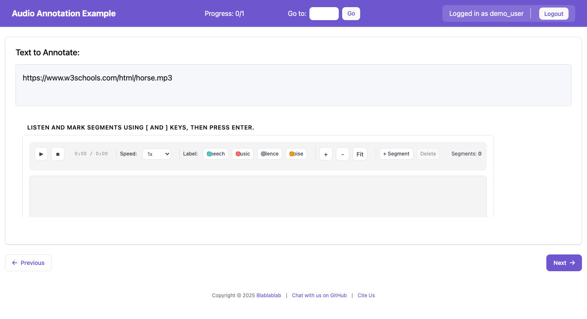

# Audio Annotation

Audio annotation lets annotators cut an audio file into time regions and label them. This is useful for speech transcription, speaker diarization, music analysis, and audio event detection.


*The audio annotation interface with waveform visualization, segment labels, and playback controls*

## Features

- **Waveform Visualization**: See audio amplitude to identify content vs silence
- **Segment Creation**: Create time-based segments by selecting regions
- **Label Assignment**: Assign category labels to each segment
- **Playback Controls**: Play, pause, stop, and variable speed playback
- **Zoom & Scroll**: Navigate long audio files (supports hour-long recordings)
- **Keyboard Shortcuts**: Fast annotation with customizable hotkeys
- **Pre-computed Waveforms**: Server-side caching for fast loading

## Requirements

### Server-Side (Recommended)

For optimal performance with long audio files, install the BBC's `audiowaveform` tool:

```bash
# macOS
brew install audiowaveform

# Ubuntu/Debian
sudo apt-get install audiowaveform

# Build from source
# See: https://github.com/bbc/audiowaveform
```

If `audiowaveform` is not installed, client-side waveform generation will be used as a fallback (suitable for shorter files < 30 minutes).

### Client-Side

The frontend uses [Peaks.js](https://github.com/bbc/peaks.js) (loaded from CDN) for waveform rendering.

## Configuration

### Basic Configuration (Label Mode)

```yaml
annotation_schemes:
  - annotation_type: audio_annotation
    name: audio_segmentation
    description: "Segment the audio by content type"
    mode: label
    labels:
      - name: speech
        color: "#4ECDC4"
        key_value: "1"
      - name: music
        color: "#FF6B6B"
        key_value: "2"
      - name: silence
        color: "#95A5A6"
        key_value: "3"
    min_segments: 1
    zoom_enabled: true
    playback_rate_control: true
```

### Configuration Options

| Option | Type | Default | Description |
|--------|------|---------|-------------|
| `name` | string | required | Unique identifier for the schema |
| `description` | string | required | Instructions shown to annotators |
| `mode` | string | `"label"` | Annotation mode: `"label"`, `"questions"`, or `"both"` |
| `labels` | list | required* | Category labels for segments (*required for label/both modes) |
| `segment_schemes` | list | required* | Per-segment annotation schemes (*required for questions/both modes) |
| `min_segments` | integer | `0` | Fewest segments the annotator must mark. Blocks Next until they have, and says how many are still missing. Needs `label_requirement.required: true` to take effect. |
| `max_segments` | integer | `null` | Maximum allowed segments |
| `zoom_enabled` | boolean | `true` | Enable zoom controls |
| `playback_rate_control` | boolean | `false` | Show playback speed selector |

### Global Audio Configuration

Configure waveform caching in your YAML config:

```yaml
audio_annotation:
  waveform_cache_dir: waveform_cache/    # Cache directory (default: task_dir/waveform_cache)
  waveform_look_ahead: 5                  # Pre-compute next N instances
  waveform_cache_max_size: 100            # Max cached waveform files
  client_fallback_max_duration: 1800      # Max seconds for client-side fallback (30 min)
```

### Annotation Modes

#### Label Mode
Annotators create segments and assign labels (similar to span annotation for text):

```yaml
mode: label
labels:
  - name: speech
    color: "#4ECDC4"
  - name: music
    color: "#FF6B6B"
```

#### Questions Mode
Each segment gets its own set of annotation questions. The annotator marks a
region, selects it, and answers the questions in the Segment Details panel:

```yaml
mode: questions
segment_schemes:
  - annotation_type: radio
    name: speaker_type
    description: "Who is speaking?"
    labels: ["host", "guest", "unknown"]
  - annotation_type: multirate
    name: quality
    description: "Rate this segment"
    options: ["Clarity", "Relevance"]
    labels: ["1", "2", "3", "4", "5"]
```

#### Both Mode
Combines labels and per-segment questions:

```yaml
mode: both
labels:
  - name: speech
  - name: music
segment_schemes:
  - annotation_type: radio
    name: speaker
    labels: ["host", "guest"]
```

#### How segment questions work

Each entry in `segment_schemes` is an ordinary annotation scheme, rendered by
the same generator that renders a top-level one — so any annotation type works
inside a segment, with the same layout, tooltips and validation messages.

Answers are stored on the segment rather than on the item, keyed by the
sub-scheme's `name`:

```json
{"segments": [
  {"id": "segment_1", "start_time": 0.0, "end_time": 16.3, "label": "interruption",
   "annotations": {"who_started": "Patient", "cues": ["Talking over"]}}
]}
```

Two limits are worth knowing:

- **Keybindings are not bound.** A segment's fields only exist while that
  segment is selected, so a global key would fire against whichever segment
  happened to be open. Answer them by clicking.
- **`label_requirement` is not enforced** on a sub-scheme. Marking one required
  would block Next on a question the annotator may not have opened yet. Use
  `min_segments` to require segments, and check completeness in analysis.

A runnable example is in `examples/audio/segment-questions/`.

### Requiring segments

With `label_requirement.required: true` on the scheme, Next is blocked until
the annotator has marked at least `min_segments` segments and given every one of
them a label. The message names what is missing: "1 of 2 segments marked", "1
segment with no label". Without `required`, neither check blocks anything.

```yaml
- annotation_type: audio_annotation
  name: speaker_turns
  description: "Mark each speaker turn"
  labels: [caller, agent]
  min_segments: 2
  label_requirement:
    required: true
```

### Label Configuration

```yaml
labels:
  - name: speech
    color: "#4ECDC4"      # Custom color (hex)
    key_value: "1"        # Keyboard shortcut
  - name: music
    color: "#FF6B6B"
    key_value: "2"
```

## Data Format

### Input Data

The audio URL should be provided in the data file field specified by `text_key`:

```json
{"id": "audio_001", "audio_url": "https://example.com/podcast.mp3"}
{"id": "audio_002", "audio_url": "/static/audio/interview.wav"}
```

Configure in YAML:
```yaml
item_properties:
  id_key: id
  text_key: audio_url
```

Supported formats: MP3, WAV, OGG, and other formats supported by the browser.

> **Header behavior:** When `text_key` points at the media file path/URL (as above),
> the redundant "instance text" header is hidden automatically — the waveform player
> is the content. If the item instead carries a real prompt or transcript (text with
> spaces, not a bare path), that text is shown above the player. The same applies to
> video and tiered/temporal tasks.

### Output Data

Annotations are saved as JSON:

```json
{
  "audio_segmentation": {
    "segments": [
      {
        "id": "segment_1",
        "start_time": 0.0,
        "end_time": 15.5,
        "label": "speech",
        "annotations": {}
      },
      {
        "id": "segment_2",
        "start_time": 15.5,
        "end_time": 45.2,
        "label": "music",
        "annotations": {
          "speaker_type": "host",
          "quality": {"Clarity": "4", "Relevance": "5"}
        }
      }
    ]
  }
}
```

## Keyboard Shortcuts

| Key | Action |
|-----|--------|
| `Space` | Play/Pause |
| `←` / `→` | Seek 5 seconds backward/forward |
| `Shift+←` / `Shift+→` | Seek 30 seconds |
| `[` | Set segment start at current position |
| `]` | Set segment end at current position |
| `Enter` | Create segment from selection |
| `Delete` | Delete selected segment |
| `1-9` | Select label by number |
| `+` / `-` | Zoom in/out |
| `0` | Fit waveform to view |

## User Interface

### Toolbar

- **Playback Controls**: Play/pause, stop, current time display
- **Speed Control**: Playback rate selector (0.5x to 2x)
- **Label Selector**: Color-coded buttons for each label
- **Zoom Controls**: Zoom in, zoom out, fit to view
- **Segment Controls**: Create segment, delete selected
- **Segment Count**: Shows current number of segments

### Waveform Display

- **Main Waveform (zoomed view)**: Zoomable view showing amplitude
- **Overview**: Mini-map showing the full audio with the current view highlighted
- **Segments**: Color-coded regions on the waveform
- **Playhead**: Current playback position indicator

### Creating Segments by Dragging

Segments can be drawn directly on either panel:

- **Zoomed view** — **right-click and drag** to draw a segment precisely. If the
  drag reaches the left or right edge, the view **auto-scrolls** so you can extend
  the selection past the currently visible window in a single gesture (no need to
  zoom out first).
- **Overview** — **right-click and drag** to draw a coarse segment anywhere across
  the whole clip, even outside the current zoom window. This makes the entire
  recording annotatable without first navigating to it.

**Left-click** on either panel still seeks / navigates the playhead, so the two
gestures never conflict. You can also create segments with the `[` / `]` / `Enter`
keyboard shortcuts or the toolbar buttons.

### Segment List

Shows all segments sorted by start time:
- Color indicator matching the label
- Label name and time range
- Play button to hear the segment
- Delete button to remove

## Example Project

See `examples/audio/audio-annotation/config.yaml` for a complete working example.

## Tips for Administrators

1. **Install audiowaveform**: For long audio files (podcasts, interviews), install the server-side tool for fast waveform loading.

2. **Look-ahead Caching**: Set `waveform_look_ahead` to pre-compute waveforms for upcoming instances based on annotation order.

3. **Audio Hosting**: Host audio files on a server accessible to annotators. Use absolute URLs or place files in the static folder.

4. **Playback Rate**: Enable `playback_rate_control` for long audio to let annotators speed through sections.

5. **Label Colors**: Choose distinct colors that are visible on the waveform (avoid grays that blend with the waveform).

6. **Min Segments**: Set `min_segments: 1` to ensure annotators create at least one segment per audio file. Pair it with `label_requirement.required: true` — `min_segments` is checked as part of the requiredness pass, so on its own it records the number and blocks nothing.

## Troubleshooting

### Waveform not loading

1. Check browser console for errors
2. Verify the audio URL is accessible
3. For long files, ensure `audiowaveform` is installed
4. Check that the cache directory is writable

### Slow waveform loading

1. Install `audiowaveform` for server-side generation
2. Increase `waveform_look_ahead` for pre-computation
3. Ensure audio files are reasonably sized

### Audio not playing

1. Check browser audio permissions
2. Verify audio format is supported (MP3, WAV, OGG)
3. Check for CORS issues if audio is hosted externally

## Already have a transcript?

This page covers segmenting a waveform from scratch. If you have ASR output or
subtitle files for your audio, you probably want a transcript-driven display
instead — the turns are already segmented, so annotators label speech rather than
re-drawing boundaries by hand.

Potato reads Whisper, WhisperX, and whisper.cpp JSON, SubRip, WebVTT, SubStation
Alpha, TTML, YouTube captions, AWS Transcribe, Deepgram, AssemblyAI, Rev.ai, CTM,
Praat TextGrid, and ELAN EAF — either inlined in your data file or read from a
sidecar next to the media.

```bash
potato transcripts ./whisper_out --media-dir ./audio -o data/interviews.json
```

- [Working with Transcripts](../../guides/working_with_transcripts.md) — running Whisper or pulling YouTube subtitles, then annotating the result
- [Transcript Format Support](transcript_formats.md) — every supported format and how it is detected
- [Audio Dialogue](audio_dialogue.md) — speaker bubbles with per-turn playback

Waveform segmentation and transcript annotation combine: keep this schema for
marking acoustic events, and add an `audio_dialogue` display for the speech.
