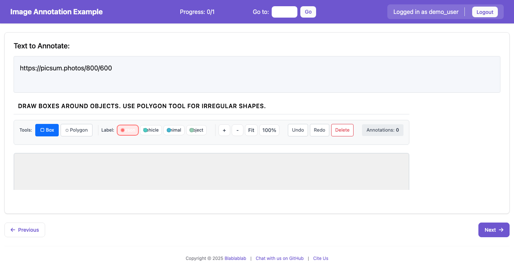

# Image Annotation

Image annotation allows annotators to mark regions on images using bounding boxes, polygons, freeform drawing, and landmark points. This is useful for object detection, segmentation, and keypoint annotation tasks.


*The image annotation interface with bounding box and polygon tools*

## Features

- **Bounding Box (bbox)**: Draw rectangular boxes around objects
- **Polygon**: Draw multi-point polygons for precise object boundaries
- **Freeform Drawing**: Free-hand drawing for irregular shapes
- **Landmark Points**: Mark specific points of interest on images
- **Segmentation Brush**: Pixel-level mask painting for semantic segmentation
- **Fill Tool**: Flood-fill enclosed regions with a label
- **Eraser**: Remove mask regions
- **Zoom & Pan**: Navigate large images with ease
- **Label Assignment**: Assign category labels to each annotation
- **Keyboard Shortcuts**: Fast annotation with customizable hotkeys

## Configuration

### Basic Configuration

```yaml
annotation_schemes:
  - annotation_type: image_annotation
    name: object_detection
    description: "Draw boxes around objects in the image"
    tools:
      - bbox
      - polygon
    labels:
      - name: person
        color: "#FF6B6B"
        key_value: "1"
      - name: vehicle
        color: "#4ECDC4"
        key_value: "2"
      - name: animal
        color: "#45B7D1"
        key_value: "3"
```

### Configuration Options

| Option | Type | Default | Description |
|--------|------|---------|-------------|
| `name` | string | required | Unique identifier for the schema |
| `description` | string | required | Instructions shown to annotators |
| `tools` | list | required | Annotation tools to enable |
| `labels` | list | required | Category labels for annotations |
| `zoom_enabled` | boolean | `true` | Enable zoom controls |
| `pan_enabled` | boolean | `true` | Enable pan/drag navigation |
| `min_annotations` | integer | `0` | Minimum required annotations |
| `max_annotations` | integer | `null` | Maximum allowed annotations |
| `freeform_brush_size` | integer | `5` | Default brush size for freeform tool |
| `freeform_simplify` | float | `2.0` | Path simplification tolerance |
| `brush_size` | integer | `20` | Default brush size for segmentation (1-100) |
| `eraser_size` | integer | `20` | Default eraser size for segmentation (1-100) |
| `mask_opacity` | float | `0.5` | Mask overlay opacity (0-1) |
| `fill_mode` | string | `region` | `region` grows across similar colours in the image; `empty` grows across unpainted mask area |
| `fill_tolerance` | integer | `32` | Per-channel colour distance for `region` fill (0-255) |
| `keybinding_profile` | string | `v7` | `v7` matches V7/CVAT conventions; `legacy` keeps Potato's pre-2.8 keys |
| `carry_over` | string/bool | `false` | `prompt` adds a Copy-previous button; `auto` also pre-fills empty images |
| `mask_mode` | string | `semantic` | `semantic` merges every stroke of a class into one region; `instance` keeps objects separate |
| `skeletons` | object | `{}` | Named keypoint layouts: `{name: {names: [...], edges: [[i,j], ...]}}` |

### Available Tools

Keys below are the default `v7` profile; see
[Keyboard Shortcuts](#keyboard-shortcuts) for the `legacy` mapping.

| Tool | Key (`v7`) | Key (`legacy`) | Description |
|------|-----------|----------------|-------------|
| `bbox` | `r` | `b` | Rectangular bounding boxes |
| `polygon` | `p` | `p` | Multi-point closed polygons |
| `polyline` | `n` | `n` | Multi-point **open** paths — lane markings, vessels, cracks, coastlines |
| `ellipse` | `i` | `i` | Ellipses and circles — cells, nuclei, wheels, faces |
| `keypoint_set` | `s` | `s` | Ordered skeletons — human pose, animal pose, facial landmarks |
| `cuboid_2d` | `c` | `c` | 3D boxes projected into the image (KITTI style) |
| `sam` | `w` | `w` | Magic wand — click an object and a model segments it. See [Interactive segmentation](segmentation.md) |
| `freeform` | `d` | `f` | Free-hand drawing |
| `landmark` | `k` | `l` | Single point markers |
| `brush` | `b` | `m` | Segmentation brush for pixel-level masks |
| `eraser` | `e` | `e` | Eraser for removing mask regions |
| `fill` | `f` | `g` | Flood fill for enclosed regions |

#### Polyline vs polygon

A polygon is closed and encloses an area; a polyline is open and has length but
no interior. The distinction is not cosmetic — a polyline exports with `area: 0`
and is never treated as a region, because closing it would invent an interior
the annotator never claimed. Use `polyline` for anything linear: road markings,
blood vessels, fractures, wires, shorelines.

#### Keypoint sets (skeletons)

An **ordered** set of points with COCO visibility flags — `2` visible, `1`
labelled but occluded, `0` not labelled. Order is what gives each point its
meaning (index 5 is "left shoulder" only because the skeleton says so), which is
why this is one annotation rather than N separate points.

```yaml
annotation_schemes:
  - annotation_type: image_annotation
    name: pose
    tools: [keypoint_set]
    labels: [person]
    skeletons:
      coco_person:
        names: [nose, left_eye, right_eye, left_ear, right_ear,
                left_shoulder, right_shoulder, left_elbow, right_elbow,
                left_wrist, right_wrist, left_hip, right_hip,
                left_knee, right_knee, left_ankle, right_ankle]
        edges: [[0,1],[0,2],[1,3],[2,4],[5,6],[5,7],[7,9],[6,8],[8,10],
                [5,11],[6,12],[11,12],[11,13],[13,15],[12,14],[14,16]]
```

COCO keypoints now round-trip. Import previously exploded each set into one
`landmark` per visible point named `person:left_shoulder`, which discarded the
ordering, the grouping (two people became an indistinguishable pile of points),
and the visibility flags — so nothing could reassemble the COCO `keypoints`
array and the format was import-only. Agreement between annotators uses **OKS**
(Object Keypoint Similarity), COCO's own metric, rather than IoU.

#### Projected 3D cuboids

`cuboid_2d` stores a 3D box **projected into the image** as two quadrilaterals,
`{front: [4 points], back: [4 points]}` — the KITTI convention. This is not true
3D: it has no depth in sensor coordinates and no calibration. Genuine 3D cuboids
in a point cloud are a separate schema (planned, not built).

The reported `area` is the **front face**, not the 8-vertex hull, because that is
the visible extent a detector would be scored against.

#### Ellipse

Stored parametrically as `{cx, cy, rx, ry, angle}` (centre, radii, rotation in
degrees), which keeps it exact rather than accumulating error through a vertex
list. For export it is approximated as a 36-vertex polygon, so every format that
understands polygons handles ellipses with no extra configuration. The reported
bounding box is the *tight* box of the rotated ellipse, not the rotated corner
box.

#### Semantic vs instance masks

By default (`mask_mode: semantic`) every brush stroke of a class merges into one
region — correct for semantic segmentation, where "road" is one thing.

`mask_mode: instance` keys masks `label#N`, so two adjacent cats stay two
objects. Use it for instance segmentation, and note that it is a **prerequisite
for interactive segmentation**: a model that returns one mask per object cannot
be used if the store merges them on arrival.

```yaml
annotation_schemes:
  - annotation_type: image_annotation
    name: instances
    tools: [brush, eraser, fill]
    mask_mode: instance
    labels: [cat, dog]
```

Instance masks export with `iscrowd: 0` (one object); label-keyed semantic
regions export with `iscrowd: 1`, which is what COCO means by a crowd region.
Imported COCO instances already use this keying, so the two paths meet.

### Label Configuration

Labels can be specified as strings or objects:

```yaml
# Simple string labels (auto-assigned colors)
labels:
  - person
  - car
  - tree

# Detailed label objects
labels:
  - name: person
    color: "#FF6B6B"      # Custom color (hex)
    key_value: "1"        # Keyboard shortcut
  - name: vehicle
    color: "#4ECDC4"
    key_value: "2"
```

`color` must be **hex**: `#rgb`, `#rrggbb`, or `#rrggbbaa` (the alpha byte is
ignored — use `mask_opacity` for overlay transparency). Named CSS colours and
`rgb()` / `hsl()` are not read: shapes and buttons are styled by CSS and would
look right, but masks are painted pixel by pixel and fall back to red. An
unreadable colour logs a console warning naming the value.

## Data Format

### Input Data

The image URL should be provided in the data file field specified by `text_key`:

```json
{"id": "img_001", "image_url": "https://example.com/image1.jpg"}
{"id": "img_002", "image_url": "/static/images/image2.png"}
```

Configure in YAML:
```yaml
item_properties:
  id_key: id
  text_key: image_url
```

### Output Data

Annotations are stored as a **flat JSON array**, with every shape and mask in
the same list. Shape coordinates are **normalized to the range 0–1** against the
image, so annotations stay correct if the image is served at a different size.

```json
[
  {
    "type": "bbox",
    "label": "person",
    "color": "#FF6B6B",
    "coordinates": {"x": 0.125, "y": 0.104, "width": 0.3125, "height": 0.625}
  },
  {
    "type": "polygon",
    "label": "vehicle",
    "color": "#4ECDC4",
    "coordinates": [
      {"x": 0.02, "y": 0.04}, {"x": 0.20, "y": 0.04},
      {"x": 0.20, "y": 0.21}, {"x": 0.02, "y": 0.21}
    ]
  },
  {
    "type": "mask",
    "label": "road",
    "color": "#45B7D1",
    "rle": {"counts": [12, 40, 8], "size": [480, 640]}
  }
]
```

Per type:

| Type | Geometry key | Shape |
|------|--------------|-------|
| `bbox` | `coordinates` | `{x, y, width, height}`, normalized |
| `polygon` | `coordinates` | list of `{x, y}`, normalized |
| `landmark` | `coordinates` | `{x, y}`, normalized |
| `freeform` | `coordinates` | `{path, left, top, scaleX, scaleY}` |
| `mask` | `rle` | `{counts: [ints], size: [height, width]}` |

Notes:

- `rle.size` is `[height, width]`, in that order.
- Mask `counts` are row-major and alternate between background and foreground
  runs, starting with a background run.
- Masks may also carry `instance` (an index that keeps two instances of one
  class apart) and `iscrowd`. A mask with no `iscrowd` is treated as a crowd
  region on export, because a brush mask is keyed by label and merges every
  stroke of that class.

To convert to and from these shapes in Python, use
`normalize_annotation_object()` and `to_client_object()` from
`potato.export.cv_utils` rather than reading the fields directly.

## Segmentation Masks

For pixel-level semantic segmentation tasks, use the brush, eraser, and fill tools. These create mask overlays that are stored as RLE (Run-Length Encoding) for efficiency.

### Segmentation Configuration Example

```yaml
annotation_schemes:
  - annotation_type: image_annotation
    name: segmentation
    description: "Paint regions using the brush tool"
    tools:
      - brush      # Pixel-level painting
      - eraser     # Remove mask regions
      - fill       # Fill enclosed areas
      - polygon    # Precise polygon boundaries
    labels:
      - name: foreground
        color: "#FF6B6B"
        key_value: "1"
      - name: background
        color: "#4ECDC4"
        key_value: "2"
    brush_size: 20        # Default brush size
    eraser_size: 20       # Default eraser size
    mask_opacity: 0.5     # Overlay transparency
```

### Segmentation Output Format

Masks are stored as RLE (Run-Length Encoding) **in the same array as the
shapes** — not under a separate `masks` key:

```json
[
  {
    "type": "mask",
    "label": "foreground",
    "color": "#FF6B6B",
    "rle": {"counts": [0, 100, 50, 200, 25], "size": [600, 800]}
  },
  {
    "type": "mask",
    "label": "background",
    "color": "#4ECDC4",
    "rle": {"counts": [50, 150, 100, 300], "size": [600, 800]}
  }
]
```

`size` is `[height, width]`. Counts are row-major and alternate between
background and foreground runs, starting with background.

Brush masks are keyed by **label**, so every stroke of one class merges into a
single region — that is semantic segmentation, and it exports as COCO
`iscrowd: 1`. Imported per-instance masks additionally carry an `instance`
index and an explicit `iscrowd: 0`, which keeps them separate and exports them
as N distinct annotations. Painting always edits the label-level mask and
leaves imported instances untouched.

### Segmentation Tips

1. **Brush Size**: Use a larger brush (40-60) for filling large areas, smaller brush (5-15) for precise edges
2. **Eraser**: Switch to eraser to fix mistakes without deleting the entire mask
3. **Fill Tool**: Use after drawing a boundary with polygon or brush to quickly fill enclosed regions
4. **Layer Order**: Masks are rendered in label order; later labels appear on top

## Showing and Hiding Classes

Dense images become unreadable once several classes overlap. Each label in the
toolbar carries an eye toggle that hides that class's annotations, and `h` /
`Shift+H` do the same from the keyboard for the currently selected label.

- Hiding is **presentation only** — hidden annotations are still saved and still
  exported. It never deletes work.
- Hidden classes are also made unselectable, so an annotator cannot accidentally
  drag or delete something they cannot see.
- The state is stored per project and schema in the browser, so a class stays
  hidden **as you move between items** rather than resetting on every image.

Nothing needs to be configured; the toggles appear automatically.

**Video annotation shares this feature.** The same toggles appear on the video
label list and hide matching segments from the timeline and the annotation list,
with the same project-wide persistence. Hidden segments remain stored and
exported.

## Copying Annotations Between Images

On image *sequences* — video frames, satellite time series, microscopy z-stacks —
consecutive images are nearly identical, and redrawing the same shapes every time
is most of the work. `carry_over` copies the annotations from the previous image
in the annotator's queue.

```yaml
annotation_schemes:
  - annotation_type: image_annotation
    name: objects
    carry_over: prompt      # false (default) | prompt | auto
```

| Value | Behaviour |
|-------|-----------|
| `false` | No carry-over. The default. |
| `prompt` | Adds a **Copy previous** button and the `Ctrl/Cmd+D` shortcut. |
| `auto` | Everything `prompt` does, and additionally pre-fills on load when the image has no annotations yet. |

Copied shapes are added to whatever is already on the image rather than replacing
it, so an annotator can copy, then adjust.

`auto` deliberately fires **only when the image has no annotations of its own**.
It will not overwrite existing work, and it will not re-copy on a revisit —
otherwise annotations the annotator deliberately deleted would keep coming back.

**Leave `carry_over` off for unordered image sets.** "The previous image" is only
meaningful when the order means something; on a shuffled set it copies annotations
from an arbitrary unrelated image.

Copying reads only the requesting annotator's own work, so it never exposes
another annotator's annotations.

## Keyboard Shortcuts

Tool shortcuts come from a **keybinding profile**. The default, `v7`, matches the
conventions used by V7 Darwin and CVAT, so annotators moving from either tool are
productive without relearning anything.

```yaml
annotation_schemes:
  - annotation_type: image_annotation
    name: segmentation
    keybinding_profile: v7      # v7 (default) | legacy
```

### Tool keys by profile

| Tool | `v7` (default) | `legacy` |
|------|----------------|----------|
| Segmentation brush | `b` | `m` |
| Eraser | `e` | `e` |
| Fill | `f` | `g` |
| Bounding box | `r` (rectangle) | `b` |
| Polygon | `p` | `p` |
| Landmark point | `k` (keypoint) | `l` |
| Freeform draw | `d` | `f` |

### Keys that are the same in both profiles

| Key | Action |
|-----|--------|
| `v` | Select/move mode (no drawing tool armed) |
| `h` | Hide/show the currently selected label |
| `Shift+H` | Show only the currently selected label (press again to restore) |
| `[` / `]` | Decrease / increase brush size |
| `Ctrl/Cmd+D` | Copy annotations from the previous image (when `carry_over` is enabled) |
| `1-9` | Select label by number (whatever `key_value` you configure) |
| `Delete` / `Backspace` | Delete selected annotation |
| `Ctrl/Cmd+Z` | Undo |
| `Ctrl/Cmd+Shift+Z` | Redo |
| Scroll wheel | Zoom in/out, anchored at the cursor |
| `+` / `=` | Zoom in |
| `-` | Zoom out |
| `0` | Fit image to view |
| Hold `Space` or `Alt` | Pan (drag the image) |

A tool shortcut only fires if that tool is enabled in `tools`.

### Migrating an existing project

The `v7` profile **rebinds `b`, `f`, and `l`**. If you have a study already
collecting data, your annotators have trained muscle memory and a mid-study
rebind will cost you accuracy. Set `keybinding_profile: legacy` to keep exactly
the keys Potato used before:

```yaml
    keybinding_profile: legacy
```

Annotators on a rebound project see a one-time dismissible notice naming the keys
that moved, so the change is announced rather than discovered.

If a label's `key_value` collides with a tool key, both actions fire on that
press. Potato logs a warning naming the schema, the key, and both bindings —
it does not drop the label, since a label you cannot reach is worse than a
double-fire you have been told about. Either change the `key_value` or switch
profiles.

## User Interface

### Toolbar

The toolbar provides:
- **Tool Selection**: Buttons to switch between annotation tools
- **Label Selection**: Color-coded buttons for each label
- **Zoom Controls**: Zoom in, zoom out, fit to view, reset
- **Edit Controls**: Undo, redo, delete selected

### Canvas

- Click and drag to create annotations
- Click existing annotations to select them
- Drag corners/edges to resize (bbox)
- Drag points to reshape (polygon)
- Double-click to close a polygon
- Zoom with the toolbar buttons or `+` / `-` / `0`
- Hold `Space` (or `Alt`) and drag to pan

### Tablets and stylus input

The canvas works on a touch device, and a stylus is a genuinely good surface for
tracing a boundary — often better than a mouse.

| Gesture | Does |
|---|---|
| One finger or stylus, drag | Draws with the armed tool — the same as a mouse |
| **Two fingers, drag** | Pans |
| **Two fingers, pinch** | Zooms about the point between them |

Two fingers rather than one, because a tablet annotator's primary action is to
draw: taking the single-touch gesture for panning would fix one problem by
creating a worse one. The pinch is clamped to the same 0.1×–10× range as the
toolbar buttons, so the two paths cannot disagree about the limits.

Panning used to require holding `Space` or `Alt` — keyboard state that a tablet
held in two hands does not have — so an annotator who zoomed in had no way to
reach the rest of the image. If you are running a study on tablets, this needs
Potato 2.7 or later.

Under **deep zoom** (`viewer: deepzoom`) OpenSeadragon supplies its own pinch and
drag handling and Potato's gestures stand aside, so the behaviour is the same
without two implementations fighting over one viewport.

Note that phones are still excluded from [Pocket Mode](../../advanced/pocket_mode.md)
for image tasks — the issue there is screen size, not input, and it is a separate
decision from whether the desktop canvas accepts touch.

## Importing existing annotations

You do not have to start from a blank image. A COCO file — polygons,
uncompressed RLE, compressed RLE strings and crowd regions — can be imported
as-is and shown to annotators pre-populated for correction:

```bash
potato import --input instances.json --image-dir ./images \
    --output-dir my-project/ --schema-name object_detection
```

See [Image Annotation Formats](image_formats.md) for the full format reference.

## Example Projects

- `examples/image/image-annotation/config.yaml` — annotating from scratch
- `examples/image/coco-import/config.yaml` — correcting imported COCO annotations

## Tips for Administrators

1. **Image Hosting**: Ensure images are accessible from the annotation server. Use absolute URLs or place images in the static folder.

2. **Tool Selection**: Only enable tools needed for your task to reduce annotator confusion.

3. **Label Colors**: Choose distinct, high-contrast colors for labels to improve visibility.

4. **Zoom for Detail**: Enable zoom for tasks requiring precise boundaries.

5. **Min/Max Annotations**: Set `min_annotations` to ensure annotators don't skip images. Set `max_annotations` to prevent over-annotation.
