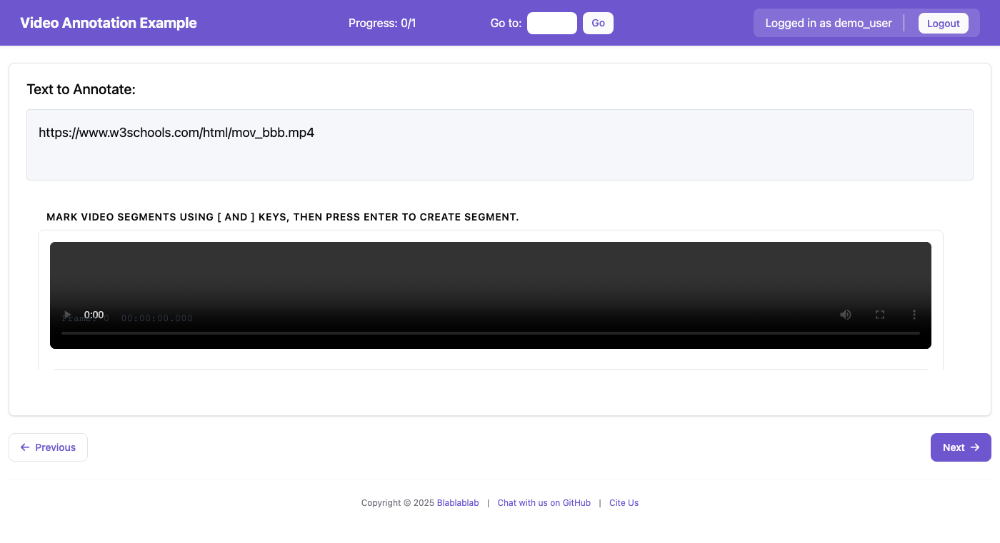
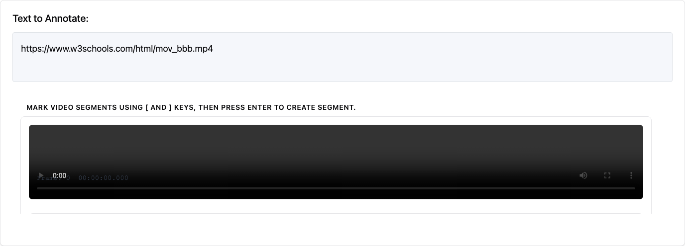

# Video Annotation

The `video_annotation` schema lets annotators mark temporal segments, classify individual frames, and attach notes to keyframes.

> **New in v2.0**: Video annotation with frame-level precision, timeline visualization, and keyboard-driven workflow.

## Overview

The schema covers:

- **Temporal Segment Marking**: Mark start and end points to create labeled segments
- **Frame-by-Frame Navigation**: Step through video frame by frame for precise annotations
- **Frame Classification**: Classify individual frames with labels
- **Keyframe Annotation**: Mark important keyframes with notes
- **Timeline Visualization**: Visual representation of annotations using Peaks.js
- **Keyboard Shortcuts**: Efficient annotation workflow with keyboard controls


*The video annotation interface showing the video player, toolbar, timeline, and annotation list*

## Quick Start

### Example Configuration

```yaml
annotation_schemes:
  - annotation_type: video_annotation
    name: video_segments
    description: "Watch the video and mark segments for different content types."
    mode: segment
    labels:
      - name: intro
        color: "#4ECDC4"
        key_value: "1"
      - name: main_content
        color: "#FF6B6B"
        key_value: "2"
      - name: outro
        color: "#95A5A6"
        key_value: "3"
    min_segments: 1
    timeline_height: 70
    playback_rate_control: true
    frame_stepping: true
    show_timecode: true
    video_fps: 30
```

### Sample Data Format

```json
[
    {
        "id": "video_001",
        "video_url": "https://example.com/video.mp4",
        "title": "Sample Video",
        "description": "A sample video for annotation"
    }
]
```

### Running the Example

```bash
python potato/flask_server.py start examples/video/video-frame-annotation/config.yaml -p 8000
```

Then open http://localhost:8000 in your browser.

## Configuration Options

### Required Fields

| Field | Type | Description |
|-------|------|-------------|
| `name` | string | Unique identifier for the annotation scheme |
| `description` | string | Description displayed to annotators |
| `labels` | array | List of labels for segments/frames/keyframes |

### Optional Fields

| Field | Type | Default | Description |
|-------|------|---------|-------------|
| `mode` | string | `"segment"` | Annotation mode (see Annotation Modes) |
| `min_segments` | integer | `0` | Fewest segments the annotator must mark. Blocks Next until they have, and says how many are still missing. Needs `label_requirement.required: true` to take effect. |
| `max_segments` | integer | `null` | Maximum allowed segments (null = unlimited) |
| `timeline_height` | integer | `70` | Height of timeline in pixels |
| `overview_height` | integer | `40` | Height of overview bar in pixels |
| `zoom_enabled` | boolean | `true` | Enable timeline zoom controls |
| `playback_rate_control` | boolean | `true` | Show playback speed selector |
| `frame_stepping` | boolean | `true` | Enable frame-by-frame navigation |
| `show_timecode` | boolean | `true` | Display frame number and timecode |
| `video_fps` | number | `30` | Video frames per second for frame calculations |

### Label Configuration

Labels can be defined as simple strings or detailed objects:

```yaml
# Simple labels (colors auto-assigned)
labels:
  - intro
  - content
  - outro

# Detailed labels
labels:
  - name: intro
    color: "#4ECDC4"
    key_value: "1"  # Keyboard shortcut
  - name: content
    color: "#FF6B6B"
    key_value: "2"
```

## Annotation Modes

### Segment Mode (`segment`)

The default mode for marking temporal segments in the video.

- Use `[` to mark segment start
- Use `]` to mark segment end
- Use `Enter` to create the segment
- Select a label before creating the segment

### Frame Mode (`frame`)

For classifying individual frames.

- Use `,` and `.` to step through frames
- Use `C` or the "Classify Frame" button to classify the current frame
- Select a label before classifying

### Keyframe Mode (`keyframe`)

For marking important moments in the video.

- Use `K` to mark the current position as a keyframe
- Keyframes can have labels and optional notes

### Tracking Mode (`tracking`)

For object tracking across video frames with keyframe-based bounding box annotation.

**Features:**
- Canvas overlay for drawing directly on the video
- Track multiple objects across frames with color-coded labels
- **Boxes and polygons** both interpolate between keyframes; masks are held
- Keyframe-based workflow: annotate key positions and let the system fill in

**Tracking-Specific Options:**

| Field | Type | Default | Description |
|-------|------|---------|-------------|
| `tracking_options.interpolation` | string | `"linear"` | Interpolation method between keyframes |
| `tracking_options.auto_advance_frames` | integer | `5` | Frames to auto-advance after placing keyframe |

**Model-assisted tracking**

Draw the object once, press **Track forward**, and SAM 2 follows it through the
frames that follow. Each result arrives as a keyframe you can scrub through and
correct.

```bash
potato download-models sam2_video_tiny   # 181 MB, once per install
```

The model keeps a memory of what the object looked like on earlier frames and
conditions each new frame on it, so it can lose an object behind an occluder and
pick it up again on the other side. It also decides for itself when the object
is hidden, and hands back an empty frame when it is. That is the answer you want
while correcting: a guessed mask on an occluded frame is work to undo.

Measured on a moving object against known ground truth: per-frame IoU of 0.974
to 0.979 across the sequence, with no decay from the first frame to the last.
Roughly 1.3 seconds per frame on a CPU; considerably faster on a GPU.

Segmentation and text prompting run in the browser; this one runs on the
server. You pay the cost once per frame instead of once per prompt, the model is
five graphs, and the video file is already sitting on the server. A hundred
frames in the browser would be minutes of a frozen tab. A run is capped at 120
frames by default, and says so when it stops early.

| Field | Type | Default | Description |
|-------|------|---------|-------------|
| `propagation.max_frames` | integer | `120` | Upper bound on one request |

**Interpolation Methods:**
- `linear` - Linear interpolation between keyframes (smooth movement)
- `cubic` - Cubic/smooth interpolation (natural motion curves)
- `constant` - Constant/hold interpolation (box stays in place until next keyframe)

**Shape kinds**

A track is not always a box.

| Kind | Between keyframes |
|---|---|
| Box | Interpolated, by the method above |
| Polygon | Interpolated by **arc-length resampling** (see below) |
| Mask | **Held** from the nearest keyframe, and marked as held |

Polygon tracks cannot simply interpolate vertex-to-vertex. Two outlines of the
same object rarely have the same vertex count, and even when they do, an
annotator who starts tracing at the nose on one frame and the tail on the next
produces two correct outlines whose vertices correspond to nothing —
interpolating them pairwise turns the shape inside out halfway between
keyframes. Potato resamples both outlines to equal fractions of their perimeter
and rotates the second to the offset that best matches the first, so differing
vertex counts and start points both work.

Masks are **not** blended. Averaging two rasters produces a shape that is
neither — ghost regions where the object was and where it will be, with holes
between. Potato holds the nearest keyframe and draws a hollow circle marker on
held frames, so an annotator can always tell a frame somebody drew from a frame
nobody did.

**Tracking Workflow:**
1. Press `t` (or click **+ Track**) to create a new object track
2. Draw a shape on the video at the current frame
3. Advance to another frame using frame stepping (`,` and `.`)
4. Draw the same object again
5. The system interpolates between the keyframes
6. Scrub with `<` and `>` to jump between this track's keyframes
7. Press `Ctrl/Cmd+K` on any interpolated frame to pin it as a real keyframe

**Tracking keyboard shortcuts**

| Key | Action |
|---|---|
| `t` | New track |
| `,` / `.` | Step one frame back / forward |
| `<` / `>` (Shift+`,` / Shift+`.`) | Previous / next **keyframe** of the active track |
| `Ctrl/Cmd+K` | Pin the current interpolated shape as a keyframe |
| `Delete` / `Backspace` | Delete the selected keyframe |
| `Escape` | Deselect |

`,` and `.` step frames; the shifted pair jumps keyframes. This mirrors video
editors, where `,`/`.` are frames and `<`/`>` are markers — and it keeps the two
handlers from firing on the same press.

**Example Configuration:**

```yaml
annotation_schemes:
  - annotation_type: video_annotation
    name: object_tracking
    description: "Track objects across video frames"
    source_field: video_url
    mode: tracking
    labels:
      - name: person
        color: "#FF6B6B"
      - name: vehicle
        color: "#4ECDC4"
      - name: object
        color: "#45B7D1"
    tracking_options:
      interpolation: linear
      auto_advance_frames: 5
    video_fps: 30
    show_timecode: true
    frame_stepping: true
```

**Tracking Keyboard Shortcuts:**

| Key | Action |
|-----|--------|
| `T` | Create new track |
| `,` | Step back one frame |
| `.` | Step forward one frame |
| `Delete` | Delete selected keyframe |

**Tracking Output Format:**

```json
{
    "tracks": {
        "track_1": {
            "id": "track_1",
            "label": "person",
            "color": "#FF6B6B",
            "interpolation": "linear",
            "startFrame": 0,
            "endFrame": 150,
            "keyframes": {
                "0": {
                    "frame": 0,
                    "time": 0.0,
                    "bbox": {"x": 100, "y": 50, "width": 80, "height": 160}
                },
                "30": {
                    "frame": 30,
                    "time": 1.0,
                    "bbox": {"x": 150, "y": 60, "width": 85, "height": 165}
                }
            }
        }
    }
}
```

### Combined Mode (`combined`)

Enables all annotation types in one interface.

- Segment, frame, and keyframe controls all available
- Useful when a video needs both segment and frame-level labels

## Showing and Hiding Classes

A timeline of stacked segments becomes unreadable in the same way a densely
boxed image does, so video shares the per-class show/hide used by
[image annotation](image_annotation.md#showing-and-hiding-classes). Each label
in the toolbar carries an eye toggle; hiding a class removes its segments from
the timeline and the annotation list.

- Hiding is **presentation only** — hidden segments are still saved and exported.
- The state persists per project and schema, so a class stays hidden as the
  annotator moves between items.

Nothing needs to be configured; the toggles appear automatically.

## Keyboard Shortcuts

| Key | Action |
|-----|--------|
| `Space` | Play/Pause video |
| `Left/Right` | Seek 5 seconds backward/forward |
| `,` | Previous frame (when frame_stepping enabled) |
| `.` | Next frame (when frame_stepping enabled) |
| `[` | Set segment start |
| `]` | Set segment end |
| `Enter` | Create segment |
| `K` | Mark keyframe (keyframe/combined mode) |
| `C` | Classify current frame (frame/combined mode) |
| `Delete` | Delete selected annotation |
| `+` | Zoom in on timeline |
| `-` | Zoom out on timeline |
| `0` | Fit timeline to view |
| `1-9` | Select label (if key_value defined) |

## Annotation Output Format

Annotations are saved in JSON format:

```json
{
    "video_metadata": {
        "duration": 120.5,
        "fps": 30,
        "width": 1920,
        "height": 1080
    },
    "segments": [
        {
            "id": "segment_1",
            "start_time": 0.0,
            "end_time": 10.5,
            "start_frame": 0,
            "end_frame": 315,
            "label": "intro"
        },
        {
            "id": "segment_2",
            "start_time": 10.5,
            "end_time": 95.0,
            "start_frame": 315,
            "end_frame": 2850,
            "label": "main_content"
        }
    ],
    "frame_annotations": {
        "450": {
            "frame": 450,
            "time": 15.0,
            "label": "scene_change"
        }
    },
    "keyframes": [
        {
            "id": "kf_1",
            "frame": 900,
            "time": 30.0,
            "label": "important_moment",
            "note": "Key dialogue"
        }
    ],
    "tracking": {}
}
```

## User Interface


*Close-up of the annotation controls and timeline*

### Video Preview Panel

The top section displays the video with:
- Standard video controls (provided by browser)
- Frame number and timecode overlay (when `show_timecode: true`)
- Tracking canvas overlay (when in tracking mode)

### Toolbar

Below the video, the toolbar contains:
- **Playback controls**: Play/Pause, Stop buttons
- **Frame stepping**: Previous/Next frame buttons
- **Speed control**: Dropdown to select playback rate (0.1x to 2x)
- **Label selector**: Buttons to select the active label
- **Mode controls**: Mark Keyframe, Classify Frame buttons (based on mode)
- **Zoom controls**: Zoom In, Zoom Out, Fit buttons
- **Segment controls**: Set Start, Set End, Create Segment, Delete buttons
- **Annotation count**: Shows number of segments created

### Timeline

The timeline uses Peaks.js to display:
- Visual waveform of the video's audio track
- Colored segments representing annotations
- Current playback position
- Selection markers for segment start/end

Below the zoomed timeline is an **overview** bar showing the whole clip.

### Creating Segments by Dragging

In addition to the `[` / `]` / `+ Segment` buttons and keyboard shortcuts, you can
draw segments directly on the timeline:

- **Timeline (zoomed view)** — **right-click and drag** to draw a segment. If the
  drag reaches an edge, the view **auto-scrolls** so the segment can extend past the
  visible window in one gesture.
- **Overview** — **right-click and drag** to draw a coarse segment anywhere across
  the whole video, even outside the current zoom window.

**Left-click** still seeks the playhead, and Peaks' native drag/resize still edits
existing segment markers.

> **Note:** The timeline requires the video to have a decodable audio track for the
> waveform. If Peaks.js can't initialize, the player still works and segments can be
> created with the buttons/keyboard.

### Annotation List

A scrollable list showing all annotations:
- Color-coded by label
- Shows time range for segments
- Click to select/seek to annotation
- Delete button on each annotation

## Tips for Annotators

1. **Watch First**: Watch the video through once before annotating to understand the content
2. **Use Keyboard Shortcuts**: They're much faster than clicking buttons
3. **Select Label First**: Always select your label before marking segment boundaries
4. **Use Frame Stepping**: For precise boundaries, use `,` and `.` to find exact frames
5. **Slow Playback**: Use 0.5x or 0.25x speed for detailed annotation
6. **Timeline Navigation**: Click on the timeline to seek to specific positions
7. **Zoom In**: Use zoom for precise segment boundaries on longer videos

## Dependencies

The video annotation feature uses:
- **Peaks.js**: For timeline visualization (loaded from CDN)
- **HTML5 Video**: Standard browser video element

No additional server-side dependencies are required. The waveform for the timeline is generated from the video's audio track using the existing WaveformService (if audiowaveform is installed).

## Troubleshooting

### Video Not Loading

1. Check that the video URL is accessible
2. Ensure the video format is supported by the browser (MP4 with H.264 is most compatible)
3. Check browser console for CORS errors if loading from external URLs

### Timeline Not Showing

1. The timeline requires the video to be fully loaded
2. Waveform generation requires audiowaveform to be installed (falls back to basic timeline if not available)

### Frame Numbers Incorrect

1. Verify the `video_fps` setting matches your video's actual frame rate
2. Frame counts are estimates based on FPS and time position

### Segments Not Saving

1. Ensure you have at least `min_segments` segments created. With
   `label_requirement.required: true` the widget says how many are still
   missing ("1 of 2 segments marked") and blocks Next; without it, neither
   `min_segments` nor an unlabelled segment stops anyone.
2. Check browser console for any JavaScript errors
3. Verify the annotation scheme name matches expectations

## Common Use Cases

### 1. Video Content Classification

Segment videos into content types (intro, main content, ads, credits):

```yaml
annotation_schemes:
  - annotation_type: video_annotation
    name: content_segments
    mode: segment
    labels:
      - name: intro
        color: "#4ECDC4"
      - name: main_content
        color: "#FF6B6B"
      - name: advertisement
        color: "#FFD93D"
      - name: credits
        color: "#95A5A6"
    min_segments: 2
```

### 2. Action Recognition / Event Detection

Mark specific events or actions in sports, surveillance, or activity videos:

```yaml
annotation_schemes:
  - annotation_type: video_annotation
    name: actions
    mode: keyframe
    labels:
      - name: goal_scored
        key_value: "g"
      - name: foul
        key_value: "f"
      - name: substitution
        key_value: "s"
    show_timecode: true
    frame_stepping: true
```

### 3. Scene Change Detection

Mark frame-level scene transitions:

```yaml
annotation_schemes:
  - annotation_type: video_annotation
    name: scenes
    mode: frame
    labels:
      - name: scene_change
        color: "#FF6B6B"
      - name: fade_transition
        color: "#4ECDC4"
      - name: cut_transition
        color: "#45B7D1"
    frame_stepping: true
    video_fps: 24
```

### 4. Interview/Dialogue Annotation

Segment speaker turns in interviews or conversations:

```yaml
annotation_schemes:
  - annotation_type: video_annotation
    name: speakers
    mode: segment
    labels:
      - name: speaker_a
        color: "#4ECDC4"
        key_value: "a"
      - name: speaker_b
        color: "#FF6B6B"
        key_value: "b"
      - name: both_speaking
        color: "#9B59B6"
        key_value: "c"
    playback_rate_control: true
```

### 5. Object Tracking

Track objects moving through a video:

```yaml
annotation_schemes:
  - annotation_type: video_annotation
    name: object_tracking
    description: "Track objects across video frames"
    source_field: video_url
    mode: tracking
    labels:
      - name: person
        color: "#FF6B6B"
      - name: animal
        color: "#4ECDC4"
      - name: vehicle
        color: "#45B7D1"
      - name: object
        color: "#96CEB4"
    tracking_options:
      interpolation: linear
      auto_advance_frames: 5
    video_fps: 30
    show_timecode: true
    frame_stepping: true
```

Run the example:

```bash
python potato/flask_server.py start examples/video/video-tracking/config.yaml -p 8000
```

## Comparison with Audio Annotation

| Feature | Video Annotation | Audio Annotation |
|---------|-----------------|------------------|
| Media Type | Video files (.mp4, .webm) | Audio files (.mp3, .wav) |
| Timeline | Peaks.js waveform | Peaks.js waveform |
| Frame Navigation | Yes (`,` and `.` keys) | N/A |
| Timecode Display | Frame + time | Time only |
| Segment Marking | `[` and `]` keys | `[` and `]` keys |
| Playback Control | 0.1x to 2x speed | 0.1x to 2x speed |

Both use Peaks.js for timeline visualization, so the annotation workflow is similar. Choose video annotation when you need:
- Frame-level precision
- Visual context for annotations
- Scene/object-based labeling

## API Endpoints

The video annotation schema uses these API endpoints:

| Endpoint | Method | Description |
|----------|--------|-------------|
| `/api/video/metadata` | POST | Get video metadata (duration, FPS, resolution) |
| `/api/video/waveform/generate` | POST | Generate waveform from video's audio track |

## Browser Compatibility

Video annotation works best with modern browsers:

| Browser | Status | Notes |
|---------|--------|-------|
| Chrome 80+ | ✓ Full support | Recommended |
| Firefox 75+ | ✓ Full support | |
| Safari 13+ | ✓ Full support | |
| Edge 80+ | ✓ Full support | |

### Video Format Support

For maximum compatibility, use:
- **Format**: MP4 container
- **Video codec**: H.264
- **Audio codec**: AAC

## Annotating video with a transcript

Video temporal annotation works on the timeline. If your video also has subtitles
or a transcript — downloaded captions, or ASR run over the audio track — you can
annotate the speech alongside it.

Potato reads WebVTT, SubRip, SubStation Alpha, TTML, and YouTube's `json3` /
`srv1`-`srv3` caption formats, plus ASR output from Whisper and the major cloud
providers. Subtitles pulled with `yt-dlp` work directly:

```bash
yt-dlp --write-auto-subs --sub-langs en --sub-format vtt --skip-download <URL>
potato transcripts ./captions --media-url-prefix https://cdn.example.org/video \
  -o data/clips.json
```

A caveat worth knowing before you design a scheme: auto-generated captions have
no punctuation and no speaker labels, and their cue boundaries fall wherever the
caption window filled up rather than at sentence ends. Sentence-level annotation
over auto-captions is guesswork.

See [Working with Transcripts](../../guides/working_with_transcripts.md) and
[Transcript Format Support](transcript_formats.md).

## See Also

- [Audio Annotation](audio_annotation.md) - Similar annotation for audio files
- [Working with Transcripts](../../guides/working_with_transcripts.md) - Subtitles and ASR output
- [Transcript Format Support](transcript_formats.md) - Every supported transcript format
- [Schemas and Templates](../schemas_and_templates.md) - All annotation types
- [Keyboard Shortcuts](../../administration/productivity.md#keyboard-shortcuts) - Productivity features
