# Annotation Schemas and Templates

`potato` supports multiple annotation schema types that can be configured in the `"annotation_schemes"` field of your YAML configuration file. Each schema defines how annotators interact with your data and what types of responses they can provide.

## Screenshot Gallery

Below are examples of the different annotation schema types available in Potato:

| Radio Buttons | Checkbox / Multi-select | Likert Scale |
|:---:|:---:|:---:|
| 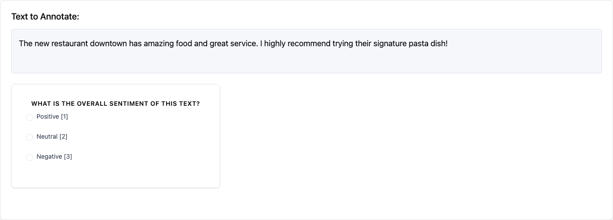 | 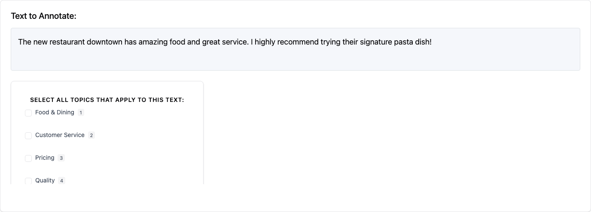 | 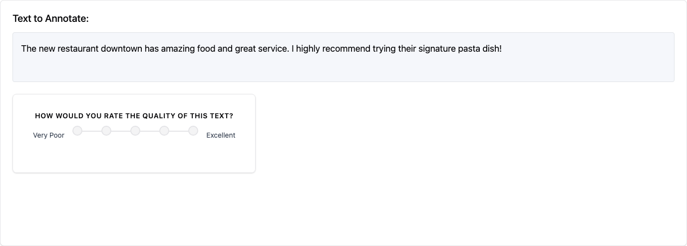 |

| Slider | Text Input | Span Annotation |
|:---:|:---:|:---:|
| 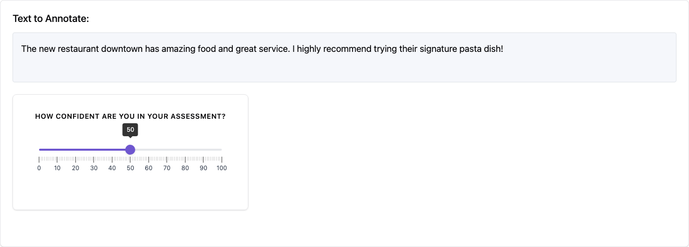 | 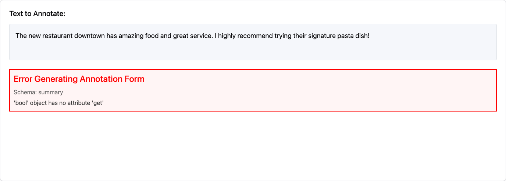 | 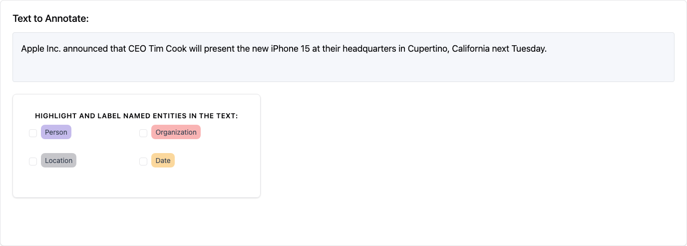 |

| Multi-rate Matrix | Pairwise Comparison | Best-Worst Scaling |
|:---:|:---:|:---:|
| 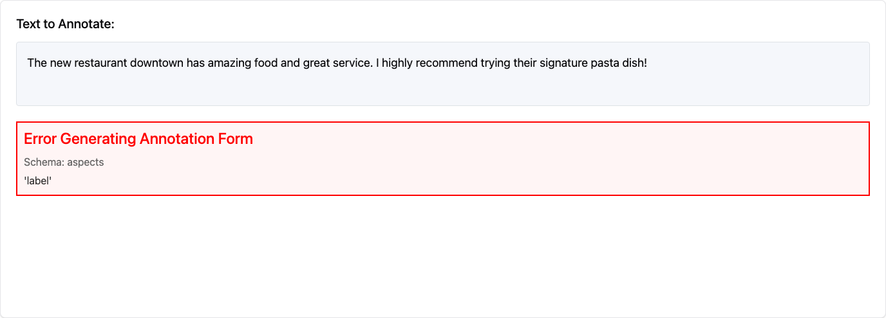 | 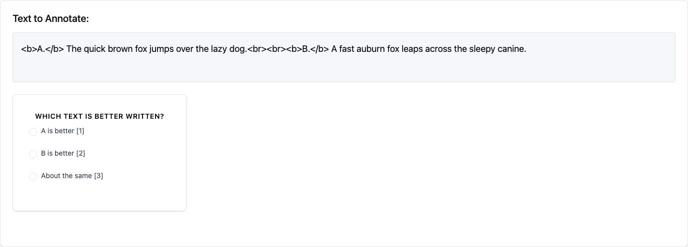 | 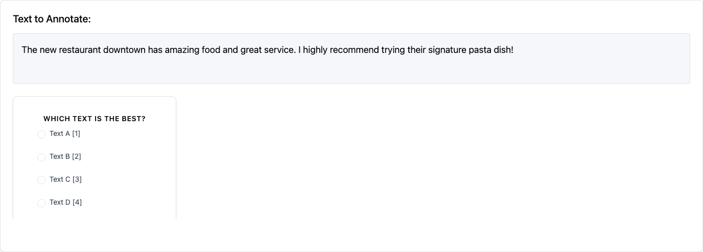 |

| Image Annotation | Audio Annotation | Video Annotation |
|:---:|:---:|:---:|
| 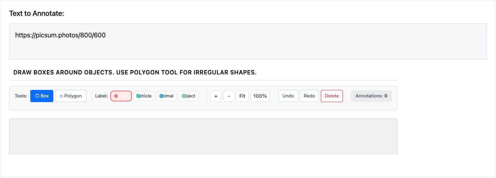 | 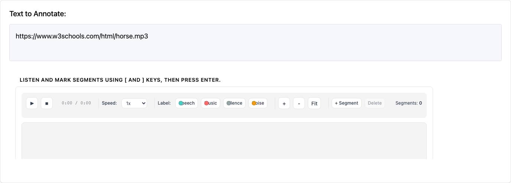 | 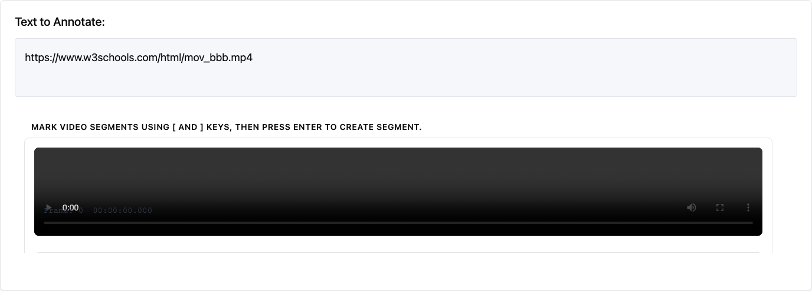 |

| Triage | Coreference | Conversation Tree |
|:---:|:---:|:---:|
|  |  |  |

| Soft Label | Constant Sum | Semantic Differential |
|:---:|:---:|:---:|
| Probability distribution sliders | Points allocation across categories | Bipolar adjective rating scales |

| Ranking | Range Slider | Hierarchical Multiselect |
|:---:|:---:|:---:|
| Drag-and-drop reordering | Dual-thumb min-max range | Tree taxonomy with checkboxes |

## Core Schema Structure

All annotation schemas share these **required fields**:

- **`annotation_type`** (string): The type of annotation interface to use
- **`name`** (string): Unique identifier for this schema, used in results reporting
- **`description`** (string): Text displayed to annotators explaining what to do

Additional fields are specific to each annotation type and may be required or optional.

## Supported Annotation Types

### 1. Single Choice (`radio`)

Allows annotators to select exactly one option from a predefined list.

**Required Fields:**
- `labels` (list): Array of option labels to choose from

**Optional Fields:**
- `sequential_key_binding` (boolean): Enable keyboard shortcuts (1, 2, 3...)
- `horizontal` (boolean): Display options horizontally

**Example:**
```yaml
annotation_schemes:
  - annotation_type: "radio"
    name: "topic_classification"
    description: "What is the main topic of this text?"
    labels: ["politics", "sports", "technology", "entertainment", "other"]
    sequential_key_binding: true
```

### 2. Likert Scale (`likert`)

Presents a rating scale with defined endpoints.

**Required Fields:**
- `min_label` (string): Text for the lowest rating
- `max_label` (string): Text for the highest rating
- `size` (integer): Number of scale points (minimum 2)

**Optional Fields:**
- `sequential_key_binding` (boolean): Enable keyboard shortcuts (1, 2, 3...)

**Example:**
```yaml
annotation_schemes:
  - annotation_type: "likert"
    name: "quality_rating"
    description: "How would you rate the quality of this text?"
    min_label: "Very Poor"
    max_label: "Excellent"
    size: 5
    sequential_key_binding: true
```

### 3. Multiple Choice (`multiselect`)

Allows annotators to select multiple options from a predefined list.

**Required Fields:**
- `labels` (list): Array of option labels to choose from

**Optional Fields:**
- `sequential_key_binding` (boolean): Enable keyboard shortcuts (1, 2, 3...)
- `single_select` (boolean): Force single selection only (default: false)
- `horizontal` (boolean): Display options horizontally
- `has_free_response` (boolean): Add optional text input field
- `video_as_label` (boolean): Use video files as labels
- `label_requirement` (object): Set completion requirements

**Example:**
```yaml
annotation_schemes:
  - annotation_type: "multiselect"
    name: "sentiment_analysis"
    description: "Select all emotions expressed in this text"
    labels: ["happy", "sad", "angry", "surprised", "neutral"]
    sequential_key_binding: true
    horizontal: true
```

**Video Labels Example:**
```yaml
annotation_schemes:
  - annotation_type: "multiselect"
    name: "gif_appropriateness"
    description: "Select all appropriate GIF replies"
    video_as_label: true
    labels:
      - name: "{{instance_obj.gifs[0]}}"
        videopath: "/files/{{instance_obj.gifs_path[0]}}"
      - name: "{{instance_obj.gifs[1]}}"
        videopath: "/files/{{instance_obj.gifs_path[1]}}"
    sequential_key_binding: true
```

### 4. Text Span Selection (`span`)

Allows annotators to highlight and label specific text spans.

**Required Fields:**
- `labels` (list): Array of label categories for spans

**Optional Fields:**
- `sequential_key_binding` (boolean): Enable keyboard shortcuts
- `bad_text_label` (object): Option for marking text as unannotatable
  - `label_content` (string): Text for the "bad text" option

**Example:**
```yaml
annotation_schemes:
  - annotation_type: "span"
    name: "sentiment_spans"
    description: "Highlight positive and negative phrases"
    labels: ["positive", "negative", "neutral"]
    sequential_key_binding: true
    bad_text_label:
      label_content: "No answer"
```

### 5. Slider (`slider`)

Provides a continuous range for numerical ratings.

**Required Fields:**
- `min` (number): Minimum value
- `max` (number): Maximum value

**Optional Fields:**
- `step` (number): Increment size (default: 1)
- `default` (number): Default position

**Example:**
```yaml
annotation_schemes:
  - annotation_type: "slider"
    name: "confidence_score"
    description: "How confident are you in your assessment?"
    min: 0
    max: 100
    step: 5
    default: 50
```

### 6. Text Input (`text`)

Allows free-form text responses.

**Required Fields:**
None beyond the core fields

**Optional Fields:**
- `labels` (list): Multiple text input fields with labels
- `textarea` (object): Configure multi-line input
  - `on` (boolean): Enable textarea mode
  - `rows` (integer): Number of rows
  - `cols` (integer): Number of columns
- `allow_paste` (boolean): Allow pasting (default: true)

**Example:**
```yaml
annotation_schemes:
  - annotation_type: "text"
    name: "explanation"
    description: "Please explain your reasoning"
    textarea:
      on: true
      rows: 4
      cols: 50
    allow_paste: false
```

**Multiple Text Fields Example:**
```yaml
annotation_schemes:
  - annotation_type: "text"
    name: "feedback"
    description: "Provide feedback on different aspects"
    labels: ["What worked well?", "What could be improved?", "Additional comments"]
```

### 7. Multi-rate (`multirate`)

Presents a matrix where multiple options are rated on the same scale.

**Required Fields:**
- `options` (list): Items to be rated
- `labels` (list): Rating scale labels

**Optional Fields:**
- `display_config` (object): Layout configuration
  - `num_columns` (integer): Number of columns in the matrix
- `arrangement` (string): "vertical" or "horizontal"
- `label_requirement` (object): Set completion requirements
  - `required` (boolean): Force completion of all ratings
- `option_randomization` (boolean): Randomize option order
- `sequential_key_binding` (boolean): Enable keyboard shortcuts

**Example:**
```yaml
annotation_schemes:
  - annotation_type: "multirate"
    name: "aspect_ratings"
    description: "Rate each aspect of the product"
    options: ["Quality", "Price", "Design", "Functionality"]
    labels: ["Poor", "Fair", "Good", "Very Good", "Excellent"]
    display_config:
      num_columns: 2
    arrangement: "vertical"
    label_requirement:
      required: true
    option_randomization: true
```

### 8. Number Input (`number`)

Allows numerical input with optional constraints.

**Required Fields:**
None beyond the core fields

**Optional Fields:**
- `min` (number): Minimum allowed value
- `max` (number): Maximum allowed value
- `step` (number): Increment size

**Example:**
```yaml
annotation_schemes:
  - annotation_type: "number"
    name: "age"
    description: "What is your age?"
    min: 18
    max: 100
```

### 9. Image Annotation (`image_annotation`)

Allows annotators to draw bounding boxes, polygons, and place landmarks on images.

**Required Fields:**
- `labels` (list): Array of label categories for annotations

**Optional Fields:**
- `annotation_mode` (string): Drawing mode - "bbox", "polygon", or "landmark"
- `allow_multiple` (boolean): Allow multiple annotations per image

**Example:**
```yaml
annotation_schemes:
  - annotation_type: "image_annotation"
    name: "object_detection"
    description: "Draw boxes around all vehicles"
    labels: ["car", "truck", "motorcycle", "bicycle"]
    annotation_mode: "bbox"
```

See [Image Annotation](multimedia/image_annotation.md) for detailed documentation.

### 10. Audio Annotation (`audio_annotation`)

Allows annotators to segment and label audio files using waveform visualization.

**Required Fields:**
- `labels` (list): Array of label categories for audio segments

**Optional Fields:**
- `show_waveform` (boolean): Display waveform visualization (default: true)
- `allow_overlapping` (boolean): Allow overlapping segments

**Example:**
```yaml
annotation_schemes:
  - annotation_type: "audio_annotation"
    name: "speaker_diarization"
    description: "Label who is speaking in each segment"
    labels: ["Speaker A", "Speaker B", "Overlap", "Silence"]
```

See [Audio Annotation](multimedia/audio_annotation.md) for detailed documentation.

### 11. Video Annotation (`video_annotation`)

Allows frame-by-frame labeling of video content with playback controls.

**Required Fields:**
- `labels` (list): Array of label categories

**Optional Fields:**
- `annotation_mode` (string): "frame" for frame-by-frame, "segment" for time segments
- `frame_step` (number): Frame advance increment

**Example:**
```yaml
annotation_schemes:
  - annotation_type: "video_annotation"
    name: "action_recognition"
    description: "Label the action being performed"
    labels: ["walking", "running", "sitting", "standing"]
    annotation_mode: "frame"
```

See [Video Annotation](multimedia/video_annotation.md) for detailed documentation.

### 12. Triage (`triage`)

Prodigy-style binary accept/reject/skip interface for rapid data curation tasks.

**Required Fields:**
None beyond the core fields

**Optional Fields:**
- `accept_label` (string): Label for accept button (default: "Keep")
- `reject_label` (string): Label for reject button (default: "Discard")
- `skip_label` (string): Label for skip button (default: "Unsure")
- `auto_advance` (boolean): Auto-advance to next item (default: true)
- `show_progress` (boolean): Show progress bar (default: true)
- `accept_key` (string): Keyboard shortcut for accept (default: "1")
- `reject_key` (string): Keyboard shortcut for reject (default: "2")
- `skip_key` (string): Keyboard shortcut for skip (default: "3")

**Example:**
```yaml
annotation_schemes:
  - annotation_type: "triage"
    name: "data_quality"
    description: "Is this data sample suitable for training?"
    auto_advance: true
    show_progress: true
```

See [Triage](triage.md) for detailed documentation.

### 13. Coreference Chains (`coreference`)

Groups text spans that refer to the same entity into coreference chains.

**Required Fields:**
- `span_schema` (string): Name of the span schema providing mentions

**Optional Fields:**
- `entity_types` (list): Entity type categories for classification
- `allow_singletons` (boolean): Allow single-mention chains (default: true)
- `visual_display.highlight_mode` (string): Display style - "background", "bracket", or "underline"

**Example:**
```yaml
annotation_schemes:
  - annotation_type: "span"
    name: "mentions"
    description: "Highlight entity mentions"
    labels: ["MENTION"]

  - annotation_type: "coreference"
    name: "entity_chains"
    description: "Group mentions of the same entity"
    span_schema: "mentions"
    entity_types: ["PERSON", "ORGANIZATION", "LOCATION"]
```

See [Coreference Annotation](text/coreference_annotation.md) for detailed documentation.

### 14. Conversation Tree (`tree_annotation`)

Enables annotation of hierarchical conversation structures with per-node rating and path selection.

**Required Fields:**
None beyond the core fields

**Optional Fields:**
- `node_scheme` (object): Annotation scheme for individual nodes
- `path_selection.enabled` (boolean): Enable path selection
- `path_selection.description` (string): Path selection instructions
- `branch_comparison.enabled` (boolean): Enable branch comparison mode

**Example:**
```yaml
annotation_schemes:
  - annotation_type: "tree_annotation"
    name: "response_eval"
    description: "Evaluate conversation responses"
    node_scheme:
      annotation_type: "likert"
      min_label: "Poor"
      max_label: "Excellent"
      size: 5
    path_selection:
      enabled: true
      description: "Select the best conversation path"
```

See [Conversation Tree Annotation](structured/conversation_tree_annotation.md) for detailed documentation.

### 15. Tiered Annotation (`tiered_annotation`)

ELAN-style hierarchical multi-tier annotation for audio and video content. Supports parent-child relationships between tiers with various constraint types.

**Required Fields:**
- `source_field` (string): Field name containing media URL
- `tiers` (list): List of tier definitions

**Optional Fields:**
- `media_type` (string): "audio" or "video" (default: "audio")
- `tier_height` (integer): Height per tier row in pixels (default: 50)
- `show_tier_labels` (boolean): Show tier name labels (default: true)
- `collapsed_tiers` (list): Tier names to start collapsed
- `zoom_enabled` (boolean): Enable zoom controls (default: true)
- `playback_rate_control` (boolean): Show playback speed controls (default: true)

**Tier Definition:**
- `name` (string): Tier identifier
- `tier_type` (string): "independent" or "dependent"
- `parent_tier` (string): Parent tier name (for dependent tiers)
- `constraint_type` (string): "time_subdivision", "included_in", "symbolic_association", or "symbolic_subdivision"
- `labels` (list): Available annotation labels with name and color

**Example:**
```yaml
annotation_schemes:
  - annotation_type: "tiered_annotation"
    name: "linguistic_tiers"
    description: "Annotate speech with hierarchical tiers"
    source_field: audio_url
    media_type: audio
    tiers:
      - name: utterance
        tier_type: independent
        labels:
          - name: Speaker_A
            color: "#4ECDC4"
          - name: Speaker_B
            color: "#FF6B6B"
      - name: word
        tier_type: dependent
        parent_tier: utterance
        constraint_type: time_subdivision
        labels:
          - name: Word
            color: "#95E1D3"
```

See [Tiered Annotation](multimedia/tiered_annotation.md) for detailed documentation.

### 16. Visual Analog Scale (`vas`)

A continuous line scale with no tick marks or discrete bins. Returns a precise float value. Psychophysically superior to Likert scales for fine-grained judgments.

```yaml
annotation_schemes:
  - annotation_type: vas
    name: pain_level
    description: "Rate the intensity of pain described"
    left_label: "No pain"
    right_label: "Worst imaginable"
    min_value: 0
    max_value: 100
    show_value: false
```

See [Visual Analog Scale](measurement/vas.md) for detailed documentation.

### 17. Extractive QA (`extractive_qa`)

SQuAD-style question answering — display a question, annotator highlights the answer span in the passage.

```yaml
annotation_schemes:
  - annotation_type: extractive_qa
    name: answer_span
    description: "Highlight the answer in the passage"
    question_field: "question"
    allow_unanswerable: true
```

See [Extractive QA](text/extractive_qa.md) for detailed documentation.

### 18. Rubric Evaluation (`rubric_eval`)

Multi-criteria rating grid for LLM evaluation. Rate items on multiple criteria simultaneously.

```yaml
annotation_schemes:
  - annotation_type: rubric_eval
    name: quality
    description: "Evaluate response quality"
    scale_points: 5
    criteria:
      - name: helpfulness
        description: "Does it answer the question?"
      - name: accuracy
        description: "Is the information correct?"
    show_overall: true
```

See [Rubric Evaluation](measurement/rubric_eval.md) for detailed documentation.

### 19. Text Edit / Post-Edit (`text_edit`)

Inline text editing with real-time diff visualization and edit distance tracking.

```yaml
annotation_schemes:
  - annotation_type: text_edit
    name: post_edit
    description: "Correct the machine translation"
    source_field: "mt_output"
    show_diff: true
    show_edit_distance: true
```

See [Text Edit](text/text_edit.md) for detailed documentation.

### 20. Error Span with Typed Severity (`error_span`)

MQM-style error annotation — mark error spans with configurable error types, severity levels, and quality scoring.

```yaml
annotation_schemes:
  - annotation_type: error_span
    name: translation_quality
    description: "Mark errors in the translation"
    error_types:
      - name: Accuracy
        subtypes: ["Omission", "Mistranslation"]
      - name: Fluency
        subtypes: ["Grammar", "Spelling"]
    show_score: true
```

See [Error Span](text/error_span.md) for detailed documentation.

### 21. Card Sorting (`card_sort`)

Drag-and-drop grouping of items into predefined or user-created categories.

```yaml
annotation_schemes:
  - annotation_type: card_sort
    name: topic_groups
    description: "Sort items into topic groups"
    mode: closed
    groups: ["Science", "Politics", "Sports"]
    items_field: "items"
```

See [Card Sorting](structured/card_sort.md) for detailed documentation.

### 22. Conjoint Analysis (`conjoint`)

Discrete choice between multi-attribute profile cards for preference elicitation and attribute importance estimation.

```yaml
annotation_schemes:
  - annotation_type: conjoint
    name: preference
    description: "Which option do you prefer?"
    profiles_per_set: 3
    attributes:
      - name: Speed
        levels: ["Fast", "Medium", "Slow"]
      - name: Price
        levels: ["$10", "$20", "$50"]
    show_none_option: true
```

See [Conjoint Analysis](comparison/conjoint.md) for detailed documentation.

### 23. Process Reward (`process_reward`)

Binary per-step correctness signals for Process Reward Model (PRM) training. Two modes: `first_error` (click first wrong step, rest auto-marked) and `per_step` (annotate each independently).

```yaml
  - annotation_type: process_reward
    name: step_rewards
    description: "Mark the first incorrect step"
    steps_key: structured_turns
    mode: first_error
```

See [Coding Agent Annotation](../agent-evaluation/coding_agent_annotation.md) for detailed documentation.

### 24. Code Review (`code_review`)

GitHub PR review-style annotation with inline diff comments, file-level ratings, and overall verdict. Click on diff lines in the `coding_trace` display to add comments.

```yaml
  - annotation_type: code_review
    name: review
    description: "Review the code changes"
    comment_categories: [bug, style, suggestion, security]
    verdict_options: [approve, request_changes, comment_only]
    file_rating_dimensions: [correctness, quality]
```

See [Coding Agent Annotation](../agent-evaluation/coding_agent_annotation.md) for detailed documentation.

### 25. Dropdown Selection (`select`)

A dropdown menu for selecting a single option from a predefined list. Supports predefined datasets (country, ethnicity, religion).

**Required Fields:**
- `labels` (list): Array of option labels

**Optional Fields:**
- `use_predefined_labels` (string): Use built-in label sets - "country", "ethnicity", or "religion"

**Example:**
```yaml
annotation_schemes:
  - annotation_type: "select"
    name: "genre"
    description: "Select the genre of this text"
    labels: ["news", "opinion", "review", "social_media"]
```

### 26. Span Linking (`span_link`)

Creates typed relationships between previously annotated spans. Works with a span annotation schema to add directed or undirected links with visual arc rendering.

**Required Fields:**
- `span_schema` (string): Name of the span schema to link from
- `link_types` (list): Link type definitions with `name` and optional constraints

**Optional Fields:**
- `link_types[].directed` (boolean): Whether link is directed (default: false)
- `link_types[].allowed_source_labels` / `allowed_target_labels` (list): Constrain which span labels can be source/target
- `visual_display` (object): Arc rendering options

**Example:**
```yaml
annotation_schemes:
  - annotation_type: "span_link"
    name: "relations"
    description: "Annotate relationships between entities"
    span_schema: "entities"
    link_types:
      - name: "WORKS_FOR"
        directed: true
        allowed_source_labels: ["PERSON"]
        allowed_target_labels: ["ORGANIZATION"]
```

See [Span Linking](text/span_linking.md) for detailed documentation.

### 27. Display Only (`pure_display`)

Renders read-only text content without interactive elements. Useful for instructions, headers, or formatted content within annotation forms.

**Required Fields:**
- `description` (string): Text to display (supports markdown-style headers)

**Optional Fields:**
- `labels` (list): Additional text content to render
- `allow_html` (boolean): Enable sanitized HTML rendering

**Example:**
```yaml
annotation_schemes:
  - annotation_type: "pure_display"
    name: "instructions"
    description: "## Please read the text carefully before annotating"
```

### 28. Video Player (`video`)

Embeds a video player for display alongside other annotation schemas. This is for video playback only — use `video_annotation` for annotating video content.

**Required Fields:**
- `video_path` (string): Path to video file or URL

**Optional Fields:**
- `autoplay` (boolean): Auto-start playback (default: false)
- `loop` (boolean): Loop playback (default: false)
- `controls` (boolean): Show player controls (default: true)
- `custom_css` (object): Width/height settings

**Example:**
```yaml
annotation_schemes:
  - annotation_type: "video"
    name: "video_display"
    description: "Watch the video below"
    video_path: "videos/sample.mp4"
    controls: true
```

### 29. Pairwise Comparison (`pairwise`)

Compares two items side-by-side with three modes: binary (clickable tiles), scale (slider), or multi_dimension (multiple dimensions).

**Required Fields:**
- `mode` (string): "binary", "scale", or "multi_dimension"

**Optional Fields:**
- `labels` (list): Custom labels for items (default: ["A", "B"])
- `allow_tie` (boolean): Show tie/no-preference option (default: false)
- `scale` (object): For scale mode — `min`, `max`, `step`, `labels.min/max/center`
- `dimensions` (list): For multi_dimension mode — list of comparison dimensions
- `justification` (object): Optional reason selection and rationale textarea
- `sequential_key_binding` (boolean): Enable keyboard shortcuts

**Example:**
```yaml
annotation_schemes:
  - annotation_type: "pairwise"
    name: "preference"
    description: "Which response is better?"
    mode: "binary"
    labels: ["Response A", "Response B"]
    allow_tie: true
```

See [Pairwise Comparison](comparison/pairwise_annotation.md) for detailed documentation.

### 30. Event Annotation (`event_annotation`)

Marks events with triggers and typed arguments. Works with span annotations to identify trigger words and fill argument roles.

**Required Fields:**
- `span_schema` (string): Name of the span schema for entities/triggers
- `event_types` (list): Event type definitions with arguments

**Optional Fields:**
- `event_types[].trigger_labels` (list): Span labels that can trigger this event
- `event_types[].arguments[].required` (boolean): Whether argument is mandatory
- `visual_display` (object): Arc rendering options

**Example:**
```yaml
annotation_schemes:
  - annotation_type: "event_annotation"
    name: "events"
    description: "Annotate events with triggers and arguments"
    span_schema: "entities"
    event_types:
      - type: "ATTACK"
        trigger_labels: ["EVENT_TRIGGER"]
        arguments:
          - role: "attacker"
            entity_types: ["PERSON", "ORGANIZATION"]
```

See [Event Annotation](text/event_annotation.md) for detailed documentation.

### 31. Best-Worst Scaling (`bws`)

Select best and worst items from a tuple for efficient ordinal ranking. Keyboard shortcuts enable rapid annotation.

**Required Fields:**
- `best_description` (string): Question text for best selection
- `worst_description` (string): Question text for worst selection

**Optional Fields:**
- `tuple_size` (integer): Items per tuple (default: 4)
- `sequential_key_binding` (boolean): Enable keyboard shortcuts

**Example:**
```yaml
annotation_schemes:
  - annotation_type: "bws"
    name: "sentiment_bws"
    description: "Sentiment Intensity"
    best_description: "Which expresses the MOST positive sentiment?"
    worst_description: "Which expresses the LEAST positive sentiment?"
```

See [Best-Worst Scaling](comparison/bws.md) for detailed documentation.

### 32. Soft Label / Probability Distribution (`soft_label`)

Constrained sliders where values must sum to a fixed total (default 100). Annotators distribute probability across labels.

**Required Fields:**
- `labels` (list): Label names for distribution

**Optional Fields:**
- `total` (number): Sum constraint (default: 100)
- `min_per_label` (number): Minimum per label (default: 0)
- `show_distribution_chart` (boolean): Show bar chart visualization (default: true)

**Example:**
```yaml
annotation_schemes:
  - annotation_type: "soft_label"
    name: "sentiment_dist"
    description: "Distribute probability across sentiment labels"
    labels: ["Positive", "Neutral", "Negative"]
    total: 100
```

See [Soft Label](measurement/soft_label.md) for detailed documentation.

### 33. Confidence Rating (`confidence`)

Rates annotator confidence paired with a primary annotation. Supports Likert-style discrete scale or continuous slider.

**Required Fields:**
- (none beyond core fields)

**Optional Fields:**
- `target_schema` (string): Name of the primary schema this confidence is for
- `scale_type` (string): "likert" (default) or "slider"
- `scale_points` (integer): Number of points for Likert (default: 5)
- `labels` (list): Custom scale labels

**Example:**
```yaml
annotation_schemes:
  - annotation_type: "confidence"
    name: "confidence"
    description: "How confident are you in your label?"
    target_schema: "sentiment"
    scale_points: 5
```

See [Confidence Annotation](measurement/confidence_annotation.md) for detailed documentation.

### 34. Constant Sum / Points Allocation (`constant_sum`)

Distributes a fixed point budget across categories using number inputs or sliders.

**Required Fields:**
- `labels` (list): Category names

**Optional Fields:**
- `total_points` (number): Point budget (default: 100)
- `min_per_item` (number): Minimum per item (default: 0)
- `input_type` (string): "number" (default) or "slider"

**Example:**
```yaml
annotation_schemes:
  - annotation_type: "constant_sum"
    name: "topic_relevance"
    description: "Allocate 100 points across topics by relevance"
    labels: ["Politics", "Technology", "Sports"]
    total_points: 100
```

See [Constant Sum](measurement/constant_sum.md) for detailed documentation.

### 35. Semantic Differential (`semantic_differential`)

Matrix of bipolar adjective scales. Each row pairs left and right poles with radio buttons between them.

**Required Fields:**
- `pairs` (list): List of [left_adjective, right_adjective] pairs

**Optional Fields:**
- `scale_points` (integer): Number of points per scale (default: 7)

**Example:**
```yaml
annotation_schemes:
  - annotation_type: "semantic_differential"
    name: "word_connotation"
    description: "Rate the word on each dimension"
    scale_points: 7
    pairs:
      - ["Good", "Bad"]
      - ["Strong", "Weak"]
      - ["Active", "Passive"]
```

See [Semantic Differential](measurement/semantic_differential.md) for detailed documentation.

### 36. Ranking / Drag-and-Drop (`ranking`)

Draggable list for reordering items by preference or quality. Supports mouse drag, arrow buttons, and keyboard controls.

**Required Fields:**
- `labels` (list): Items to rank

**Optional Fields:**
- `allow_ties` (boolean): Whether ties are allowed (default: false)

**Example:**
```yaml
annotation_schemes:
  - annotation_type: "ranking"
    name: "response_quality"
    description: "Rank responses from best to worst"
    labels: ["Response A", "Response B", "Response C"]
```

See [Ranking](comparison/ranking.md) for detailed documentation.

### 37. Range Slider / Dual-Thumb (`range_slider`)

Goldilocks slider with two draggable handles for selecting a min-max range.

**Required Fields:**
- (none beyond core fields)

**Optional Fields:**
- `min_value` (number): Minimum value (default: 0)
- `max_value` (number): Maximum value (default: 100)
- `step` (number): Step size (default: 1)
- `left_label` / `right_label` (string): Endpoint labels
- `show_values` (boolean): Display numeric values (default: true)

**Example:**
```yaml
annotation_schemes:
  - annotation_type: "range_slider"
    name: "formality_range"
    description: "What range of formality is appropriate?"
    min_value: 0
    max_value: 100
    left_label: "Very informal"
    right_label: "Very formal"
```

See [Range Slider](measurement/range_slider.md) for detailed documentation.

### 38. Hierarchical Multi-Label Selection (`hierarchical_multiselect`)

Expandable/collapsible tree of checkboxes for hierarchical taxonomy selection. Supports automatic parent/child selection and search filtering.

**Required Fields:**
- `taxonomy` (object): Nested dict/list defining the label hierarchy

**Optional Fields:**
- `auto_select_children` (boolean): Auto-select children when parent selected (default: false)
- `auto_select_parent` (boolean): Auto-select parent when all children selected (default: false)
- `show_search` (boolean): Show search/filter box (default: false)
- `max_selections` (integer): Maximum selections allowed

**Example:**
```yaml
annotation_schemes:
  - annotation_type: "hierarchical_multiselect"
    name: "topic_hierarchy"
    description: "Select topics that apply"
    taxonomy:
      Science:
        Physics: ["Quantum Mechanics", "Thermodynamics"]
        Biology: ["Genetics"]
      Technology: ["AI", "Blockchain"]
    show_search: true
```

See [Hierarchical Multi-Label Selection](structured/hierarchical_multiselect.md) for detailed documentation.

### 39. Trajectory Evaluation (`trajectory_eval`)

Per-step error marking for agent/LLM traces. Marks each step with correctness status, structured error types, severity levels, and optional scoring.

**Required Fields:**
- (none beyond core fields)

**Optional Fields:**
- `steps_key` (string): Key in instance data containing steps (default: "steps")
- `step_text_key` (string): Key for step text (default: "action")
- `correctness_options` (list): Status options (default: ["correct", "incorrect", "partially_correct"])
- `error_types` (list): Error type definitions with optional subtypes
- `severities` (list): Severity levels with penalty weights
- `show_score` (boolean): Display cumulative score (default: true)

**Example:**
```yaml
annotation_schemes:
  - annotation_type: "trajectory_eval"
    name: "step_evaluation"
    description: "Evaluate each agent step"
    steps_key: "steps"
    error_types:
      - name: "reasoning"
        subtypes: ["logical_error", "factual_error"]
      - name: "execution"
        subtypes: ["wrong_tool", "wrong_args"]
    severities:
      - name: "minor"
        weight: -1
      - name: "major"
        weight: -5
```

See [Trajectory Evaluation](../agent-evaluation/trajectory_eval.md) for detailed documentation.

## Advanced Features

### Discontinuous Span Selection

For span annotation, you can enable discontinuous span selection, allowing annotators to select multiple non-contiguous text ranges as part of a single span annotation:

```yaml
annotation_schemes:
  - annotation_type: "span"
    name: "phrases"
    description: "Highlight relevant phrases (Ctrl/Cmd+click to add more)"
    labels: ["RELEVANT", "IRRELEVANT"]
    allow_discontinuous: true
```

When enabled:
- Hold **Ctrl** (Windows/Linux) or **Cmd** (Mac) while selecting text to add additional ranges
- All selected ranges are stored as part of the same annotation
- Useful for split antecedents, discontinuous constituents, or multi-part expressions

### Entity Linking

Span annotations can be linked to external knowledge bases like Wikidata:

```yaml
annotation_schemes:
  - annotation_type: "span"
    name: "ner"
    description: "Highlight and link named entities"
    labels: ["PERSON", "ORG", "LOC"]
    entity_linking:
      enabled: true
      knowledge_bases:
        - name: wikidata
          type: wikidata
          language: en
      auto_search: true
      required: false
```

See [Entity Linking](text/entity_linking.md) for detailed documentation.

### Keyboard Shortcuts

Most annotation types support `sequential_key_binding: true` to enable keyboard shortcuts:
- Numbers 1-9 map to the first 9 options in the order they are listed
- For more than 9 options, use custom key bindings

### Tooltips

Add tooltips to labels for additional guidance:

```yaml
labels:
  - name: "Economic"
    tooltip_file: "config/tooltips/economic.html"
    key_value: "1"
```

### Label Requirements

The `label_requirement` field controls validation behavior for annotation schemas:

**General Required Validation:**
```yaml
label_requirement:
  required: true  # Makes all fields in this schema required
```

**Specific Label Required Validation:**
```yaml
label_requirement:
  required_label: "specific_option"  # Only this specific option is required
```

**Multiple Labels Required:**
```yaml
label_requirement:
  required_label: ["option1", "option2"]  # Only these specific options are required
```

When `required: true` is set, annotators must complete all fields in the schema before they can proceed to the next instance. This is particularly useful for ensuring data quality in multi-rate and other complex annotation tasks.

### Multiple Schemas

Combine different annotation types in a single task:

```yaml
annotation_schemes:
  - annotation_type: "radio"
    name: "overall_sentiment"
    description: "What is the overall sentiment?"
    labels: ["positive", "negative", "neutral"]

  - annotation_type: "span"
    name: "sentiment_spans"
    description: "Highlight specific sentiment phrases"
    labels: ["positive", "negative"]

  - annotation_type: "text"
    name: "explanation"
    description: "Explain your reasoning"
```

## Configuration Options

### Task-Level Settings

```yaml
# Page title
annotation_task_name: "Sentiment Analysis Task"

# Codebook URL (displayed to annotators)
annotation_codebook_url: "https://docs.google.com/document/d/example"

# Hide navigation bar (for crowdworking)
hide_navbar: false

# HTML layout template
html_layout: "default"  # Options: default, fixed_keybinding, kwargs, or custom path
```

### Available Layout Templates

- **`default`**: General-purpose layout for most annotation tasks
- **`fixed_keybinding`**: Shows keyboard shortcuts prominently
- **`kwargs`**: Specialized layout for Likert scales with custom endpoints
- **Custom path**: Point to your own HTML template file

### Surveyflow Layout

Use different layouts for survey pages vs annotation pages:

```yaml
html_layout: "templates/annotation-layout.html"
surveyflow_html_layout: "default"
```

## Best Practices

1. **Use descriptive names**: Schema names appear in results, so make them meaningful
2. **Provide clear descriptions**: Help annotators understand exactly what to do
3. **Enable keyboard shortcuts**: Improves annotation speed for experienced users
4. **Test your configuration**: Verify the interface works as expected before deployment
5. **Consider annotation quality**: Use required fields and validation where appropriate
6. **Keep it simple**: Avoid overly complex schemas that may confuse annotators

## Examples and Templates

For complete working examples, see the [examples](https://potato-annotation.readthedocs.io/en/latest/example-projects/) directory which contains ready-to-use configurations for various annotation tasks.

### Customizing the Instance Area

If you want to make changes to the instance area, simply edit the corresponding div:

```html
<div id="instance-text" name="instance_text" style="max-width:400px;">
    {{instance | safe}}
</div>
```

This will change the `max-width` of the instance area.
