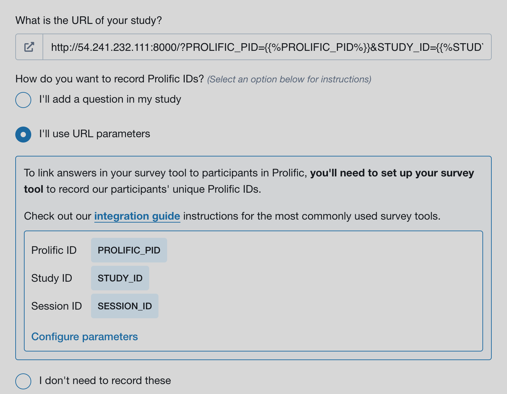

# Crowdsourcing setting

Potato can be seamlessly deployed online to collect annotations from common crowdsourcing platforms like prolifc.co

## Setup potato on a server with open ports 
To run potato in a crowdsourcing setup, you need to setup potato on a server
with open ports (ports that can be accessed via open internet). When you
start the potato server, simply change to default port to the openly
accessible ports and you should be able to access the annotation page
via `your_ip_address:the_port`

## Prolific

[Prolific](https://www.prolific.co/) is a platform where you can easily recruit task participants
and Potato can be used seamlessly with prolific.co. 

Potato project-hub already contains several example projects configurated for prolific:

- [match_finding](https://potato-annotation.readthedocs.io/en/latest/example-projects/#match-findings-in-papers-and-news-likert-prescreening-questions-multi-task):
the annotation site used in a [EMNLP 2022 paper](https://arxiv.org/abs/2210.13001)
- [match_finding_with_prestudy](https://potato-annotation.readthedocs.io/en/latest/example-projects/#match-findings-in-papers-and-news-prestudy-test):
a piloted version of the annotation site used in a [EMNLP 2022 paper](https://arxiv.org/abs/2210.13001). 
It contains a prestudy qualification test where you could set up a list of qualification questions to filter out participants who are 
not qualified to participate your study.

To set up your own project for prolific, please follow the steps below:

### 1. Set up url argument for prolific

To use potato with prolific, you need to define the login type as
`url_direct` and set up the `url_argument` as
`PROLIFIC_PID`. 

``` YAML
#defining the ways annotators entering the annotation system
"login": {
   "type": 'url_direct',    #can be 'password' or 'url_direct'
   "url_argument": 'PROLIFIC_PID' # when the login type is set to 'url_direct', 'url_argument' must be setup for a direct url argument login
},
```
In this way, the participants will be able to access your site with a link looks like: http://your-server-ip-with-port/?PROLIFIC_PID=participant-user-id.

You would also need to use the following setup on prolific.co and user your own study URL.



It is also recommended to set the `jumping_to_id_disabled` and `hide_navbar` as True

``` YAML
#the jumping-to-id function will be disabled if "jumping_to_id_disabled" is True
 "jumping_to_id_disabled": False,

#the navigation bar will be hidden to the annotators if "hide_navbar" is True
 "hide_navbar": True,
```

### 2. set up finishing code
As prolific uses finishing code or a redirect link to indicate whether an annotator has finished all the tasks, you would also need to set up an end page 
and display it at the end of the study. To insert an end page, you would need to use the surveyflow feature of potato and here are the following steps


#### 2.1 Create an end page in surveyflow
create a dir named `surveyflow` under your project dir and create a `end.jsonl` file with the following content:
``` YAML
{"id":"1","text":"Thanks for your time, please click the following link to complete the study","schema": "pure_display", "choices": ["<a href=\"https://app.prolific.co/submissions/complete?cc=YOUR-PROLIFIC-CODE\">Click to finish the study</a>"]}
```
Please make sure you use your own prolific end code and replace `YOUR-PROLIFIC-CODE`. 

#### 2.2 Edit the configuration file and add the page
Please add the relative path to your end page in the `surveyflow` field of your `.yaml` file

``` YAML
"surveyflow": {
        "on": true,
        "order": [
            "pre_annotation",
            "post_annotation"
        ],
        "pre_annotation": [
            "surveyflow/consent.jsonl",
        ],
        "post_annotation": [
            "surveyflow/end.jsonl",
        ],
        "testing": [
        ]
},
```

After this setup, the following page will be shown to the annotators when they finish their annotations. 
Once they click the link, they will be redirect to prolific website to indicate that they have finished study.


If you want to directly show the end code instead of a url, you could edit the content in `end.json`, for example:

``` YAML
{"id":"1","text":"Thanks for your time, please copy the following end code to prolific to complete the study","schema": "pure_display", "choices": ["YOUR-PROLIFIC-CODE"]}
```

and the following page will be displayed to the annotators. The participants will copy the code to prolific and finish their study.


You can also edit the content of `end.jsonl` to display your own messages to the participants.

### 3. Set up automatic task assignment
In crowdsourcing setting, we usually assign a small set of instances to each annotator. 
Potato can handle this automatic task assignment process.
Simply add the following block to your `.yaml` configuration file and edit the following field to indicate your setup
    
- `on`: whether do automatic task assignment for annotators, default False. If False, all the instances in your input data will 
be displayed to each participant. 
- `sampling_strategy`: how you want to assign the instances to each participant. If `random`, the instances will be randomly assigned.
If set as `ordered`, the instances will be assigned following the order of your input data.
- `labels_per_instance`: how many labels do you need for each instance, default 3
- `instance_per_annotator`: how many instances do you want each participant to annotate, default 5
- `test_question_per_annotator`: how many test instances do you want each annotator to see, default 0

``` YAML
"automatic_assignment": {
"on": True, #whether do automatic task assignment for annotators, default False.
"output_filename": 'task_assignment.json', #no need to change
"sampling_strategy": 'random', #currently we support random assignment or ordered assignment. Use 'random' for random assignment and 'ordered' for ordered assignment
"labels_per_instance": 3,  #the number of labels for each instance
"instance_per_annotator": 5, #the total amount of instances to be assigned to each annotator
"test_question_per_annotator": 0, # the number of attention test question to be inserted into the annotation queue. you must set up the test question in surveyflow to use this function
},
```
After this setup, all the instances in your input data will be automatically assigned to the annotators. 

### 4. Set up the configuration file for your prolific study
Starting from 1.2.2.0, potato supports automatic task management for prolific, which saves you from
manually releasing the places previously assigned to the returned, time-out or rejected users. 
In order to do this, you need to create a separate `.yaml` file
for your prolific study setting:
``` YAML
{
    "token": 'your-prolific-token',
    "study_id": 'your-study-id',
}
```
then in the main `.yaml` file, add a field named `prolific` and add the path to the prolific 
configuration file:
``` YAML
"prolific": {
    "config_file_path": 'prolific_config.yaml'
},
```

potato will then do all the work to check the returned, time-out or rejected users and automatically
release the study place to new users. Potato will also automatically pause the study when the study
is done. 

#### Managing server workload
When a large amount of users are working on your task concurrently, your server might overload, which 
may lead to a server crash. Potato now allows you to easily set up the `max_concurrent_sessions` and 
will help to automatically manage the server load for you. Potato will check if the current active users are above this threshold once a new 
user click the study link. If so, potato will pause the prolific study for a while (`workload_checker_period` seconds) 
and will automatically restart the prolific task once the amount of active users drops
below a predefined threshold (20% of the `max_concurrent_sessions`).

``` YAML
{
    "token": 'your-prolific-token',
    "study_id": 'your-study-id',
    "max_concurrent_sessions": 30  #maximum number of concurrent users, default 30
    "workload_checker_period": 300  #the waiting time in seconds before next workload check, 
                                   #default 300 seconds
}
```

You can also check [prolific_api_example](https://github.com/davidjurgens/potato/raw/master/project-hub/prolific_api_example) in the 
potato project-hub to see how to set up prolific api for your annotation task.

> **_NOTE:_**  Prolific api may not work well when the number of users is above 200, we are currently 
> working on to resolve this issue.

### 5. Add instructions, study consent and survey questions 
Potato allows you to easily insert instruction pages and survey questions before and after the annotation flow, please check
[setting up surveyflow](https://potato-annotation.readthedocs.io/en/latest/surveyflow/) for more details.

### 6. look and feel 
After all the steps above, you will be able to preview your study. Simply go to the bottom of your study on prolific.co and click `preview`,
after seeing the following page, clik `open study link in a new window` and then you will see the annotation site just like your 
future participants.


