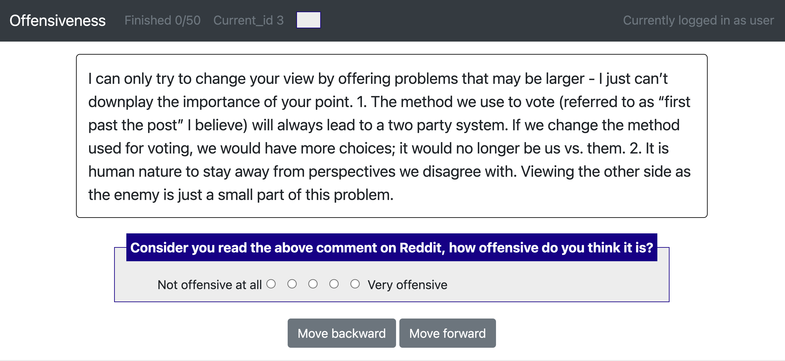
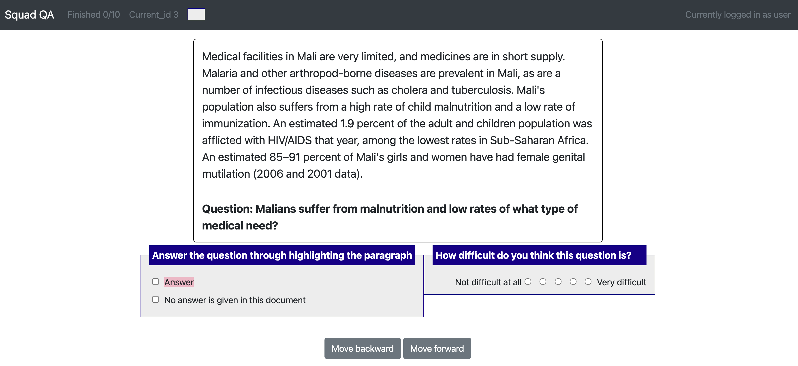
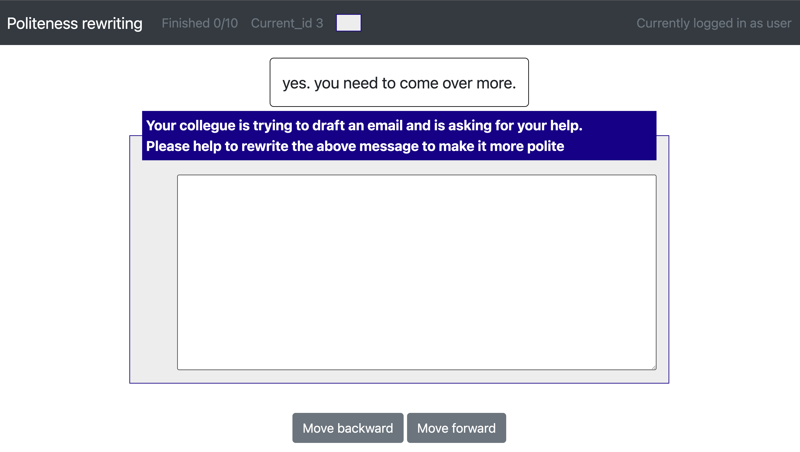
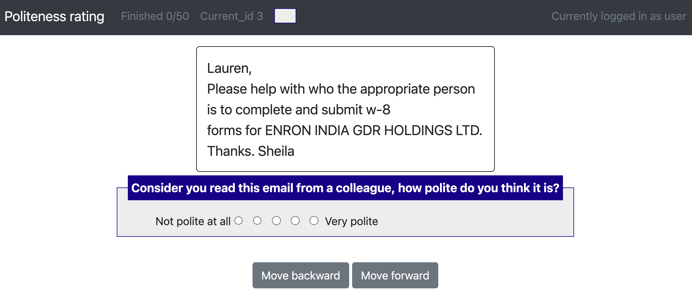
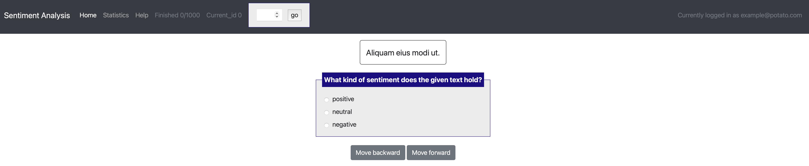
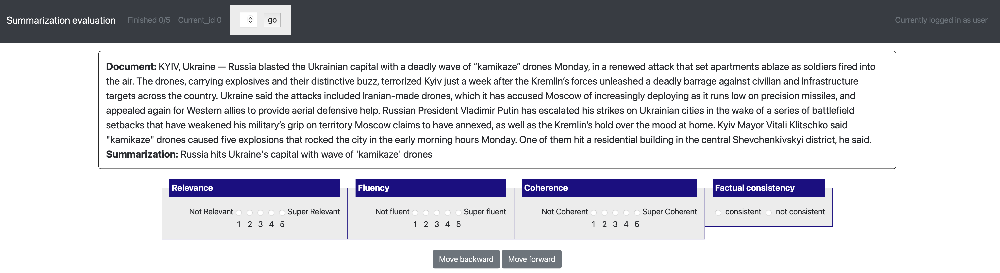
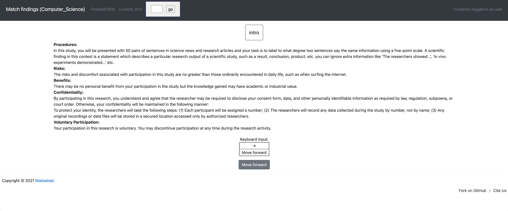

# Example projects (project hub)

Potato aims to improve the replicability of data annotation and reduce the cost for researchers to
set up new annotation tasks. Therefore, Potato comes with a list of
predefined example projects, and welcome public contribution to the
project hub. If you have used potato for your own annotation, you are
encouraged to create a pull request and release your annotation setup.


## Schema examples
Potato provides a list of example templates for [all the supporting annotation schemas](https://github.com/davidjurgens/potato/tree/pypi/project-hub/simple_examples/configs)
and you can easily download them from project hub using:
``` 
[fetch] potato get simple_schema_examples
[launch] potato start simple_schema_examples -p 8000

>>> multiple config files found, please select the one you want to use (number 0-13)
[0] simple-active-learning.yaml
[1] simple-best-worst-scaling.yaml
[2] simple-pairwise-comparison.yaml
[3] simple-check-box-dynamic-labels.yaml
[4] simple-video-as-label.yaml
[5] simple-span-labeling.yaml
[6] simple-likert.yaml
[7] simple-html-annotation.yaml
[8] empty-to-copy.yaml
[9] simple-video-annotation.yaml
[10] simple-single-choice-selection.yaml
[11] simple-text-box.yaml
[12] simple-check-box.yaml
[13] kwargs_example.yaml
[14] simple-check-box-with-free-response.yaml

[Annotate] http://localhost:8000
```


## Annotation projects


### Offensiveness rating

[yaml
config](https://github.com/davidjurgens/potato/tree/master/project-hub/offensiveness)
|
[Dataset](https://github.com/Jiaxin-Pei/Potato-Prolific-Dataset/tree/main/dataset/offensiveness)

``` 
[fetch] potato get offensiveness
[launch] potato start offensiveness -p 8000
[Annotate] http://localhost:8000/?PROLIFIC_PID=user
```



### Question Answering / Reading comprehension (SQuAD style)

[yaml
config](https://github.com/davidjurgens/potato/tree/master/project-hub/reading_comprehension)
|
[Dataset](https://github.com/Jiaxin-Pei/Potato-Prolific-Dataset/tree/main/dataset/question_answering)

``` 
[fetch] potato get reading_comprehension
[launch] potato start reading_comprehension -p 8000
[Annotate] http://localhost:8000/?PROLIFIC_PID=user
```




### Text rewriting

[yaml
config](https://github.com/davidjurgens/potato/tree/master/project-hub/email_rewriting)
|
[Dataset](https://github.com/Jiaxin-Pei/Potato-Prolific-Dataset/tree/main/dataset/text_rewriting)

``` 
[fetch] potato get text_rewriting
[launch] potato start text_rewriting -p 8000
[Annotate] http://localhost:8000/?PROLIFIC_PID=user
```



### Politeness rating

[yaml
config](https://github.com/davidjurgens/potato/tree/master/project-hub/politeness_rating)
|
[Dataset](https://github.com/Jiaxin-Pei/Potato-Prolific-Dataset/tree/main/dataset/politeness_rating)

``` 
[fetch] potato get politeness_rating
[launch] potato start politeness_rating -p 8000
[Annotate] http://localhost:8000/?PROLIFIC_PID=user
```



### Dialogue analysis (span + categorization) 

[yaml
config](https://github.com/davidjurgens/potato/tree/master/project-hub/dialogue_analysis)

``` 
[fetch] potato get dialogue_analysis
[launch] potato start dialogue_analysis -p 8000
[Annotate] http://localhost:8000
```


### Sentiment analysis (categorization) 

[yaml
config](https://github.com/davidjurgens/potato/tree/master/project-hub/sentiment_analysis)

``` 
[fetch] potato get sentiment_analysis
[launch] potato start sentiment_analysis -p 8000
[Annotate] http://localhost:8000
```



### Summarization evaluation (likert + categorization)

``` 
[fetch] potato get summarization_evaluation
[launch] potato start summarization_evaluation -p 8000
[Annotate] http://localhost:8000/?PROLIFIC_PID=user
```



### Match findings in papers and news (likert + prescreening questions + multi-task) 

[yaml
config](https://github.com/davidjurgens/potato/tree/master/project-hub/match_finding)
| [Paper](http://www.copenlu.com/publication/2022_emnlp_wright/) |
[Dataset](https://huggingface.co/datasets/copenlu/spiced)

``` 
[fetch] potato get match_finding
[launch] potato start match_finding -p 8000
[Annotate] http://localhost:8000/?PROLIFIC_PID=user
```



### Match findings in papers and news (prestudy test)

[yaml
config](https://github.com/davidjurgens/potato/tree/master/project-hub/match_finding_with_prestudy)

``` 
[fetch] potato get match_finding_with_prestudy
[launch] potato start match_finding_with_prestudy -p 8000
[Annotate] http://localhost:8000/?PROLIFIC_PID=user
```


### Textual uncertainty (likert + categorization) 

[yaml
config](https://github.com/davidjurgens/potato/tree/master/project-hub/textual_uncertainty)
|
[Paper](https://jiaxin-pei.github.io/project_websites/certainty/Certainty-in-Science-Communication.html)
|
[Dataset](https://github.com/Jiaxin-Pei/Certainty-in-Science-Communication/tree/main/data/annotated_data)

``` 
[fetch] potato get textual_uncertainty
[launch] potato start textual_uncertainty -p 8000
[Annotate] http://localhost:8000/
```


### Immigration framing in tweets (Multi-schema categorization)

[yaml
config](https://github.com/davidjurgens/potato/tree/master/project-hub/immigration_framing)
| [Paper](https://aclanthology.org/2021.naacl-main.179/) |
[Dataset](https://github.com/juliamendelsohn/framing)

``` 
[fetch] potato get immigration_framing
[launch] potato start immigration_framing -p 8000
[Annotate] http://localhost:8000/
```


### GIF Reply Appropriateness (video as label)

[yaml
config](https://github.com/davidjurgens/potato/tree/master/project-hub/gif_reply)
| [Paper](https://aclanthology.org/2021.findings-emnlp.276/) |
[Dataset](https://github.com/xingyaoww/gif-reply)

``` 
[fetch] potato get gif_reply
[launch] potato start gif_reply -p 8000
[Annotate] http://localhost:8000/
```


### Empathy as Appraisal (paired texts + likert)
[yaml config](https://github.com/davidjurgens/potato/tree/master/project-hub/empathy) | [Paper](https://aclanthology.org/2020.emnlp-main.45.pdf)
```
[fetch] potato get empathy
[launch] potato start empathy -p 8000
[Annotate] http://localhost:8000/
```

