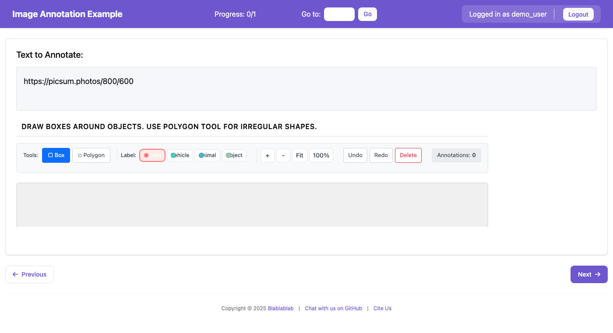

# Image Annotation

Image annotation allows annotators to mark regions on images using bounding boxes, polygons, freeform drawing, and landmark points. This is useful for object detection, segmentation, and keypoint annotation tasks.


*The image annotation interface with bounding box and polygon tools*

## Features

- **Bounding Box (bbox)**: Draw rectangular boxes around objects
- **Polygon**: Draw multi-point polygons for precise object boundaries
- **Freeform Drawing**: Free-hand drawing for irregular shapes
- **Landmark Points**: Mark specific points of interest on images
- **Zoom & Pan**: Navigate large images with ease
- **Label Assignment**: Assign category labels to each annotation
- **Keyboard Shortcuts**: Fast annotation with customizable hotkeys

## Configuration

### Basic Configuration

```yaml
annotation_schemes:
  - annotation_type: image_annotation
    name: object_detection
    description: "Draw boxes around objects in the image"
    tools:
      - bbox
      - polygon
    labels:
      - name: person
        color: "#FF6B6B"
        key_value: "1"
      - name: vehicle
        color: "#4ECDC4"
        key_value: "2"
      - name: animal
        color: "#45B7D1"
        key_value: "3"
```

### Configuration Options

| Option | Type | Default | Description |
|--------|------|---------|-------------|
| `name` | string | required | Unique identifier for the schema |
| `description` | string | required | Instructions shown to annotators |
| `tools` | list | required | Annotation tools to enable |
| `labels` | list | required | Category labels for annotations |
| `zoom_enabled` | boolean | `true` | Enable zoom controls |
| `pan_enabled` | boolean | `true` | Enable pan/drag navigation |
| `min_annotations` | integer | `0` | Minimum required annotations |
| `max_annotations` | integer | `null` | Maximum allowed annotations |
| `freeform_brush_size` | integer | `5` | Default brush size for freeform tool |
| `freeform_simplify` | float | `2.0` | Path simplification tolerance |

### Available Tools

| Tool | Key | Description |
|------|-----|-------------|
| `bbox` | `b` | Rectangular bounding boxes |
| `polygon` | `p` | Multi-point polygons |
| `freeform` | `f` | Free-hand drawing |
| `landmark` | `l` | Single point markers |

### Label Configuration

Labels can be specified as strings or objects:

```yaml
# Simple string labels (auto-assigned colors)
labels:
  - person
  - car
  - tree

# Detailed label objects
labels:
  - name: person
    color: "#FF6B6B"      # Custom color (hex)
    key_value: "1"        # Keyboard shortcut
  - name: vehicle
    color: "#4ECDC4"
    key_value: "2"
```

## Data Format

### Input Data

The image URL should be provided in the data file field specified by `text_key`:

```json
{"id": "img_001", "image_url": "https://example.com/image1.jpg"}
{"id": "img_002", "image_url": "/static/images/image2.png"}
```

Configure in YAML:
```yaml
item_properties:
  id_key: id
  text_key: image_url
```

### Output Data

Annotations are saved as JSON with the following structure:

```json
{
  "object_detection": {
    "annotations": [
      {
        "id": "ann_1",
        "type": "bbox",
        "label": "person",
        "coordinates": {
          "left": 100,
          "top": 50,
          "width": 200,
          "height": 300
        }
      },
      {
        "id": "ann_2",
        "type": "polygon",
        "label": "vehicle",
        "points": [
          {"x": 10, "y": 20},
          {"x": 100, "y": 20},
          {"x": 100, "y": 100},
          {"x": 10, "y": 100}
        ]
      }
    ]
  }
}
```

## Keyboard Shortcuts

| Key | Action |
|-----|--------|
| `b` | Select bounding box tool |
| `p` | Select polygon tool |
| `f` | Select freeform tool |
| `l` | Select landmark tool |
| `1-9` | Select label by number |
| `Delete` | Delete selected annotation |
| `Ctrl+Z` | Undo |
| `Ctrl+Y` | Redo |
| `+` / `-` | Zoom in/out |
| `0` | Fit image to view |
| `Escape` | Cancel current drawing |

## User Interface

### Toolbar

The toolbar provides:
- **Tool Selection**: Buttons to switch between annotation tools
- **Label Selection**: Color-coded buttons for each label
- **Zoom Controls**: Zoom in, zoom out, fit to view, reset
- **Edit Controls**: Undo, redo, delete selected

### Canvas

- Click and drag to create annotations
- Click existing annotations to select them
- Drag corners/edges to resize (bbox)
- Drag points to reshape (polygon)
- Use scroll wheel to zoom (when zoom enabled)

### Annotation List

Shows all annotations with:
- Color indicator matching the label
- Label name and annotation type
- Click to select, double-click to focus

## Example Project

See `project-hub/simple_examples/configs/simple-image-annotation.yaml` for a complete working example.

## Tips for Administrators

1. **Image Hosting**: Ensure images are accessible from the annotation server. Use absolute URLs or place images in the static folder.

2. **Tool Selection**: Only enable tools needed for your task to reduce annotator confusion.

3. **Label Colors**: Choose distinct, high-contrast colors for labels to improve visibility.

4. **Zoom for Detail**: Enable zoom for tasks requiring precise boundaries.

5. **Min/Max Annotations**: Set `min_annotations` to ensure annotators don't skip images. Set `max_annotations` to prevent over-annotation.
