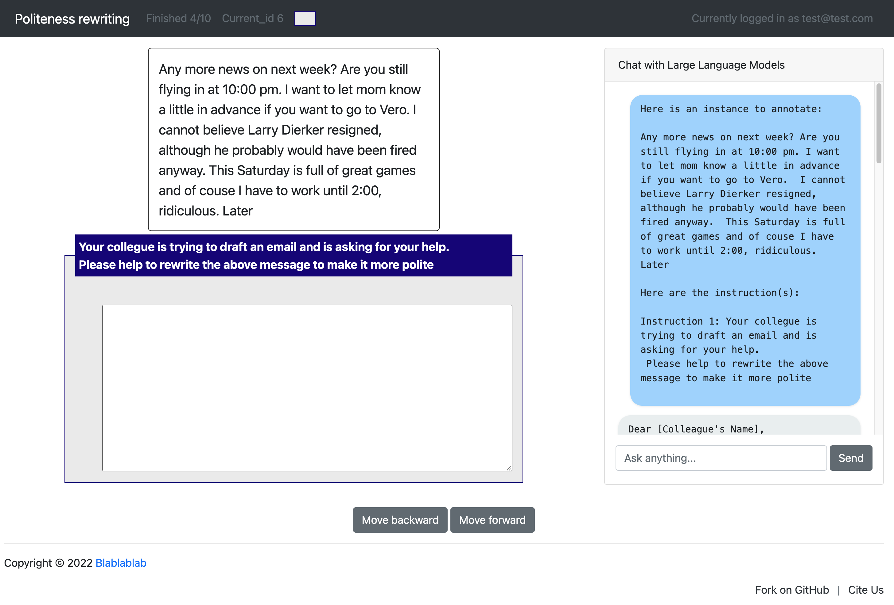
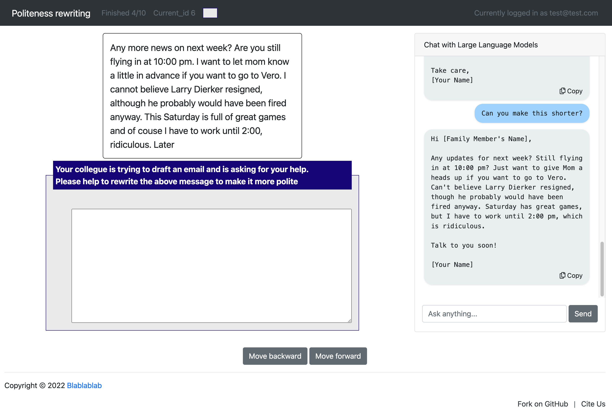

# LLM-Assisted Annotation Guide

The LLM-Assisted annotation function in POTATO is designed to streamline the data annotation process by integrating Large Language Models (LLM) into the workflow. This guide will explain how to configure the tool to assist annotators.

## Introduction to LLM-Assisted Annotation

### Automatic Initial Query



By setting `send_initial_query` to `True` in the configuration, annotators are provided with immediate assistance upon loading a new annotation instance. Potato automatically sends the current instance and the annotation instructions to the LLM, obtaining suggested annotations.

This is only available for text-box annotation schema now, we will add support for other schemas in the future (PR is always welcomed!).

```yaml
"llm_chat": {
  "enable": True,
  "send_initial_query": True,
  # other configuration (see later section) ... 
}
```

This feature accelerates the annotation process by providing a starting point for the annotator, reducing the time spent on generating initial annotations from scratch.

### Manual Initial Query and Follow-Up Interactions



If `send_initial_query` is set to `False`, the tool will not automatically send an initial query to the LLM, but the chat functionality remains active. Annotators can still manually initiate interactions with the LLM to get assistance at any point.

```yaml
"llm_chat": {
  "enable": True,
  "send_initial_query": False
  # other configuration (see later section) ... 
}
```

Annotators have the flexibility to follow up with the LLM for potential revisions untin the annotators are satisfied. A convenient copy button is available to copy the LLM output to the annotation box, ensuring a smooth annotation experience.

## Configuration Steps

Following this introduction, the next sections of the documentation will guide you through the detailed configuration steps to set up the LLM-Assisted Annotation Tool with either OpenAI's proprietary models or compatible open-source models.


### LLM of Choice

The LLM you choose to integrate can be from OpenAI's selection of models or from an open-source model that is compatible with the OpenAI API interface. Configuration varies slightly depending on the source.

#### OpenAI Models

To use an OpenAI model, you must specify `openai` as the API and provide your API key, which can be directly inserted into the configuration file or set as an environment variable.

```yaml
"llm_chat": {
  "api": "openai",
  "api_key": "YOUR OPENAI API KEY HERE" // Alternatively, use the environment variable "OPENAI_API_KEY"
}
```

#### Open-Source Models

For open-source models, you can serve any compatible model through a local or remote server using tools like [FastChat](https://github.com/lm-sys/FastChat/tree/main/fastchat) or [vLLM](https://vllm.ai/).
To integrate such a model, set the `OPENAI_API_BASE` environment variable to point to your server before starting the annotation tool.

```bash
export OPENAI_API_BASE="http://<YOUR_SERVER_URL>:<YOUR_PORT>/v1"
```

After setting the environment variable, you can set a dummy API key unless specified in your model serving process.

```yaml
"llm_chat": {
  "api": "openai",
  "api_key": "DUMMY_KEY"
}
```

### Model Name

For OpenAI models, set the model name to your preferred version.

```yaml
"llm_chat": {
  "model_name": "gpt-3.5-turbo-0613" // Change to your chosen OpenAI model
}
```

For open-source models, the model name should match the identifier used by your server setup.

```yaml
"llm_chat": {
  "model_name": "your-open-source-model-name" // Set to the name used in your server configuration
}
```

### Complete Example

This is an example that uses OpenAI GPT-3.5 to perform LLM annotation.
You need to add this section to your annotation `.yaml` configuration file.

```yaml
"llm_chat": {
    "enable": True,  # whether to enable LLM-assist annotation
    "api": "openai",  # API format
    
    # "api_key": "YOUR KEY HERE",
    # if not defined, potato will automatically look for "OPENAI_API_KEY" in environment variable

    "model_name": "gpt-3.5-turbo-0613",

    # You can customized the system message and/or adding examples (List[Dict])
    # Follow https://platform.openai.com/docs/api-reference/chat/create#chat-create-messages for message format
    # "prompt_messages": [
    #   {"role": "system", "content": "You are a helpful assistant. Your role is to assist the human annotator in generating creative and accurate responses. Provide guidance and information whenever asked, ensuring that the human annotator produces the best possible output. Always be supportive and informative.  Answer the initial question without adding extra information."}
    # ],

    # If true, potato will automatically generate a query given 
    # the instance text and the annotation schema,
    # and send this query to LLM at the time of page load.
    "send_initial_query": True
}
```

We provide an example for `text_rewriting` project. You can run this example directly by:

```bash
OPENAI_API_KEY="YOUR_API_KEY" python potato/flask_server.py start project-hub/text_rewriting/configs/politeness_w_LLM.yaml -p 8000
```


---
