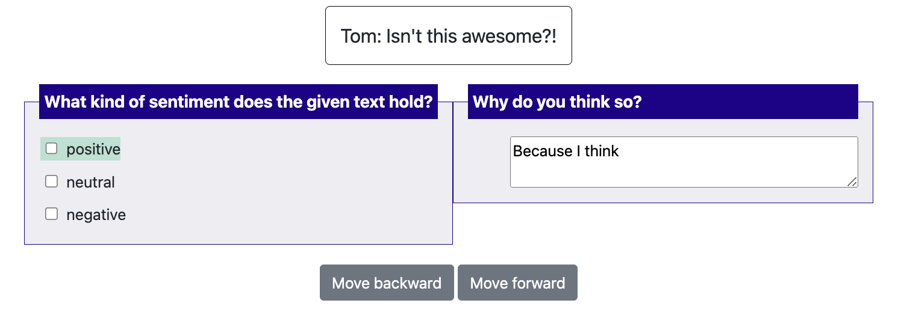

# Productivity features

## Keyboard shortcuts

*Sequential keybindings:* Some annotation schemes provide keybindings
for selecting options. For tasks where there are at most 10 options,
keybindings can be assigned sequentially by default. When defining your
annotation scheme, set the `sequential_key_binding` field to `True`.

The first option will correspond to the \"1\" key, the second to the
\"2\" key, \..., the tenth to the \"0\" key.

*Custom keybindings:* For greater control, custom keybindings can also
be configured. In this case, pass in objects into the `labels` field of
the annotation scheme. Each label object can take a `key_value` field
specifying the key that corresponds to it.

For example,

``` yaml
"annotation_schemes": [
    {
        "annotation_type": "multiselect",
        "labels": [
            {
              "name": "Option 1",
              "key_value": '1'
            },
            {
              "name": "Option 2",
              "key_value": '2'
             }
          ]
      }
]
```

## Admin Keyword Highlights

Potato supports admin-defined keyword highlights to help annotators identify relevant words and phrases in the text. Keywords are displayed as colored bordered boxes around matching text when an instance loads.

### Configuration

Add a `keyword_highlights_file` to your configuration pointing to a TSV file:

```yaml
keyword_highlights_file: data/keywords.tsv
```

The path is relative to the directory where you run the server (task_dir).

### TSV File Format

The keywords file should be tab-separated with three columns:

```
Word	Label	Schema
love	positive	sentiment
hate	negative	sentiment
excel*	positive	sentiment
disappoint*	negative	sentiment
```

| Column | Description |
|--------|-------------|
| **Word** | The keyword or phrase to highlight (supports `*` wildcards) |
| **Label** | The annotation label associated with this keyword |
| **Schema** | The annotation schema name this keyword is relevant to |

**Note:** Use actual tab characters between columns, not spaces.

### Matching Behavior

- **Case-insensitive**: "Love" matches "love", "LOVE", "Love"
- **Word boundaries**: "love" matches "love" but not "lovely" (unless using wildcards)
- **Wildcards**: Use `*` for prefix/suffix matching:
  - `excel*` matches "excellent", "excels", "excel"
  - `*happy` matches "unhappy", "happy"
  - `dis*ed` matches "disappointed", "dismayed"

### Configuring Colors

Colors for keyword highlights are configured in the `ui.spans.span_colors` section, matching the schema and label names:

```yaml
ui:
  spans:
    span_colors:
      sentiment:
        positive: "(34, 197, 94)"    # Green
        negative: "(239, 68, 68)"    # Red
        neutral: "(156, 163, 175)"   # Gray
```

If no color is specified, Potato automatically assigns colors from a default palette.

### Multiple Schemas

A single keywords file can support multiple annotation schemas:

```
Word	Label	Schema
excellent	positive	sentiment
terrible	negative	sentiment
price	economic	topic
election	political	topic
```

### Example

See the [keyword-highlights-example](https://github.com/davidjurgens/potato/tree/master/project-hub/simple_examples/keyword-highlights-example) in the project hub for a complete working example.

## Tooltips

For radio and multiselect question types, you have the option to add
tooltips with more details about each response option. You can do this
in two ways.

**Option 1:** you can enter plaintext in the `tooltip` field and the
unformatted text will display when you hover your mouse over the
response option.

``` YAML
"annotation_schemes": [
{
     "annotation_type": "multiselect",
     "name": "Question",
     "labels": [
         {
           "name": "Label 1",
           "tooltip": "lorem ipsum dolor",
         },
     ]
},
]
```

**Option 2:** you can create an HTML file with formatted text (e.g.,
bold, unordered list), and pass the path to the html file to the
`tooltip_file` field. The formatted text will display when you hover
your mouse over the response option.

``` YAML
"annotation_schemes": [
{
     "annotation_type": "multiselect",
     "name": "Question",
     "labels": [
         {
           "name": "Label 1",
           "tooltip_file": "config/tooltips/label1_tooltip.html"
         },
     ]
},
]
```

## Active Learning

Active learning uses machine learning to intelligently prioritize annotation tasks, helping you maximize the value of your annotation budget. For comprehensive configuration and usage instructions, see the [Active Learning Guide](active_learning_guide.md).

### Basic Configuration

```yaml
active_learning:
  enabled: true
  schema_names: ["sentiment", "topic"]
  min_annotations_per_instance: 2
  min_instances_for_training: 20
  update_frequency: 10
  max_instances_to_reorder: 100
  classifier_name: "sklearn.linear_model.LogisticRegression"
  vectorizer_name: "sklearn.feature_extraction.text.TfidfVectorizer"
  vectorizer_kwargs:
    max_features: 1000
    stop_words: "english"
  resolution_strategy: "majority_vote"
  random_sample_percent: 20
```

### Key Benefits

- **Maximize annotation efficiency** by focusing on the most informative instances
- **Reduce annotation costs** by requiring fewer annotations for the same model performance
- **Improve model quality** by ensuring diverse and representative training data
- **Scale annotation workflows** with intelligent instance prioritization

### How It Works

1. **Training**: A machine learning classifier is trained on existing annotations
2. **Prediction**: The model predicts confidence scores for unannotated instances
3. **Reordering**: Instances are reordered based on uncertainty (lowest confidence first)
4. **Annotation**: Annotators work on the most uncertain instances
5. **Retraining**: The model is retrained periodically as new annotations are added

For advanced features including LLM integration, model persistence, and multi-schema support, refer to the [Active Learning Guide](active_learning_guide.md).

## Automatic task assignent

Potato allows you to easily assign annotation tasks to different
annotators, this is especially userful for crowdsourcing setting where
you only need one annotator to work on a fixed amount of instances.

You can edit the automatic_assignmetn section in the configureation file
for this function

``` yaml
"automatic_assignment": {
   "on": true, # set false to turn off automatic assignment
   "output_filename": "task_assignment.json", # saving path of the task assignment status
   "sampling_strategy:": "random", # currently we only support random assignment
   "labels_per_instance": 10, # number of labels for each instance
   "instance_per_annotator": 50, # number of instances assigned for each annotator
   "test_question_per_annotator": 2, # number of attention test questions for each annotator
   "users": []
},
```

## Label suggestions
Starting from 1.2.2.1, Potato supports displaying suggestions to improve the productivity of annotators. Currently we
support two types of label suggestions: `prefill` and `highlight`. `prefill` will automatically
pre-select the labels or prefill the text inputs for the annotators while `highlight` will only
highlight the text of the labels. `highlight` can only be used for `multiselect` and `radio`.
`prefill` can also be used with textboxes.

There are two steps to set up label suggestions for your annotation tasks:

### Step 1: modify your configuration file
Labels suggestions are defined for each scheme. In your configuration file, you can simply add
a field named `label_suggestions` to specific annotation schemes. You can use different suggestion
types for different schemes.
``` yaml
{
    "annotation_type": "multiselect",
    "name": "sentiment",
    "description": "What kind of sentiment does the given text hold?",
    "labels": [
       "positive", "neutral", "negative",
    ],

    # If true, numbers [1-len(labels)] will be bound to each
    # label. Aannotations with more than 10 are not supported with this
    # simple keybinding and will need to use the full item specification
    # to bind all labels to keys.
    "sequential_key_binding": True,

    #how to display the suggestions, currently support:
    # "highlight": highlight the suggested labels with color
    # "pre-select": directly prefill the suggested labels or content
    # otherwise this feature is turned off
    "label_suggestions":"highlight"
},
{
    "annotation_type": "text",
    "name": "explanation",
    "description": "Why do you think so?",
    # if you want to use multi-line textbox, turn on the text area and set the desired rows and cols of the textbox
    "textarea": {
      "on": True,
      "rows": 2,
      "cols": 40
    },
    #how to display the suggestions, currently support:
    # "highlight": highlight the suggested labels with color
    # "pre-select": directly prefill the suggested labels or content
    # otherwise this feature is turned off
    "label_suggestions": "prefill"
},
```

### Step 2: prepare your data
For each line of your input data, you can add a field named `label_suggestions`. `label_suggestions` defines
a mapping from the scheme name to labels. For example:
``` yaml
{"id":"1","text":"Good Job!","label_suggestions": {"sentiment": "positive", "explanation": "Because I think "}}
{"id":"2","text":"Great work!","label_suggestions": {"sentiment": "positive", "explanation": "Because I think "}}
```

You can check out our [example project](https://github.com/davidjurgens/potato/tree/master/project-hub/label_suggestions) in project hub regarding how to set up label suggestions

