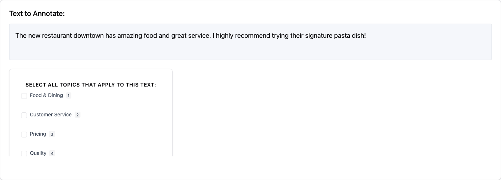
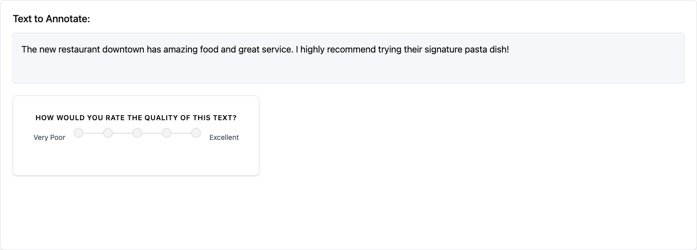
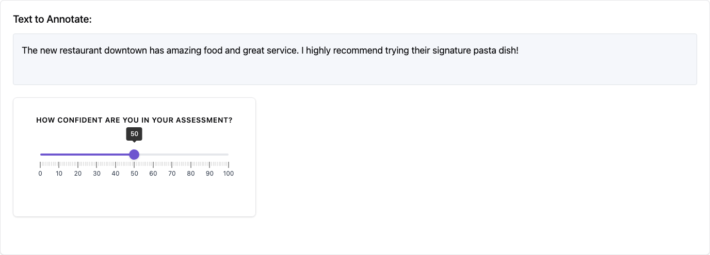
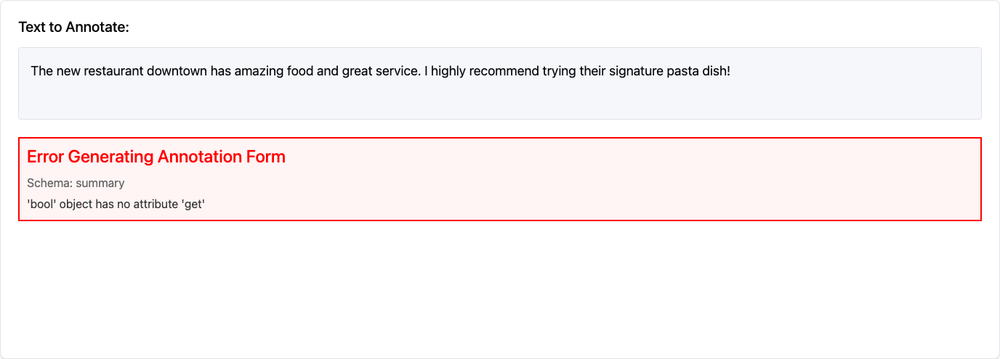
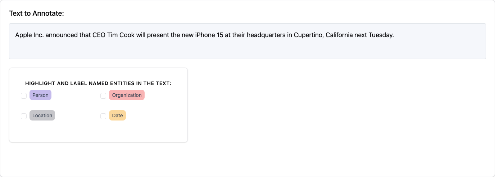
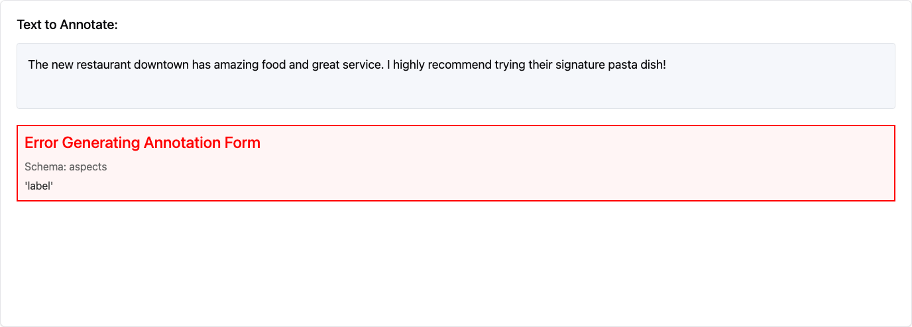
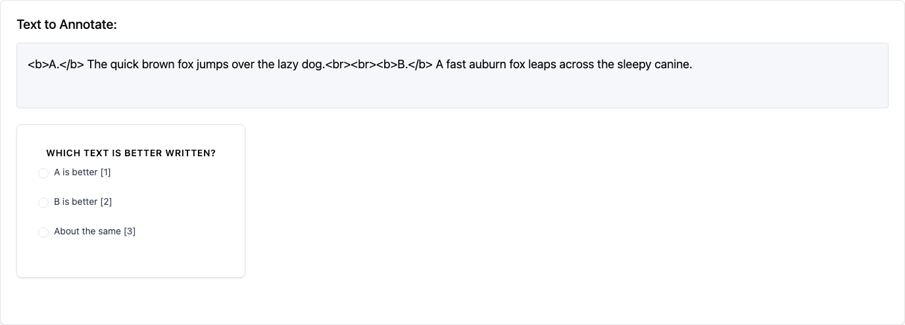
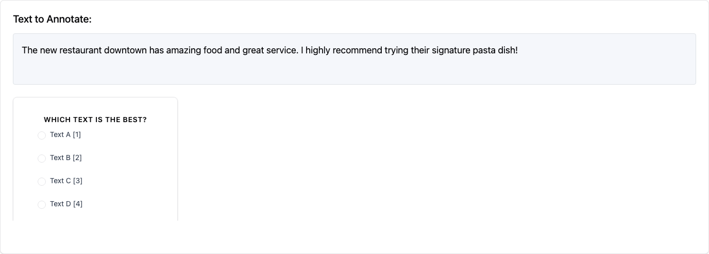
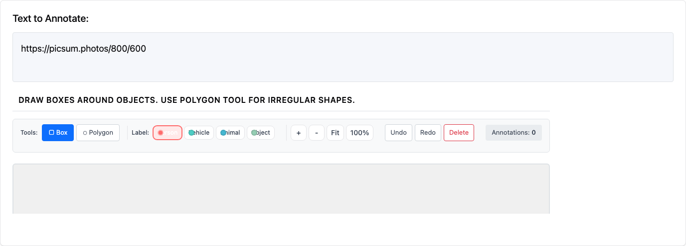
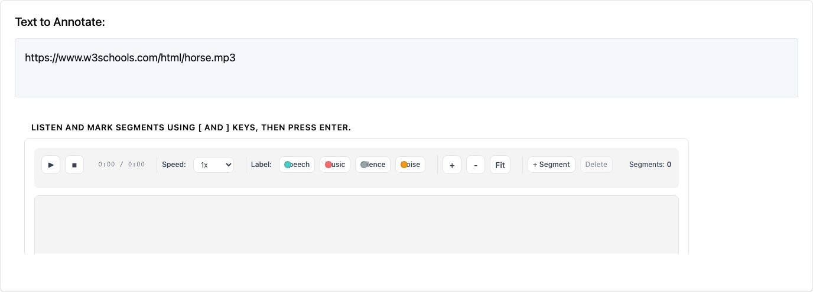

# Annotation Schemas and Templates

`potato` supports multiple annotation schema types that can be configured in the `"annotation_schemes"` field of your YAML configuration file. Each schema defines how annotators interact with your data and what types of responses they can provide.

## Screenshot Gallery

Below are examples of the different annotation schema types available in Potato:

| Radio Buttons | Checkbox / Multi-select | Likert Scale |
|:---:|:---:|:---:|
|  |  |  |

| Slider | Text Input | Span Annotation |
|:---:|:---:|:---:|
|  |  |  |

| Multi-rate Matrix | Pairwise Comparison | Best-Worst Scaling |
|:---:|:---:|:---:|
|  |  |  |

| Image Annotation | Audio Annotation | Video Annotation |
|:---:|:---:|:---:|
|  |  |  |

## Core Schema Structure

All annotation schemas share these **required fields**:

- **`annotation_type`** (string): The type of annotation interface to use
- **`name`** (string): Unique identifier for this schema, used in results reporting
- **`description`** (string): Text displayed to annotators explaining what to do

Additional fields are specific to each annotation type and may be required or optional.

## Supported Annotation Types

### 1. Single Choice (`radio`)

Allows annotators to select exactly one option from a predefined list.

**Required Fields:**
- `labels` (list): Array of option labels to choose from

**Optional Fields:**
- `sequential_key_binding` (boolean): Enable keyboard shortcuts (1, 2, 3...)
- `horizontal` (boolean): Display options horizontally

**Example:**
```yaml
annotation_schemes:
  - annotation_type: "radio"
    name: "topic_classification"
    description: "What is the main topic of this text?"
    labels: ["politics", "sports", "technology", "entertainment", "other"]
    sequential_key_binding: true
```

### 2. Likert Scale (`likert`)

Presents a rating scale with defined endpoints.

**Required Fields:**
- `min_label` (string): Text for the lowest rating
- `max_label` (string): Text for the highest rating
- `size` (integer): Number of scale points (minimum 2)

**Optional Fields:**
- `sequential_key_binding` (boolean): Enable keyboard shortcuts (1, 2, 3...)

**Example:**
```yaml
annotation_schemes:
  - annotation_type: "likert"
    name: "quality_rating"
    description: "How would you rate the quality of this text?"
    min_label: "Very Poor"
    max_label: "Excellent"
    size: 5
    sequential_key_binding: true
```

### 3. Multiple Choice (`multiselect`)

Allows annotators to select multiple options from a predefined list.

**Required Fields:**
- `labels` (list): Array of option labels to choose from

**Optional Fields:**
- `sequential_key_binding` (boolean): Enable keyboard shortcuts (1, 2, 3...)
- `single_select` (boolean): Force single selection only (default: false)
- `horizontal` (boolean): Display options horizontally
- `has_free_response` (boolean): Add optional text input field
- `video_as_label` (boolean): Use video files as labels
- `label_requirement` (object): Set completion requirements

**Example:**
```yaml
annotation_schemes:
  - annotation_type: "multiselect"
    name: "sentiment_analysis"
    description: "Select all emotions expressed in this text"
    labels: ["happy", "sad", "angry", "surprised", "neutral"]
    sequential_key_binding: true
    horizontal: true
```

**Video Labels Example:**
```yaml
annotation_schemes:
  - annotation_type: "multiselect"
    name: "gif_appropriateness"
    description: "Select all appropriate GIF replies"
    video_as_label: true
    labels:
      - name: "{{instance_obj.gifs[0]}}"
        videopath: "/files/{{instance_obj.gifs_path[0]}}"
      - name: "{{instance_obj.gifs[1]}}"
        videopath: "/files/{{instance_obj.gifs_path[1]}}"
    sequential_key_binding: true
```

### 4. Text Span Selection (`span`)

Allows annotators to highlight and label specific text spans.

**Required Fields:**
- `labels` (list): Array of label categories for spans

**Optional Fields:**
- `sequential_key_binding` (boolean): Enable keyboard shortcuts
- `bad_text_label` (object): Option for marking text as unannotatable
  - `label_content` (string): Text for the "bad text" option

**Example:**
```yaml
annotation_schemes:
  - annotation_type: "span"
    name: "sentiment_spans"
    description: "Highlight positive and negative phrases"
    labels: ["positive", "negative", "neutral"]
    sequential_key_binding: true
    bad_text_label:
      label_content: "No answer"
```

### 5. Slider (`slider`)

Provides a continuous range for numerical ratings.

**Required Fields:**
- `min` (number): Minimum value
- `max` (number): Maximum value

**Optional Fields:**
- `step` (number): Increment size (default: 1)
- `default` (number): Default position

**Example:**
```yaml
annotation_schemes:
  - annotation_type: "slider"
    name: "confidence_score"
    description: "How confident are you in your assessment?"
    min: 0
    max: 100
    step: 5
    default: 50
```

### 6. Text Input (`text`)

Allows free-form text responses.

**Required Fields:**
None beyond the core fields

**Optional Fields:**
- `labels` (list): Multiple text input fields with labels
- `textarea` (object): Configure multi-line input
  - `on` (boolean): Enable textarea mode
  - `rows` (integer): Number of rows
  - `cols` (integer): Number of columns
- `allow_paste` (boolean): Allow pasting (default: true)

**Example:**
```yaml
annotation_schemes:
  - annotation_type: "text"
    name: "explanation"
    description: "Please explain your reasoning"
    textarea:
      on: true
      rows: 4
      cols: 50
    allow_paste: false
```

**Multiple Text Fields Example:**
```yaml
annotation_schemes:
  - annotation_type: "text"
    name: "feedback"
    description: "Provide feedback on different aspects"
    labels: ["What worked well?", "What could be improved?", "Additional comments"]
```

### 7. Multi-rate (`multirate`)

Presents a matrix where multiple options are rated on the same scale.

**Required Fields:**
- `options` (list): Items to be rated
- `labels` (list): Rating scale labels

**Optional Fields:**
- `display_config` (object): Layout configuration
  - `num_columns` (integer): Number of columns in the matrix
- `arrangement` (string): "vertical" or "horizontal"
- `label_requirement` (object): Set completion requirements
  - `required` (boolean): Force completion of all ratings
- `option_randomization` (boolean): Randomize option order
- `sequential_key_binding` (boolean): Enable keyboard shortcuts

**Example:**
```yaml
annotation_schemes:
  - annotation_type: "multirate"
    name: "aspect_ratings"
    description: "Rate each aspect of the product"
    options: ["Quality", "Price", "Design", "Functionality"]
    labels: ["Poor", "Fair", "Good", "Very Good", "Excellent"]
    display_config:
      num_columns: 2
    arrangement: "vertical"
    label_requirement:
      required: true
    option_randomization: true
```

### 8. Number Input (`number`)

Allows numerical input with optional constraints.

**Required Fields:**
None beyond the core fields

**Optional Fields:**
- `min` (number): Minimum allowed value
- `max` (number): Maximum allowed value
- `step` (number): Increment size

**Example:**
```yaml
annotation_schemes:
  - annotation_type: "number"
    name: "age"
    description: "What is your age?"
    min: 18
    max: 100
```

### 9. Image Annotation (`image`)

Allows annotators to draw bounding boxes, polygons, and place landmarks on images.

**Required Fields:**
- `labels` (list): Array of label categories for annotations

**Optional Fields:**
- `annotation_mode` (string): Drawing mode - "bbox", "polygon", or "landmark"
- `allow_multiple` (boolean): Allow multiple annotations per image

**Example:**
```yaml
annotation_schemes:
  - annotation_type: "image"
    name: "object_detection"
    description: "Draw boxes around all vehicles"
    labels: ["car", "truck", "motorcycle", "bicycle"]
    annotation_mode: "bbox"
```

See [Image Annotation](image_annotation.md) for detailed documentation.

### 10. Audio Annotation (`audio`)

Allows annotators to segment and label audio files using waveform visualization.

**Required Fields:**
- `labels` (list): Array of label categories for audio segments

**Optional Fields:**
- `show_waveform` (boolean): Display waveform visualization (default: true)
- `allow_overlapping` (boolean): Allow overlapping segments

**Example:**
```yaml
annotation_schemes:
  - annotation_type: "audio"
    name: "speaker_diarization"
    description: "Label who is speaking in each segment"
    labels: ["Speaker A", "Speaker B", "Overlap", "Silence"]
```

See [Audio Annotation](audio_annotation.md) for detailed documentation.

### 11. Video Annotation (`video`)

Allows frame-by-frame labeling of video content with playback controls.

**Required Fields:**
- `labels` (list): Array of label categories

**Optional Fields:**
- `annotation_mode` (string): "frame" for frame-by-frame, "segment" for time segments
- `frame_step` (number): Frame advance increment

**Example:**
```yaml
annotation_schemes:
  - annotation_type: "video"
    name: "action_recognition"
    description: "Label the action being performed"
    labels: ["walking", "running", "sitting", "standing"]
    annotation_mode: "frame"
```

See [Video Annotation](video_annotation.md) for detailed documentation.

## Advanced Features

### Keyboard Shortcuts

Most annotation types support `sequential_key_binding: true` to enable keyboard shortcuts:
- Numbers 1-9 map to the first 9 options in the order they are listed
- For more than 9 options, use custom key bindings

### Tooltips

Add tooltips to labels for additional guidance:

```yaml
labels:
  - name: "Economic"
    tooltip_file: "config/tooltips/economic.html"
    key_value: "1"
```

### Label Requirements

The `label_requirement` field controls validation behavior for annotation schemas:

**General Required Validation:**
```yaml
label_requirement:
  required: true  # Makes all fields in this schema required
```

**Specific Label Required Validation:**
```yaml
label_requirement:
  required_label: "specific_option"  # Only this specific option is required
```

**Multiple Labels Required:**
```yaml
label_requirement:
  required_label: ["option1", "option2"]  # Only these specific options are required
```

When `required: true` is set, annotators must complete all fields in the schema before they can proceed to the next instance. This is particularly useful for ensuring data quality in multi-rate and other complex annotation tasks.

### Multiple Schemas

Combine different annotation types in a single task:

```yaml
annotation_schemes:
  - annotation_type: "radio"
    name: "overall_sentiment"
    description: "What is the overall sentiment?"
    labels: ["positive", "negative", "neutral"]

  - annotation_type: "span"
    name: "sentiment_spans"
    description: "Highlight specific sentiment phrases"
    labels: ["positive", "negative"]

  - annotation_type: "text"
    name: "explanation"
    description: "Explain your reasoning"
```

## Configuration Options

### Task-Level Settings

```yaml
# Page title
annotation_task_name: "Sentiment Analysis Task"

# Codebook URL (displayed to annotators)
annotation_codebook_url: "https://docs.google.com/document/d/example"

# Hide navigation bar (for crowdworking)
hide_navbar: false

# HTML layout template
html_layout: "default"  # Options: default, fixed_keybinding, kwargs, or custom path
```

### Available Layout Templates

- **`default`**: General-purpose layout for most annotation tasks
- **`fixed_keybinding`**: Shows keyboard shortcuts prominently
- **`kwargs`**: Specialized layout for Likert scales with custom endpoints
- **Custom path**: Point to your own HTML template file

### Surveyflow Layout

Use different layouts for survey pages vs annotation pages:

```yaml
html_layout: "templates/annotation-layout.html"
surveyflow_html_layout: "default"
```

## Best Practices

1. **Use descriptive names**: Schema names appear in results, so make them meaningful
2. **Provide clear descriptions**: Help annotators understand exactly what to do
3. **Enable keyboard shortcuts**: Improves annotation speed for experienced users
4. **Test your configuration**: Verify the interface works as expected before deployment
5. **Consider annotation quality**: Use required fields and validation where appropriate
6. **Keep it simple**: Avoid overly complex schemas that may confuse annotators

## Examples and Templates

For complete working examples, see the [project-hub](https://potato-annotation.readthedocs.io/en/latest/example-projects/) directory which contains ready-to-use configurations for various annotation tasks.

### Customizing the Instance Area

If you want to make changes to the instance area, simply edit the corresponding div:

```html
<div id="instance-text" name="instance_text" style="max-width:400px;">
    {{instance | safe}}
</div>
```

This will change the `max-width` of the instance area.
