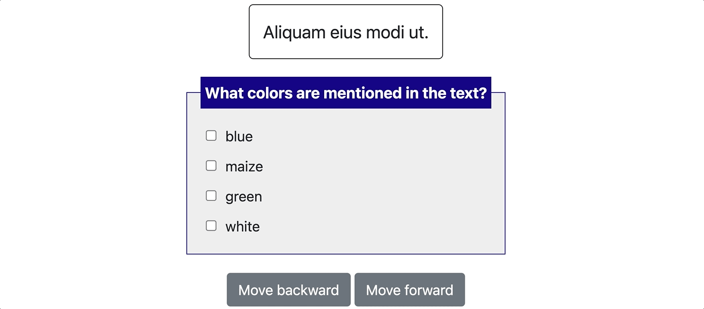
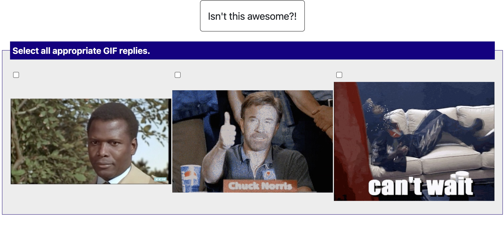
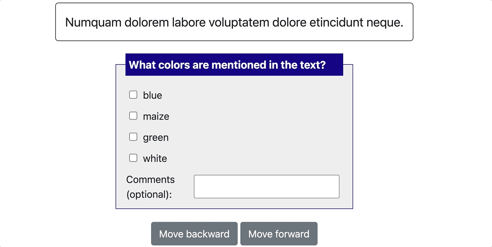
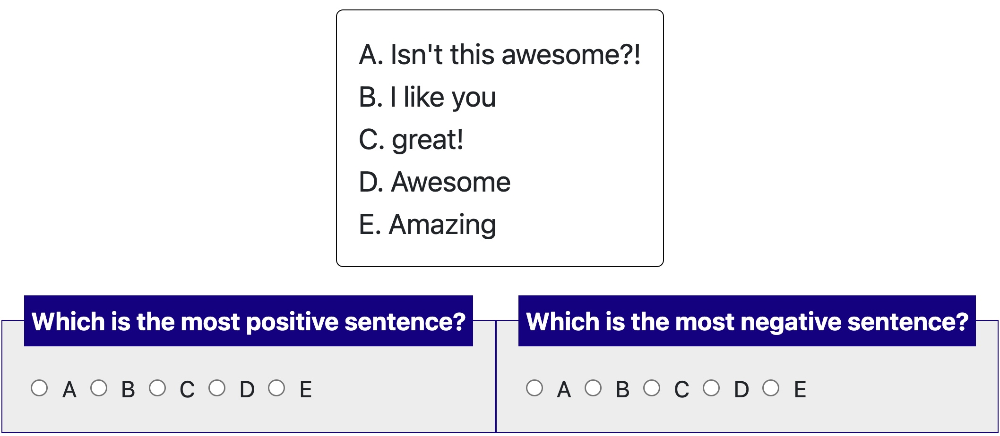
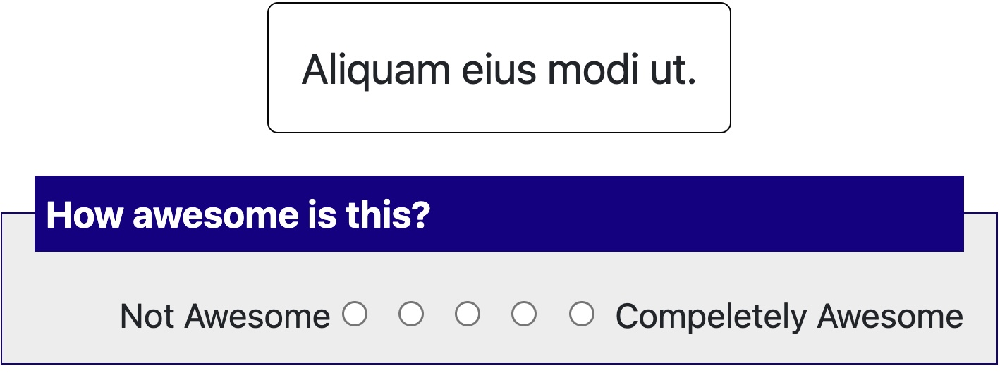
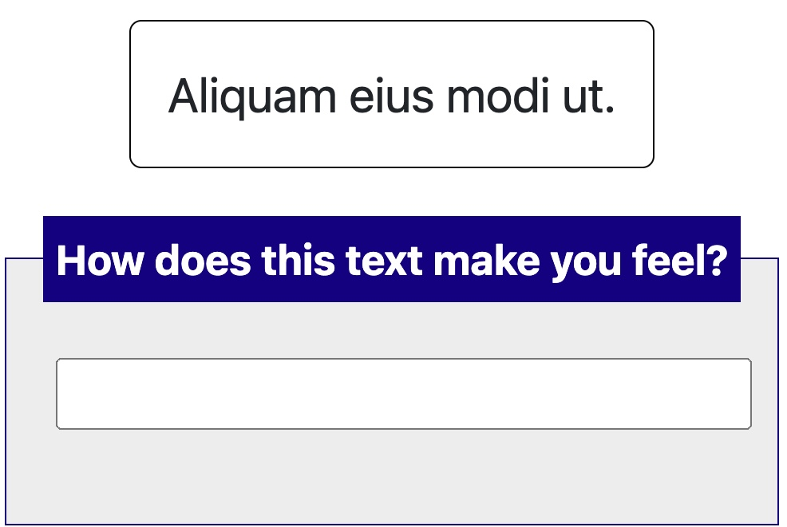
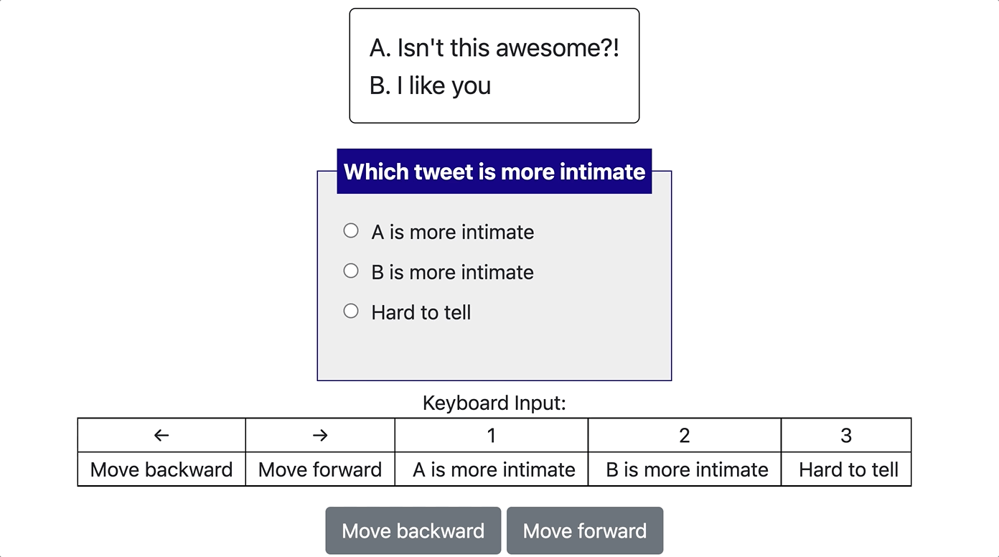

# Templates and Schemas

`potato` allows deployers to select one or more forms of annotation for
their data using predefined schema types in the `"annotation_schemes"`
field of the config yaml.

Deployers fill out which options should be shown and then each scheme is
rendered into HTML upon the completion of loading data. These schema
configurations allow deployers to quickly add keyboard shortcuts to
specific options or tooltips to help annotators.

## Existing Task templates

Please check [project-hub](https://potato-annotation.readthedocs.io/en/latest/example-projects/) for the full list of available templates.

## Supported Schemas

`potato` currently support 4 customizable schemas with examples are
shown below.

## Multiple Choice

**Simple Checkbox Example** ([yaml
config](https://github.com/davidjurgens/potato/blob/b57d12a2bd2133604c00ebe80861c8187da4d6bf/config/examples/simple-check-box.yaml#L49),
[data
example](https://github.com/davidjurgens/potato/blob/b57d12a2bd2133604c00ebe80861c8187da4d6bf/data/toy-example.json)):



``` YAML
"annotation_schemes": [      
        {
            "annotation_type": "multiselect",
            "name": "favorite_color", 
            "description": "What colors are mentioned in the text?",
            "labels": [
               "blue", "maize", "green", "white"
            ],

            # If true, numbers [1-len(labels)] will be bound to each
            # label. Check box annotations with more than 10 are not supported
            # with this simple keybinding and will need to use the full item
            # specification to bind all labels to keys.
            "sequential_key_binding": True,            
        },       
]
```

**Video as label** We also support using video/animated-gif as label for
multi-modal annotation ([yaml
config](https://github.com/davidjurgens/potato/blob/b57d12a2bd2133604c00ebe80861c8187da4d6bf/config/examples/simple-video-as-label.yaml),
[data
example](https://github.com/davidjurgens/potato/blob/b57d12a2bd2133604c00ebe80861c8187da4d6bf/data/video-label-example.json)):



``` YAML
"annotation_schemes": [ 
      {
          "annotation_type": "multiselect",
          "name": "GIF Reply Appropriateness",
          "video_as_label": "True", # <- set this to True for video_as_label annotation
          "description": "Select all appropriate GIF replies.",

          # Files http://[server]:[port]/data/* will be forwarded from directory data/files/*
          "labels": [
             {"name": "{{instance_obj.gifs[0]}}", "videopath": "/files/{{instance_obj.gifs_path[0]}}"},
             {"name": "{{instance_obj.gifs[1]}}", "videopath": "/files/{{instance_obj.gifs_path[1]}}"},
             {"name": "{{instance_obj.gifs[2]}}", "videopath": "/files/{{instance_obj.gifs_path[2]}}"},
          ],

          # If true, numbers [1-len(labels)] will be bound to each
          # label. Check box annotations with more than 10 are not supported
          # with this simple keybinding and will need to use the full item
          # specification to bind all labels to keys.
          "sequential_key_binding": True,            
      },       
  ],
```

**Multiple Choice with Free Response** ([yaml
config](https://github.com/davidjurgens/potato/blob/b57d12a2bd2133604c00ebe80861c8187da4d6bf/config/examples/simple-check-box-with-free-response.yaml),
[data
example](https://github.com/davidjurgens/potato/blob/b57d12a2bd2133604c00ebe80861c8187da4d6bf/data/toy-example.csv)):



``` YAML
"annotation_schemes": [      
      {
          "annotation_type": "multiselect",
          "name": "favorite_color", 
          "description": "What colors are mentioned in the text?",
          "labels": [
             "blue", "maize", "green", "white"
          ],

          # If true, the field will have an optional text box the user can 
          'has_free_response': True,

          # If true, numbers [1-len(labels)] will be bound to each
          # label. Check box annotations with more than 10 are not supported
          # with this simple keybinding and will need to use the full item
          # specification to bind all labels to keys.
          "sequential_key_binding": True,            
      },       
  ],
```

## Single Choice (Radio)

**Simple Single (radio) Choice Example** ([yaml
config](https://github.com/davidjurgens/potato/blob/b57d12a2bd2133604c00ebe80861c8187da4d6bf/config/examples/simple-single-choice-selection.yaml#L49),
[data
example](https://github.com/davidjurgens/potato/blob/b57d12a2bd2133604c00ebe80861c8187da4d6bf/data/toy-example.json)):

``` YAML
"annotation_schemes": [      
      {
          "annotation_type": "radio",
          "name": "favorite_color", 
          "description": "What food does this text make you want to eat?",
          "labels": [
             "pizza", "bagels", "burgers", "curry", "tacos",
          ],
          # If true, numbers [1-len(labels)] will be bound to each
          # label. Check box annotations with more than 10 are not supported
          # with this simple keybinding and will need to use the full item
          # specification to bind all labels to keys.
          "sequential_key_binding": True,                        
      },       
  ]
```

**Best-Worst Scaling Example** ([yaml
config](https://github.com/davidjurgens/potato/blob/b57d12a2bd2133604c00ebe80861c8187da4d6bf/config/examples/simple-best-worst-scaling.yaml#L53),
[data
example](https://github.com/davidjurgens/potato/blob/b57d12a2bd2133604c00ebe80861c8187da4d6bf/data/bws-example.json)):



``` YAML
"annotation_schemes": [      
      {
          "annotation_type": "radio",
          "name": "bws_best",
          "description": "Which is the most positive sentence?",

          # If true, display the labels horizontally
          "horizontal": True,

          "labels": [
             "A", "B", "C", "D", "E",
          ],
          "sequential_key_binding": True,                        
      },

      {
        "annotation_type": "radio",
        "name": "bws_worst",
        "description": "Which is the most negative sentence?",

        # If true, display the labels horizontally
        "horizontal": True,

        "labels": [
          "A", "B", "C", "D", "E",
        ],
        "sequential_key_binding": True,
      },
  ]
```

## Likert

**Simple Likert Example** ([yaml
config](https://github.com/davidjurgens/potato/blob/b57d12a2bd2133604c00ebe80861c8187da4d6bf/config/examples/simple-likert.yaml#L39),
[data
example](https://github.com/davidjurgens/potato/blob/b57d12a2bd2133604c00ebe80861c8187da4d6bf/data/toy-example.json)):



``` YAML
"annotation_schemes": [      
      {
          "annotation_type": "likert",

          # This name gets used in reporting the annotation results
          "name": "awesomeness",

          # This text is shown to the user and can be a longer statement
          "description": "How awesome is this?",

          # The min and max labels are text shown at each end of the scale
          "min_label": "Not Awesome",
          "max_label": "Compeletely Awesome",

          # How many scale points to show
          "size": 5,

          # If true, keys [1-size] will be bound to scale responses. Likert
          # scales larger than 10 are not supported with this simple
          # keybinding and will need to use the full item specification to
          # bind all scale points to keys.
          "sequential_key_binding": True,
      }       
  ]
```

## Text span

**Simple Text Span Example** ([yaml
config](https://github.com/davidjurgens/potato/edit/master/config/examples/simple-span-labeling.yaml#L47),
[data
example](https://github.com/davidjurgens/potato/blob/b57d12a2bd2133604c00ebe80861c8187da4d6bf/data/toy-example.json)):


``` YAML
"annotation_schemes": [      
    {
        "annotation_type": "highlight",
        "name": "certainty", 
        "description": "Highlight which phrases make the sentence more or less certain",
        "labels": [
           "certain", "uncertain"
        ],
        "bad_text_label": {
          "label_content": "No answer"
        },
        # If true, numbers [1-len(labels)] will be bound to each
        # label. Highlight selection annotations with more than 10 are not supported
        # with this simple keybinding and will need to use the full item
        # specification to bind all labels to keys.
        "sequential_key_binding": True,            
    },       
], 
```
if you want to add a bad text check box (e.g. the displayed instance is a random string or no answer to the given question), simply add 
a "bad_text_label" like this will work.
``` YAML
"annotation_schemes": [      
    {
        "annotation_type": "highlight",
        "name": "certainty", 
        "description": "Highlight which phrases make the sentence more or less certain",
        "labels": [
           "certain", "uncertain"
        ],
        "bad_text_label": {
          "label_content": "No answer"
        },
        # If true, numbers [1-len(labels)] will be bound to each
        # label. Highlight selection annotations with more than 10 are not supported
        # with this simple keybinding and will need to use the full item
        # specification to bind all labels to keys.
        "sequential_key_binding": True,            
    },       
], 

```

## Text Box

**Simple Text Box Example** ([yaml
config](https://github.com/davidjurgens/potato/blob/b57d12a2bd2133604c00ebe80861c8187da4d6bf/config/examples/simple-text-box.yaml#L53),
[data
example](https://github.com/davidjurgens/potato/blob/b57d12a2bd2133604c00ebe80861c8187da4d6bf/data/toy-example.json)):



``` YAML
"annotation_schemes": [      
    {
        "annotation_type": "text",
        "name": "textbox_input",
        "description": "How does this text make you feel?",
    }       
]
```

If you want to use a textarea, simply add a text area field in the annotation_schemas and you can also add multiple input textboxes 
with "labels":
``` YAML
"annotation_schemes": [      
    {
        "annotation_type": "text",
        "name": "textbox_input",
        "description": "How does this text make you feel?",
        # you could easily define a list of textboxes within one schema with a list of labels
        "labels": ['happy?','sad?'],
        # if you want to use multi-line textbox, turn on the text area and set the desired rows and cols of the textbox
            "textarea": {
              "on": False,
              "rows": 2,
              "cols": 40
        }
    }       
]
```

If you want to disallowing pasting into a textbox, you could add the `allow_paste` field and set it as `False`:

```YAML
"annotation_schemes": [      
        {
            "annotation_type": "text",
            "name": "textbox_input",
            "description": "How does this text make you feel?",
            # you could easily define a list of textboxes within one schema with a list of labels
            "labels": ['happy?','sad?'],
            # if you want to use multi-line textbox, turn on the text area and set the desired rows and cols of the textbox
            "textarea": {
              "on": False,
              "rows": 2,
              "cols": 40
            },
            "allow_paste": False
        }       
    ],
```

This will disallow pasting into the textbox and will alert the user when they are pasting.


## Number

If you want to use number as the input, simply change the annotation_type to ''number''
``` YAML
"annotation_schemes": [      
    {
        "annotation_type": "number",
        "name": "number",
        "description": "What is your age?",
    }       
]
```

## Pairwise comparison

**Simple Pairwise Example** ([yaml
config](https://github.com/davidjurgens/potato/blob/master/config/examples/simple-pairwise-comparison.yaml#L34),
[data
example](https://github.com/davidjurgens/potato/blob/b57d12a2bd2133604c00ebe80861c8187da4d6bf/data/pairwise-example.json)):



``` YAML
#setting up list_as_text input, where the pairs will be inputed as a list of texts and potato will automatically unfold them 
"list_as_text": {
  "text_list_prefix_type": 'alphabet'
},

"annotation_schemes": [      
    {
        "annotation_type": "text",
        "name": "textbox_input",
        "description": "How does this text make you feel?",
    }       
]
```

## Tasks with multiple schemas

`potato` also support using multiple (different) schemas per annotation task as shown
below:


``` YAML
"annotation_schemes": [
      {
          "annotation_type": "multiselect",
          "single_select":"True",
          "name": "Issue-General",
          "labels": [
              { 
                "name": "Economic",
                "tooltip_file": "config/tooltips/ig_economic.html",
                "key_value": '1'
              },
              # ...
          ]
      },
      {
          "annotation_type": "multiselect",
          "name": "Issue-Specific",
          "labels": [

              { 
                "name": "Victim: Global Economy",
                "tooltip_file": "config/tooltips/sp_global.html"
              },
              # ...
          ]

      },
      # ... more schemes
  ],
```

## Add the codebook to the page

If you have a url to a codebook (e.g., in Google Docs), you can add it
to the page by setting the `annotation_codebook_url` field in the YAML
file. You can also add the task name as the page title using the
`annotation_task_name` field.

``` yaml
# page title
"annotation_task_name": "Example Task",

# If annotators are using a codebook, this will be linked at the top to the
# instance for easy access
"annotation_codebook_url": "https://www.codebook.com",
```

Please make sure the `hide_navbar` is set as `false`:
``` yaml
# If true, the navigation bar is hidden to the annotators, 
# usually used in the crowdourcing settings
"hide_navbar": false,
```


## Choose (or create) your HTML template
In the YAML file, `html_layout` defines the layout of your task. 
``` yaml
# The html that changes the visualiztation for your task. Change this file
# to influence the layout and description of your task. This is not a full
# HTML page, just the piece that does lays out your task's pieces
# you may use templates in our lib, if you want to use your own template,
# please replace the string as a path to the template
"html_layout": "default",
```
This is not a full HTML page, just the piece that does lays out your task's pieces you may use the following 
templates in our lib:

-   `default`: this template covers a wide
    range of NLP tasks (e.g., text classification, image or gif
    classification, Likert scales, best-worst scaling, question
    answering, multiple questions), and is designed to minimize
    scrolling and optimize placement of the document and questions on
    the screen.
-   `fixed_keybinding`: almost the same as the default template, but 
    display all the keyboard shortcuts under the annotation box
-   `kwargs`: this template specifies
    the layout for a task where each document is rated on some Likert
    scales with differing endpoints (`kwargs` and `other_kwargs`). It\'s
    an example of how to use a custom keyword argument in an HTML file.

If you want to use custom template, simply create an HTML file that lays out your task pieces and
upload it to `your-project-dir/templates/`. The templates can be easily
customized using JINJA expressions to specify where parts of the
annotation task and data are populated within the user-defined
template. ([custom example](https://github.com/davidjurgens/potato/blob/master/project-hub/reading_comprehension/templates/layout.html))

And then point it to the new template file in YAML file:
``` yaml
"html_layout": "templates/layout.html",
```

### Different layouts for surveyflow and annotation pages
Surveyflow and annotation pages share the same layout file by default, however, if you want to use 
different html layouts for them, you could use `surveyflow_html_layout` to set up the layout for surveyflow
pages.

For example, if you want to use a customized page for the annotation task but keep the default layout for the 
surveyflow pages, you can use the follow configuration in your `.yaml` file. `surveyflow_html_layout` pages accept the same
template strings as the normal `html_layout` (i.e. `default`, `fixed_keybinding`, `kwargs` and custom html file).
``` yaml
    "html_layout": "templates/layout.html",
    "surveyflow_html_layout": "default",
```

if you want to use another customized page for the surveyflow pages:
``` yaml
    "html_layout": "templates/layout.html",
    "surveyflow_html_layout": "templates/surveyflow-layout.html",
```


### Example for custom layout
Sometimes we have multiple annotation schemes and how to display them on the same page could 
be tricky. Potato aligns the boxes horizontally by default. However, you might
need to display them in grids or align them vertically. Custom layout is a great solution
for this.

First, you need to create the custom layout html file as introduced above, then simply copy
the following content into it:

``` html
<div class="row">
  <div class="col-md-12">
    <div class="row">
      <div class="col-md-12">

        <div name="context_text" class="instance">
          <div name="instance_text" style="max-width:400px;">
            {{instance | safe}}
          </div>
        </div>
          <div class="annotation_schema" style="display: grid;grid-template-columns: repeat(1, 1fr);gap: 20px;grid-auto-rows: auto; max-width:400px;">
              {{annotation_schematic}}
          </div>
      </div>
    </div>
    <div style="height: 15px;" />

  </div>
  <div class="col-md-12">
  </div>
</div>
```

The major change we made to the default layout is: 

``` html
<div class="annotation_schema" style="display: grid;grid-template-columns: repeat(1, 1fr);gap: 20px;grid-auto-rows: auto; max-width:400px;">
              {{annotation_schematic}}
</div>
```

You could easily change the style of the annotation input boxes via editing the style key
of the above `div`

If you want to make changes to the instance area, simply edit the corresponding div will work, 
for example:

``` html
<div name="instance_text" style="max-width:400px;">
            {{instance | safe}}
</div>
```

This will change the `max-width` of the instance area.