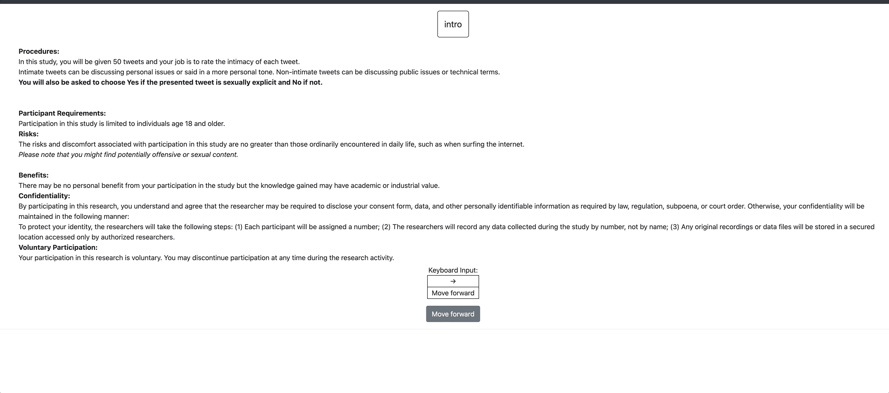

# Surveyflow

Potato allows you to easily set up a series of modules traditionally
used in social science surveys.

## Pre-screening questions
You could easily insert any survey questions before the annotation instances using our
built-in schemas: likert, radio, checkbox, textbox, drop-down list.
Potato also provide templates for setting up task instructions and user
consents.



Step 1, prepare a .jsonl file for the survey questions you want to
insert. For example, if you want to insert a page of censent questions,
you can add the following likes to a jsonl file named consent.jsonl

``` YAML
{"id":"1","text":"I certify that I am at least 18 years of age.","schema": "radio", "choices": ["I agree", "I disagree"], "label_requirement": {"right_label":["I agree"]}}
{"id":"2","text":"I have read and understood the information above.","schema": "radio", "choices": ["Yes", "No"], "label_requirement": {"right_label":["Yes"]}}
{"id":"3","text":"I understand I might see potentially offensive or sexual content.","schema": "radio", "choices": ["Yes", "No"], "label_requirement": {"right_label":["Yes"]}}
{"id":"4","text":"I want to participate in this research and continue with the study.","schema": "radio", "choices": ["Yes", "No"], "label_requirement": {"right_label":["Yes"]}}
```

Step 2, insert the file path into the configuration file:

``` YAML
"surveyflow": {
        "on": true,
        "order": [
            "pre_annotation",
            "post_annotation"
        ],
        "pre_annotation": [
            "projects/your-project-name/surveyflow/English/consent.jsonl",
        ],
        "post_annotation": [

        ],
        "testing": [

        ]
},
```

Potato will automatically create a consent page for all the annotators
when you launch it.

## Pre-study qualification test 
Details coming soon

## Attention test

Potato also allows you to easily assign attention test questions into
the annotation instances, just create another jsonl file, for example:

``` YAML
{"id":"test_question","text":"This is a test question, please select [test_question_choice].", "choices": ["1", "2", "3", "4", "5"]}
```

`[test_question_choice]` is the placeholder where the desired option will be displayed.
`choices` defines all the potential options and the system will automatically choose one from it. 
In the example above, `["1", "2", "3", "4", "5"]` will be randomly used to replace `[test_question_choice]`
and the annotators are required to choose the displayed option as an attention test.

and edit the surveyflow section in the configuration file:

``` YAML
"surveyflow": {
        "on": true,
        "order": [
            "pre_annotation",
            "post_annotation"
        ],
        "pre_annotation": [
            "surveyflow/consent.jsonl",
        ],
        "post_annotation": [

        ],
        "testing": [
             "surveyflow/testing.jsonl",
        ]
},
```

## Post-screening questions 


You can also insert post study surveys just like the prestudy survey:

``` YAML
{"id":"1","text":"What gender do you most closely identify with?","schema": "radio", "choices": ["Male", "Female", "Non-binary"], "label_requirement": {"required":true}}
```

and add the filename into the surveyflow section of your configuration
file:

``` YAML
"surveyflow": {
        "on": true,
        "order": [
            "pre_annotation",
            "post_annotation"
        ],
        "pre_annotation": [
            "surveyflow/consent.jsonl",
        ],
        "post_annotation": [
            "surveyflow/demographics.jsonl",
        ],
        "testing": [
             "surveyflow/testing.jsonl",
        ]
},
```
## Customize the header for each surveyflow page
On each page of the surveyflow, we display the filename of the page by default. For example,
for the page of `surveyflow/consent.jsonl`, we will display `consent` as the theme of the page.
If you want to display a different theme text, you could use a `dict` to define the surveyflow pages. For example:

``` YAML
"surveyflow": {
        "on": true,
        "order": [
            "pre_annotation",
            "post_annotation"
        ],
        "pre_annotation": [
            {"file":"surveyflow/consent.jsonl", "text":"Please answer all the consent questions"},
        ],
        "post_annotation": [
            "surveyflow/demographics.jsonl",
        ],
        "testing": [
             "surveyflow/testing.jsonl",
        ]
},
```


## Built-in demographic questions 
Potato provides a list of basic demographic questions covering common needs:

``` YAML
{"id":"1","text":"What is your gender?","schema": "radio", "choices": ["Woman", "Man", "Non-binary","Prefer not to disclose", "Prefer to self-describe (please specify)"], "has_free_response": {"instruction": ""},"label_requirement": {"required":true}}
{"id":"2","text":"What is your current age?","schema": "number", "label_requirement": {"required":true}}
{"id":"3","text":"What is your occupation?","schema": "radio", "choices": ["Employed", "Unemployed", "Student", "Retired", "Homemaker", "Self-employed", "Other"], "label_requirement": {"required":true}}
{"id":"4","text":"What is your education level?","schema": "radio", "choices": ["Less than a high school diploma", "High school diploma or equivalent", "College degree", "Graduate degree", "Other"], "label_requirement": {"required":true}}
{"id":"5","text":"What is your country of birth?","schema": "select", "use_predefined_labels": "country", "label_requirement": {"required":true}}
{"id":"6","text":"In which country did you spend most of your time before you turned 18?","schema": "select", "use_predefined_labels": "country", "label_requirement": {"required":true}}
{"id":"7","text":"Which country are you currently living in?", "schema": "select", "use_predefined_labels": "country", "label_requirement": {"required":true}}
{"id":"8","text":"What ethnic group do you belong to?","schema": "select", "use_predefined_labels": "ethnicity", "label_requirement": {"required":true}}
{"id":"9","text":"What is your present religion, if any?","schema": "select", "use_predefined_labels": "religion", "label_requirement": {"required":true}}
{"id":"10","text":"Please feel free to leave any comments about our study (optional)","schema": "text"}
```

## Built-in study experience survey:
Potato also supports you to survey the user annotation experience with the
following questions:

``` YAML
{"id":"1","text":"How satisfied do you feel about your experience participating our study?","schema": "radio", "choices": ["Not satisfied", "Satisfied", "Very satisfied"], "label_requirement": {"required":true}}
{"id":"2","text":"How do you feel about your experience participating our study compared with other studies?","schema": "radio", "choices": ["Much worse than others", "Worse than others", "Similar", "Better than others", "Much better than others"], "label_requirement": {"required":true}}
{"id":"3","text":"Please feel free to leave any comments about our study (optional)","schema": "text"}
```
