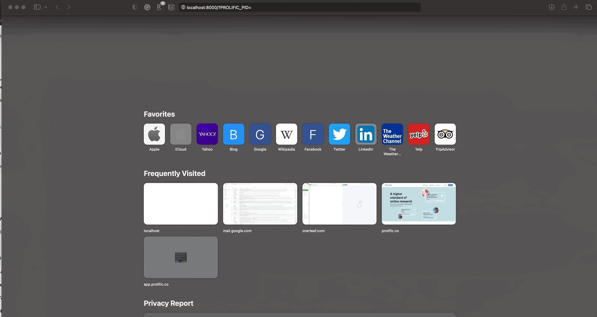

# User and collaboration

## Sign up and log in
Potato supports self-registration by default. A new user can register for the annotation
task by navigating to the annotation server, then selecting \"Create
your account\".


After creating an account, you can log in with the email and password
used in the account creation step.

### Set up authorized users
Sometimes you might only allow a short list of users to sign up.
All you need to do is set  `allow_all_users: False` and add a list of authorized
emails to `authorized_users`. Other users will not be allowed to sign up.
``` YAML
"user_config": {
  "allow_all_users": False,
  "authorized_users": ["hello@123.com", "good@354.com"],
},
```


## Direct login with URL argument



Potato also supports direct login through URL arguments, for example:
<http://localhost:8000/?PROLIFIC_PID=user>

You could setup direct login in the YAML configuration file
([example](https://github.com/davidjurgens/potato/blob/master/example-projects/match_finding/configs/match_finding.yaml#L48)):

``` YAML
#defining the ways annotators entering the annotation system
"login": {
   "type": 'url_direct',    #can be 'password' or 'url_direct'
   "url_argument": 'PROLIFIC_PID' # when the login type is set to 'url_direct', 'url_argument' must be setup for a direct url argument login
},
```

Collaboration under local network \-\-\-\-\-\-\-\-\-\-\-\-\-\-\--If you
do not want to expose the annotation app globally, Potato serves to the
local area network by default. You can access the Potato instance
through the local IP address of the server.

On Linux machines, you can determine the local IP by running

``` bash
hostname -I
```
