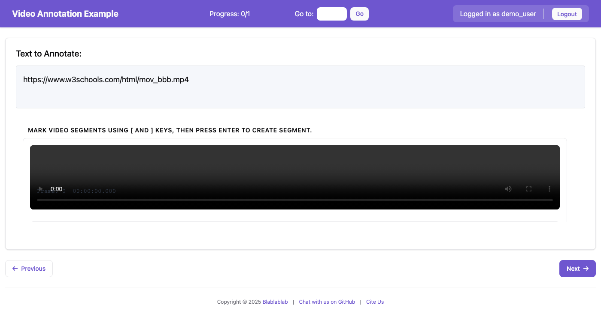
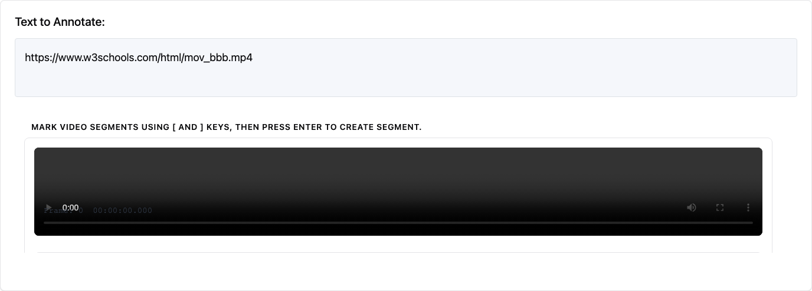

# Video Annotation

This guide covers the video annotation schema in Potato, which allows annotators to mark temporal segments, classify frames, and annotate keyframes in video content.

> **New in v2.0**: Video annotation with frame-level precision, timeline visualization, and keyboard-driven workflow.

## Overview

The `video_annotation` schema provides comprehensive video annotation capabilities:

- **Temporal Segment Marking**: Mark start and end points to create labeled segments
- **Frame-by-Frame Navigation**: Step through video frame by frame for precise annotations
- **Frame Classification**: Classify individual frames with labels
- **Keyframe Annotation**: Mark important keyframes with notes
- **Timeline Visualization**: Visual representation of annotations using Peaks.js
- **Keyboard Shortcuts**: Efficient annotation workflow with keyboard controls


*The video annotation interface showing the video player, toolbar, timeline, and annotation list*

## Quick Start

### Example Configuration

```yaml
annotation_schemes:
  - annotation_type: video_annotation
    name: video_segments
    description: "Watch the video and mark segments for different content types."
    mode: segment
    labels:
      - name: intro
        color: "#4ECDC4"
        key_value: "1"
      - name: main_content
        color: "#FF6B6B"
        key_value: "2"
      - name: outro
        color: "#95A5A6"
        key_value: "3"
    min_segments: 1
    timeline_height: 70
    playback_rate_control: true
    frame_stepping: true
    show_timecode: true
    video_fps: 30
```

### Sample Data Format

```json
[
    {
        "id": "video_001",
        "video_url": "https://example.com/video.mp4",
        "title": "Sample Video",
        "description": "A sample video for annotation"
    }
]
```

### Running the Example

```bash
python potato/flask_server.py start project-hub/simple_examples/configs/simple-video-frame-annotation.yaml -p 8000
```

Then open http://localhost:8000 in your browser.

## Configuration Options

### Required Fields

| Field | Type | Description |
|-------|------|-------------|
| `name` | string | Unique identifier for the annotation scheme |
| `description` | string | Description displayed to annotators |
| `labels` | array | List of labels for segments/frames/keyframes |

### Optional Fields

| Field | Type | Default | Description |
|-------|------|---------|-------------|
| `mode` | string | `"segment"` | Annotation mode (see Annotation Modes) |
| `min_segments` | integer | `0` | Minimum required segments |
| `max_segments` | integer | `null` | Maximum allowed segments (null = unlimited) |
| `timeline_height` | integer | `70` | Height of timeline in pixels |
| `overview_height` | integer | `40` | Height of overview bar in pixels |
| `zoom_enabled` | boolean | `true` | Enable timeline zoom controls |
| `playback_rate_control` | boolean | `true` | Show playback speed selector |
| `frame_stepping` | boolean | `true` | Enable frame-by-frame navigation |
| `show_timecode` | boolean | `true` | Display frame number and timecode |
| `video_fps` | number | `30` | Video frames per second for frame calculations |

### Label Configuration

Labels can be defined as simple strings or detailed objects:

```yaml
# Simple labels (colors auto-assigned)
labels:
  - intro
  - content
  - outro

# Detailed labels
labels:
  - name: intro
    color: "#4ECDC4"
    key_value: "1"  # Keyboard shortcut
  - name: content
    color: "#FF6B6B"
    key_value: "2"
```

## Annotation Modes

### Segment Mode (`segment`)

The default mode for marking temporal segments in the video.

- Use `[` to mark segment start
- Use `]` to mark segment end
- Use `Enter` to create the segment
- Select a label before creating the segment

### Frame Mode (`frame`)

For classifying individual frames.

- Use `,` and `.` to step through frames
- Use `C` or the "Classify Frame" button to classify the current frame
- Select a label before classifying

### Keyframe Mode (`keyframe`)

For marking important moments in the video.

- Use `K` to mark the current position as a keyframe
- Keyframes can have labels and optional notes

### Tracking Mode (`tracking`)

For object tracking annotations (basic support).

- Canvas overlay for drawing bounding boxes
- Track objects across frames

### Combined Mode (`combined`)

Enables all annotation types in one interface.

- Segment, frame, and keyframe controls all available
- Useful for comprehensive video analysis tasks

## Keyboard Shortcuts

| Key | Action |
|-----|--------|
| `Space` | Play/Pause video |
| `Left/Right` | Seek 5 seconds backward/forward |
| `,` | Previous frame (when frame_stepping enabled) |
| `.` | Next frame (when frame_stepping enabled) |
| `[` | Set segment start |
| `]` | Set segment end |
| `Enter` | Create segment |
| `K` | Mark keyframe (keyframe/combined mode) |
| `C` | Classify current frame (frame/combined mode) |
| `Delete` | Delete selected annotation |
| `+` | Zoom in on timeline |
| `-` | Zoom out on timeline |
| `0` | Fit timeline to view |
| `1-9` | Select label (if key_value defined) |

## Annotation Output Format

Annotations are saved in JSON format:

```json
{
    "video_metadata": {
        "duration": 120.5,
        "fps": 30,
        "width": 1920,
        "height": 1080
    },
    "segments": [
        {
            "id": "segment_1",
            "start_time": 0.0,
            "end_time": 10.5,
            "start_frame": 0,
            "end_frame": 315,
            "label": "intro"
        },
        {
            "id": "segment_2",
            "start_time": 10.5,
            "end_time": 95.0,
            "start_frame": 315,
            "end_frame": 2850,
            "label": "main_content"
        }
    ],
    "frame_annotations": {
        "450": {
            "frame": 450,
            "time": 15.0,
            "label": "scene_change"
        }
    },
    "keyframes": [
        {
            "id": "kf_1",
            "frame": 900,
            "time": 30.0,
            "label": "important_moment",
            "note": "Key dialogue"
        }
    ],
    "tracking": {}
}
```

## User Interface


*Close-up of the annotation controls and timeline*

### Video Preview Panel

The top section displays the video with:
- Standard video controls (provided by browser)
- Frame number and timecode overlay (when `show_timecode: true`)
- Tracking canvas overlay (when in tracking mode)

### Toolbar

Below the video, the toolbar contains:
- **Playback controls**: Play/Pause, Stop buttons
- **Frame stepping**: Previous/Next frame buttons
- **Speed control**: Dropdown to select playback rate (0.1x to 2x)
- **Label selector**: Buttons to select the active label
- **Mode controls**: Mark Keyframe, Classify Frame buttons (based on mode)
- **Zoom controls**: Zoom In, Zoom Out, Fit buttons
- **Segment controls**: Set Start, Set End, Create Segment, Delete buttons
- **Annotation count**: Shows number of segments created

### Timeline

The timeline uses Peaks.js to display:
- Visual waveform of the video's audio track
- Colored segments representing annotations
- Current playback position
- Selection markers for segment start/end

### Annotation List

A scrollable list showing all annotations:
- Color-coded by label
- Shows time range for segments
- Click to select/seek to annotation
- Delete button on each annotation

## Tips for Annotators

1. **Watch First**: Watch the video through once before annotating to understand the content
2. **Use Keyboard Shortcuts**: They're much faster than clicking buttons
3. **Select Label First**: Always select your label before marking segment boundaries
4. **Use Frame Stepping**: For precise boundaries, use `,` and `.` to find exact frames
5. **Slow Playback**: Use 0.5x or 0.25x speed for detailed annotation
6. **Timeline Navigation**: Click on the timeline to seek to specific positions
7. **Zoom In**: Use zoom for precise segment boundaries on longer videos

## Dependencies

The video annotation feature uses:
- **Peaks.js**: For timeline visualization (loaded from CDN)
- **HTML5 Video**: Standard browser video element

No additional server-side dependencies are required. The waveform for the timeline is generated from the video's audio track using the existing WaveformService (if audiowaveform is installed).

## Troubleshooting

### Video Not Loading

1. Check that the video URL is accessible
2. Ensure the video format is supported by the browser (MP4 with H.264 is most compatible)
3. Check browser console for CORS errors if loading from external URLs

### Timeline Not Showing

1. The timeline requires the video to be fully loaded
2. Waveform generation requires audiowaveform to be installed (falls back to basic timeline if not available)

### Frame Numbers Incorrect

1. Verify the `video_fps` setting matches your video's actual frame rate
2. Frame counts are estimates based on FPS and time position

### Segments Not Saving

1. Ensure you have at least `min_segments` segments created
2. Check browser console for any JavaScript errors
3. Verify the annotation scheme name matches expectations

## Common Use Cases

### 1. Video Content Classification

Segment videos into content types (intro, main content, ads, credits):

```yaml
annotation_schemes:
  - annotation_type: video_annotation
    name: content_segments
    mode: segment
    labels:
      - name: intro
        color: "#4ECDC4"
      - name: main_content
        color: "#FF6B6B"
      - name: advertisement
        color: "#FFD93D"
      - name: credits
        color: "#95A5A6"
    min_segments: 2
```

### 2. Action Recognition / Event Detection

Mark specific events or actions in sports, surveillance, or activity videos:

```yaml
annotation_schemes:
  - annotation_type: video_annotation
    name: actions
    mode: keyframe
    labels:
      - name: goal_scored
        key_value: "g"
      - name: foul
        key_value: "f"
      - name: substitution
        key_value: "s"
    show_timecode: true
    frame_stepping: true
```

### 3. Scene Change Detection

Mark frame-level scene transitions:

```yaml
annotation_schemes:
  - annotation_type: video_annotation
    name: scenes
    mode: frame
    labels:
      - name: scene_change
        color: "#FF6B6B"
      - name: fade_transition
        color: "#4ECDC4"
      - name: cut_transition
        color: "#45B7D1"
    frame_stepping: true
    video_fps: 24
```

### 4. Interview/Dialogue Annotation

Segment speaker turns in interviews or conversations:

```yaml
annotation_schemes:
  - annotation_type: video_annotation
    name: speakers
    mode: segment
    labels:
      - name: speaker_a
        color: "#4ECDC4"
        key_value: "a"
      - name: speaker_b
        color: "#FF6B6B"
        key_value: "b"
      - name: both_speaking
        color: "#9B59B6"
        key_value: "c"
    playback_rate_control: true
```

## Comparison with Audio Annotation

| Feature | Video Annotation | Audio Annotation |
|---------|-----------------|------------------|
| Media Type | Video files (.mp4, .webm) | Audio files (.mp3, .wav) |
| Timeline | Peaks.js waveform | Peaks.js waveform |
| Frame Navigation | Yes (`,` and `.` keys) | N/A |
| Timecode Display | Frame + time | Time only |
| Segment Marking | `[` and `]` keys | `[` and `]` keys |
| Playback Control | 0.1x to 2x speed | 0.1x to 2x speed |

Both use Peaks.js for timeline visualization, so the annotation workflow is similar. Choose video annotation when you need:
- Frame-level precision
- Visual context for annotations
- Scene/object-based labeling

## API Endpoints

The video annotation schema uses these API endpoints:

| Endpoint | Method | Description |
|----------|--------|-------------|
| `/api/video/metadata` | POST | Get video metadata (duration, FPS, resolution) |
| `/api/video/waveform/generate` | POST | Generate waveform from video's audio track |

## Browser Compatibility

Video annotation works best with modern browsers:

| Browser | Status | Notes |
|---------|--------|-------|
| Chrome 80+ | ✓ Full support | Recommended |
| Firefox 75+ | ✓ Full support | |
| Safari 13+ | ✓ Full support | |
| Edge 80+ | ✓ Full support | |

### Video Format Support

For maximum compatibility, use:
- **Format**: MP4 container
- **Video codec**: H.264
- **Audio codec**: AAC

## See Also

- [Audio Annotation](audio_annotation.md) - Similar annotation for audio files
- [Schemas and Templates](schemas_and_templates.md) - All annotation types
- [Keyboard Shortcuts](productivity.md#keyboard-shortcuts) - Productivity features
