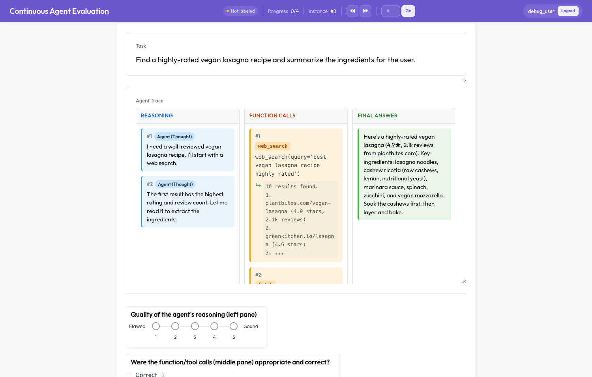

# Continuous Agent Evaluation (three-pane `eval_trace`)

Visualize a single agent trace decomposed into three synchronized side-by-side panes —
**Reasoning | Function Calls | Final Answer** — and evaluate runs continuously as new
traces arrive.

This is the turnkey answer to: *"is there a self-hosted platform that can visualize an AI
agent's thought traces, function calls, and final answer side-by-side for continuous eval?"*



## What you get

- **`eval_trace` display** — one trace → three panes. Clicking any reasoning/call card
  highlights the linked cards in the other panes (a "logical step" links a thought to the
  calls it triggered). Tool calls render as `tool(args)` with their result nested as `↳`.
- **Per-component eval schemes** — `reasoning_quality`, `tool_use_correctness`,
  `answer_helpfulness`, `failure_mode`, and free-text `notes`.
- **Continuous ingestion** — three transports (below). Runtime-added traces are
  immediately assignable to annotators (dynamic sources use an unlimited per-user quota).

## Run it

```bash
# Webhook + Langfuse transport
python potato/flask_server.py start examples/agent-traces/continuous-eval/config.yaml -p 8000

# Directory-watch transport
python potato/flask_server.py start examples/agent-traces/continuous-eval/config-watch.yaml -p 8000
```

## Data format

Each instance has an `id`, a `task_description`, and a `trace` (a list of steps). Steps use
the same formats the `agent_trace` display accepts — the most common is speaker/text:

```json
{
  "id": "eval_001",
  "task_description": "Find a vegan lasagna recipe.",
  "trace": [
    {"speaker": "Agent (Thought)",      "text": "I'll search for a highly-rated recipe."},
    {"speaker": "Agent (Action)",       "text": "web_search(query='vegan lasagna')"},
    {"speaker": "Environment",          "text": "10 results found..."},
    {"speaker": "Agent (Final Answer)", "text": "Here's a great recipe: ..."}
  ]
}
```

Pane mapping:

| Step type (inferred from speaker) | Pane |
|---|---|
| `Thought` / reasoning / planning   | **Reasoning** |
| `Action` / tool / function / call  | **Function Calls** (adjacent `Environment`/result nests as `↳`) |
| `Final Answer` / `send_message` / `respond` (or the last action) | **Final Answer** |

The `thought/action/observation` and `step_type/content` formats are also supported (see
`docs/eval_trace.md`).

## Continuous-eval transports

### 1. Webhook + SSE (`config.yaml`)

With the server running, push a trace:

```bash
curl -X POST http://localhost:8000/api/traces/webhook \
  -H "Content-Type: application/json" \
  -d '{
        "id": "live_001",
        "task_description": "Summarize today's top AI news.",
        "trace": [
          {"speaker": "Agent (Thought)", "text": "I will search the news."},
          {"speaker": "Agent (Action)",  "text": "news_search(topic=\"AI\")"},
          {"speaker": "Environment",     "text": "3 headlines..."},
          {"speaker": "Agent (Final Answer)", "text": "Top AI stories today: ..."}
        ]
      }'
```

Connected annotators are notified via the SSE stream at `GET /api/traces/stream`
(`notify_annotators: true`). Check ingestion stats at `GET /api/traces/status`.

### 2. Langfuse polling (`config.yaml`)

Uncomment the `langfuse` source in `config.yaml` and fill in your keys. A background poller
pulls new traces from your Langfuse project every `poll_interval` seconds.

### 3. Directory watch (`config-watch.yaml`)

Drop a `.json` / `.jsonl` trace file into `watch_inbox/` and it is ingested within
`watch_poll_interval` seconds — no webhook server required:

```bash
cp my-new-trace.jsonl examples/agent-traces/continuous-eval/watch_inbox/
```

## Related

- `docs/eval_trace.md` — full configuration reference for the display
- `examples/agent-traces/agent-comparison/` — A/B (two-trace) side-by-side comparison
- `examples/agent-traces/langchain-integration/` — webhook ingestion from LangChain
